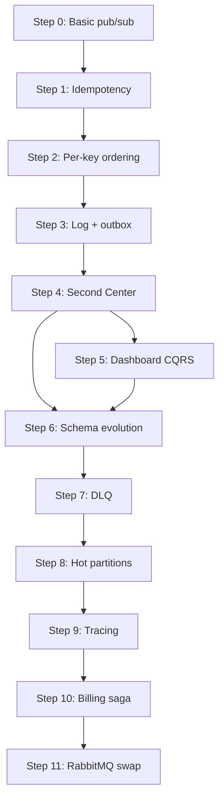

# DuckNet — Detailed Implementation Plan

> **Sources:** [CentersBuildPlan.md](./CentersBuildPlan.md) (what to build, why) and [DuckNetArchitectureSteps.html](./DuckNetArchitectureSteps.html) (architecture per step).
>
> **Goal:** Rebuild Telia-style interconnected-Center complexity in the smallest runnable codebase — toy domain, real seams.

---

## Executive summary

DuckNet is a stepwise .NET 9 learning/production-shaped demo: smart rubber ducks emit `Squeaked` facts; autonomous Centers react without calling each other or sharing databases. Each step adds one distributed-systems concept while keeping the demo runnable end-to-end.

| Phase | Steps | Outcome |
|-------|-------|---------|
| **A — The Kernel** | 0–3 | At-least-once, idempotency, per-key ordering, durable log + outbox |
| **B — Distributed** | 4–6 | Multi-Center Aspire host, CQRS projections, schema evolution |
| **C — Production pain** | 7–11 | DLQ, hot partitions, tracing, sagas, broker swap |

**Interview milestone:** Steps 0–4 before Epiroc interview (~4–5 evenings).

---

## Non-negotiable rules

These constraints *are* the architecture — do not relax them for convenience:

1. **No Center-to-Center calls.** Integration is events only.
2. **No shared database.** Each Center owns its schema; cross-Center reads go through events or local projections.
3. **Events are past facts**, never commands (`Squeaked`, not `SqueakTheDuck`).
4. **Transport is hostile:** at-least-once delivery and unordered across keys — simulate even in-memory.
5. **Every step stays runnable.** Tag commits per step; never leave main in a broken state.

---

## Solution layout (evolves by step)

### Phase A (Steps 0–3) — single project

```
DuckNet/
├── DuckNet.sln
├── src/
│   └── DuckNet.Kernel/              # Console app; rename/split later
│       ├── Program.cs
│       ├── Domain/
│       │   ├── Events/
│       │   │   └── Squeaked.cs
│       │   └── DuckState.cs
│       ├── Transport/
│       │   ├── IEventBus.cs
│       │   ├── InMemoryEventBus.cs
│       │   ├── HostileBusMiddleware.cs   # dup + shuffle (Steps 1–2)
│       │   └── EventEnvelope.cs
│       ├── Consumer/
│       │   ├── Inbox.cs
│       │   ├── PerKeySequencer.cs
│       │   ├── SqueakCounter.cs
│       │   └── ConsumerOffsetStore.cs
│       ├── Producer/
│       │   ├── DuckSimulator.cs
│       │   └── OutboxDispatcher.cs       # Step 3
│       └── Persistence/
│           ├── EventLogStore.cs          # append-only
│           ├── OutboxStore.cs
│           └── StateStore.cs
└── tests/
    └── DuckNet.Kernel.Tests/
```

### Phase B onward — Aspire multi-project

```
DuckNet/
├── DuckNet.AppHost/                  # Aspire orchestration (Step 4+)
├── src/
│   ├── DuckNet.Contracts/            # Shared event DTOs + versions
│   ├── DuckNet.EventBus/             # IEventBus + in-memory impl
│   ├── DuckNet.TelemetryCenter/
│   ├── DuckNet.AlarmCenter/
│   ├── DuckNet.DashboardCenter/      # Step 5
│   └── DuckNet.BillingCenter/        # Step 10
└── tests/
    ├── DuckNet.Kernel.Tests/         # keep kernel tests
    ├── DuckNet.AlarmCenter.Tests/
    └── ...
```

**Shared library rule:** `DuckNet.Contracts` holds *immutable event shapes and metadata only* — no behavior, no DB access, no HTTP clients. Centers reference it; they never reference each other.

---

## Core abstractions (introduce early, keep stable)

### Event envelope

Every message on the bus carries metadata separate from payload:

```csharp
record EventEnvelope(
    Guid EventId,           // unique per emission — inbox dedup key
    string Type,            // e.g. "Squeaked"
    int Version,            // contract version
    string PartitionKey,    // duckId
    long SequenceNumber,    // per-partition monotonic
    DateTimeOffset OccurredAt,
    string PayloadJson,
    string? TraceId = null,
    string? CausationId = null
);
```

### IEventBus

```csharp
interface IEventBus
{
    Task PublishAsync(EventEnvelope envelope, CancellationToken ct);
    IAsyncEnumerable<EventEnvelope> SubscribeAsync(
        string consumerGroup,
        CancellationToken ct);
}
```

- **Consumer group** = logical subscriber identity (e.g. `alarm-center`, `dashboard-projector`).
- Step 11 adds `RabbitMqEventBus : IEventBus` — Center projects unchanged.

### Hostile transport middleware

Composable pipeline wrapping any bus:

| Middleware | Step | Behavior |
|------------|------|----------|
| `DuplicatorMiddleware` | 1 | Re-enqueue ~10–20% of events after random delay |
| `ShufflerMiddleware` | 2 | Buffer + release in random order (per burst or globally) |
| Both | 3+ | Applied after log replay / dispatcher read |

Make duplication and shuffle **configurable via env vars** for demos and tests.

---

## Domain events (contract catalog)

| Event | Producer | Version | Key fields |
|-------|----------|---------|------------|
| `Squeaked` | TelemetryCenter | v1: `duckId, seq, at` · v2: + `volumeDb` | `duckId` |
| `AlarmRaised` | AlarmCenter | v1: `duckId, rate, windowStart` | `duckId` |
| `AlarmResolved` | AlarmCenter | v1: `duckId, resolvedAt` | `duckId` |
| `FeeReserved` | BillingCenter | v1: `alarmId, duckId, amount, expiresAt` | `alarmId` |
| `FeeReleased` | BillingCenter | v1: `alarmId, reason` | `alarmId` |

Store payloads as JSON in the log; deserialize with version-aware readers from Step 6 onward.

---

## Phase A — The Kernel

### Step 0 — One event, one producer, one consumer

**Architecture:** `DuckSimulator → Channel<Event> → SqueakCounter`

**Implement:**

1. **`Squeaked` record** — `DuckId`, `SequenceNumber`, `OccurredAt`.
2. **`DuckSimulator`** — background loop; N ducks, random squeak intervals; assigns incrementing seq per duck.
3. **`InMemoryEventBus`** — thin wrapper over `Channel<EventEnvelope>` (no hostility yet).
4. **`SqueakCounter`** — subscribes, increments global + per-duck totals, logs every N events.
5. **`Program.cs`** — wire simulator + counter; run until Ctrl+C.

**Acceptance criteria:**

- [ ] Counter totals match events produced (deterministic seed optional).
- [ ] Producer has zero references to consumer types.
- [ ] Solution builds; ~150 lines in kernel project acceptable.

**Demo script:** Run 30s; show per-duck and total counts.

**Estimated effort:** ~2 hours.

---

### Step 1 — At-least-once + idempotent consumer

**Architecture:** `Simulator → HostileBus (Duplicator) → Inbox → SqueakCounter`

**Implement:**

1. **`DuplicatorMiddleware`** — after publish, with probability `P` (default 0.15), clone envelope with **same `EventId`** and re-enqueue.
2. **`Inbox`** — `HashSet<Guid>` or SQLite table `processed_events(event_id PK)`; check before handle; mark after successful handle.
3. **`SqueakCounter`** — skip if `EventId` already processed.
4. **Mis-demo mode** — flag to disable inbox; show wrong counts live, then fix.

**Acceptance criteria:**

- [ ] With `DUPLICATE_RATE=0.20`, counts remain exact over 10k events.
- [ ] Duplicate deliveries log at debug: `"Skipping duplicate {EventId}"`.
- [ ] Inbox survives in-memory only (Phase A Step 1); persistence comes Step 3.

**Tests:**

- Property-style: publish event twice with same id → handler runs once.
- Integration: 1000 events, 20% dup rate → exact count.

**Estimated effort:** ~1 evening.

---

### Step 2 — Out-of-order delivery + per-key ordering

**Architecture:** `Simulator (+ key, seq) → HostileBus (Duplicator + Shuffler) → PerKeySequencer → Inbox → Counter`

**Implement:**

1. **Extend `Squeaked`** — enforce `PartitionKey = DuckId`, monotonic `SequenceNumber` per duck at producer.
2. **`ShufflerMiddleware`** — collect events in a buffer; flush in shuffled order (windowed shuffle: e.g. shuffle within batches of 50).
3. **`PerKeySequencer`** — per `PartitionKey` state:
   - `nextExpectedSeq`
   - `Dictionary<long, EventEnvelope> buffer`
   - On receive: if `seq == nextExpected`, emit and drain buffer; if `seq > nextExpected`, buffer; if `seq < nextExpected`, treat as duplicate (drop or inbox handles).
4. **Gap policy** — log gap after timeout (e.g. 5s) for demo visibility; document that real systems would DLQ or alert.

**Acceptance criteria:**

- [ ] Shuffled + duplicated stream → correct per-duck sequence and totals.
- [ ] Explicit comment/doc: *ordering is per-partition-key, never global*.

**Tests:**

- Feed events `{duckA:1, duckB:1, duckA:2}` in order `(B1, A2, A1)` → output `(A1, A2, B1)` or equivalent per-key correct order.

**Estimated effort:** ~1 evening.

---

### Step 3 — Durability: append-only log + outbox

**Architecture:**

```
Producer: Simulator → Tx(state + outbox) → OutboxDispatcher → EventLog
Transport: EventLog → HostileBus → PerKeySequencer → Inbox → Handler
Consumer: Handler → ConsumerOffsetStore
```

**Implement:**

1. **SQLite first** (Postgres optional via connection string) — single file `ducknet.db` for simplicity.

   **`event_log`** table:
   ```sql
   CREATE TABLE event_log (
     offset INTEGER PRIMARY KEY AUTOINCREMENT,
     event_id TEXT NOT NULL UNIQUE,
     partition_key TEXT NOT NULL,
     type TEXT NOT NULL,
     version INTEGER NOT NULL,
     payload_json TEXT NOT NULL,
     occurred_at TEXT NOT NULL
   );
   ```

   **`outbox`** table:
   ```sql
   CREATE TABLE outbox (
     id INTEGER PRIMARY KEY AUTOINCREMENT,
     event_id TEXT NOT NULL,
     payload_json TEXT NOT NULL,
     published_at TEXT NULL
   );
   ```

   **`consumer_offsets`** table:
   ```sql
   CREATE TABLE consumer_offsets (
     consumer_group TEXT PRIMARY KEY,
     last_offset INTEGER NOT NULL
   );
   ```

   **`inbox`** table (replace in-memory set):
   ```sql
   CREATE TABLE inbox (
     consumer_group TEXT NOT NULL,
     event_id TEXT NOT NULL,
     processed_at TEXT NOT NULL,
     PRIMARY KEY (consumer_group, event_id)
   );
   ```

2. **`StateStore`** — duck aggregate state if needed for simulator realism (last seq per duck).

3. **Transactional publish** — single transaction: update state + insert outbox row.

4. **`OutboxDispatcher`** — background loop: read unpublished outbox rows → append to `event_log` → mark published → push to bus (or bus reads from log tail).

5. **`LogTailReader`** — consumer reads from `last_offset + 1`; hostile middleware applied after read.

6. **Checkpointing** — after successful handle + inbox write, update offset in **same transaction** as inbox insert.

**Acceptance criteria:**

- [ ] Kill consumer mid-stream; restart → resumes from offset, no double-count.
- [ ] Kill producer mid-transaction → no orphaned dual-write (outbox only commits with state).
- [ ] Full log replay from offset 0 reproduces same handler side effects.

**Demo script:**

1. Run until ~500 events.
2. `kill -9` consumer.
3. Restart → counts continue correctly; show offset in DB.

**Phase A tag:** `step-3-kernel-complete`

**Estimated effort:** ~2 evenings.

---

## Phase B — Becoming Distributed

### Step 4 — Second Center, own database (Aspire)

**Architecture:** Aspire AppHost hosts TelemetryCenter + AlarmCenter; shared event log; separate DBs.

**Implement:**

1. **`DuckNet.AppHost`**
   - Add TelemetryCenter + AlarmCenter projects.
   - SQLite/Postgres containers or per-center connection strings.
   - Shared `event_log` — owned by TelemetryCenter *infrastructure* but readable by subscribers via bus abstraction (not direct DB coupling: subscribers consume via `IEventBus` backed by log tail / dispatcher).

2. **`TelemetryCenter`**
   - DuckSimulator + ingest API (optional minimal HTTP health).
   - Own DB: duck registry, outbox, event log writes.
   - Publishes `Squeaked`.

3. **`AlarmCenter`**
   - Own DB: `alarms`, `alarm_rules`, inbox, offsets.
   - Handler: sliding window rate count per duck; if > N/minute → insert alarm + publish `AlarmRaised` via local outbox.
   - Subscribes to `Squeaked` only.

4. **Enforce boundaries**
   - No project references between Centers.
   - Separate connection strings in AppHost.
   - Integration tests spin both centers; assert AlarmCenter never opens Telemetry DB.

**Configuration:**

| Setting | Default | Purpose |
|---------|---------|---------|
| `ALARM_RATE_THRESHOLD` | 10 | squeaks/minute |
| `ALARM_WINDOW_SECONDS` | 60 | sliding window |

**Acceptance criteria:**

- [ ] Stop AlarmCenter 60s; TelemetryCenter keeps publishing; restart AlarmCenter → catches up, alarms fire for qualifying ducks.
- [ ] No synchronous HTTP between Centers.
- [ ] Aspire dashboard shows both services healthy.

**Demo script:** Stop alarm service → squeak storm → restart → alarm backlog drains.

**Estimated effort:** ~2 evenings.

---

### Step 5 — CQRS: disposable read model

**Architecture:** DashboardCenter projects `squeaks_per_duck_per_hour` from log; rebuild command drops and replays.

**Implement:**

1. **`DashboardCenter`**
   - Consumer group: `dashboard-projector`.
   - Read model table:
     ```sql
     CREATE TABLE squeaks_by_duck_hour (
       duck_id TEXT NOT NULL,
       hour_utc TEXT NOT NULL,
       count INTEGER NOT NULL,
       PRIMARY KEY (duck_id, hour_utc)
     );
     ```
   - **`Projector`** — idempotent upsert on `Squeaked` (and later events if needed).
   - **`RebuildHostedService` or CLI command** — truncate read model; reset offset to 0; replay.

2. **Query API** — minimal GET `/dashboard/duck/{id}` or `/dashboard/summary` for demo.

**Acceptance criteria:**

- [ ] Delete/truncate read model DB → run rebuild → identical row counts to pre-delete snapshot.
- [ ] Projector handles duplicate events (inbox or upsert idempotency).
- [ ] DashboardCenter never writes to Telemetry or Alarm DBs.

**Tests:**

- Snapshot read model after 1000 events → rebuild → assert deep equality.

**Estimated effort:** ~1 evening.

---

### Step 6 — Schema evolution across a boundary

**Architecture:** Telemetry emits `Squeaked v2`; log contains mixed v1/v2; upcasters in each consumer.

**Implement:**

1. **`SqueakedV1` / `SqueakedV2`** in Contracts — v2 adds `VolumeDb` (nullable in upcaster default: 0 or estimated).

2. **`IEventUpcaster` chain**
   ```csharp
   interface IEventUpcaster
   {
     bool CanUpcast(string type, int version);
     EventEnvelope Upcast(EventEnvelope source);
   }
   ```

3. **TelemetryCenter** — emit v2 for new events; keep v1 deserializable for replay tests.

4. **AlarmCenter** — upcast v1→v2 before rate handler; handler only sees v2.

5. **DashboardCenter** — upcast; projector stores `volume_db` column (migration adds nullable column).

6. **Test fixture** — seed log with alternating v1/v2 payloads; replay all Centers.

**Acceptance criteria:**

- [ ] Mixed log replays cleanly in Alarm + Dashboard without code changes in handlers.
- [ ] Upcaster unit tests for v1→v2 defaults.

**Estimated effort:** ~1 evening.

**Phase B tag:** `step-6-three-centers`

---

## Phase C — Production-Shaped Pain

### Step 7 — Poison messages + DLQ

**Architecture:** `Log → RetryPipeline → Handler`; exhausted retries → DLQ; stream continues.

**Implement:**

1. **`RetryPipeline`** — wrap handler; catch exceptions; exponential backoff; max attempts (e.g. 5).

2. **`dead_letter_queue`** table:
   ```sql
   CREATE TABLE dead_letter_queue (
     id INTEGER PRIMARY KEY AUTOINCREMENT,
     consumer_group TEXT,
     event_id TEXT,
     payload_json TEXT,
     error TEXT,
     failed_at TEXT,
     attempts INTEGER
   );
   ```

3. **Poison injector** — test-only HTTP or env flag `INJECT_POISON_EVENT=true` adds one malformed payload.

4. **DLQ replay tool** — CLI: re-enqueue single DLQ entry by id.

**Acceptance criteria:**

- [ ] One bad event does not block partition processing.
- [ ] DLQ row inspectable (error message, payload).
- [ ] Manual replay succeeds after fix or skip.

**Estimated effort:** ~1 evening.

---

### Step 8 — Backpressure + hot partitions

**Architecture:** `LoudDuck (100x) → Log → Key-hash sharding → N workers with bounded channels → lag metrics`

**Implement:**

1. **`LoudDuck` profile** — one duckId with 100x squeak rate in simulator config.

2. **Shard assignment** — `shard = Hash(partitionKey) % ShardCount` (default 3).

3. **Worker pool** — each shard has bounded `Channel`; `TryWrite` failure → backpressure signal (drop simulator rate or block producer in demo).

4. **Metrics** — per-shard lag = `latest_log_offset - last_processed_offset`; expose via `/metrics` or Aspire OpenTelemetry meters.

5. **Before/after demo** — single-thread consumer shows lag spike; sharded shows bounded lag on other ducks.

**Acceptance criteria:**

- [ ] Hot key causes measurable lag without sharding.
- [ ] With sharding, non-hot ducks stay near real-time.
- [ ] Lag metrics visible in logs or dashboard.

**Estimated effort:** ~1–2 evenings.

---

### Step 9 — Distributed tracing

**Architecture:** `traceId + causationId` on every envelope; OTel spans per Center; Aspire dashboard shows E2E trace.

**Implement:**

1. **Envelope propagation** — simulator creates `traceId`; each handler starts span, sets `causationId = parent EventId`.

2. **OpenTelemetry** — `AddOpenTelemetry()` in each Center; Aspire service defaults.

3. **ActivitySource** names — `DuckNet.Telemetry`, `DuckNet.Alarm`, etc.

4. **Baggage** (optional) — `duckId` on span attributes.

**Acceptance criteria:**

- [ ] One squeak trace visible: Simulator → Telemetry → Alarm → Dashboard spans linked.
- [ ] Trace survives duplicate delivery (same traceId on replays — document idempotent span handling).

**Estimated effort:** ~1 evening.

---

### Step 10 — Saga: cross-Center workflow without transactions

**Architecture:** BillingCenter state machine driven by `AlarmRaised` / `AlarmResolved` + 5-minute timeout compensation.

**Implement:**

1. **`BillingCenter`**
   - Saga table:
     ```sql
     CREATE TABLE billing_sagas (
       alarm_id TEXT PRIMARY KEY,
       duck_id TEXT NOT NULL,
       state TEXT NOT NULL,  -- Reserved | Released | Expired
       amount_cents INTEGER NOT NULL,
       reserved_at TEXT NOT NULL,
       expires_at TEXT NOT NULL
     );
     ```

2. **State machine**
   - `AlarmRaised` → if no row, insert saga `Reserved`, publish `FeeReserved`.
   - `AlarmResolved` before `expires_at` → `Released`, publish `FeeReleased` (compensation).
   - Timeout worker → if still `Reserved` after 5 min → publish `FeeReleased` with reason `Timeout`.

3. **Idempotency** — inbox on `alarm_id` events.

4. **No distributed locks** — duplicate `AlarmRaised` must not double-charge (DB PK + inbox).

**Acceptance criteria:**

- [ ] Happy path: alarm → fee reserved → alarm resolved → fee released.
- [ ] Timeout path: fee released after 5 min without resolve.
- [ ] AlarmCenter and BillingCenter never call each other.

**Demo script:** Fast resolve vs slow resolve side-by-side.

**Estimated effort:** ~2 evenings.

---

### Step 11 (stretch) — Swap the transport

**Architecture:** `IEventBus` → RabbitMQ (Aspire container); in-memory impl removed from production path only.

**Implement:**

1. **`RabbitMqEventBus`**
   - Exchange: topic `ducknet.events`.
   - Routing key: `{type}.{version}` or partition key hash.
   - At-least-once: manual ack after handler + inbox commit; nack → redelivery.
   - Consumer groups → separate queues per group.

2. **AppHost** — RabbitMQ resource; connection string to all Centers.

3. **Event log retention** — log remains source of truth for replay; broker is transport, not system of record.

**Acceptance criteria:**

- [ ] `git diff` on Center `.csproj` and handler code = empty (only AppHost + EventBus project change).
- [ ] Full demo runs on RabbitMQ.
- [ ] Kill broker → Centers retry/reconnect gracefully.

**Estimated effort:** ~2 evenings.

**Phase C tag:** `step-11-production-shaped`

---

## Cross-cutting concerns

### Configuration reference

| Variable | Used from | Description |
|----------|-----------|-------------|
| `DUPLICATE_RATE` | Step 1+ | 0.0–1.0 hostile redelivery |
| `SHUFFLE_ENABLED` | Step 2+ | Enable order randomization |
| `CONSUMER_GROUP` | Step 3+ | Subscriber identity |
| `SQLITE_PATH` / `ConnectionStrings__*` | Step 3+ | Persistence |
| `SHARD_COUNT` | Step 8+ | Worker parallelism |
| `LOUD_DUCK_ID` | Step 8+ | Hot partition demo |
| `ALARM_RATE_THRESHOLD` | Step 4+ | Alarms/minute |

### Testing strategy

| Layer | Focus |
|-------|--------|
| **Unit** | Inbox, sequencer, upcasters, saga transitions |
| **Integration** | SQLite log + outbox + restart recovery |
| **Architecture tests** | NetArchTest or manual: Centers don't reference each other |
| **Demo tests** | Scriptable `--run-demo --seconds 30` exit code 0 |

### Commit / tagging cadence

- One git tag per completed step: `step-0` … `step-11`.
- Commit message format: `feat(step-N): short description`.
- Keep `ImplementationPlan.md` checklist updated as steps complete.

### Observability checklist (Step 9+)

- [ ] Structured logging with `EventId`, `PartitionKey`, `ConsumerGroup`.
- [ ] OTel traces across Centers.
- [ ] Lag metrics per shard (Step 8+).
- [ ] DLQ depth metric (Step 7+).

---

## Step dependency graph



Steps 5 and 6 can partially overlap after Step 4; Step 6 should not block Step 5 start. Steps 7–9 are mostly independent modules layered onto existing consumers.

---

## Interview preparation map

| Topic | Show in step | Talking point |
|-------|--------------|---------------|
| Exactly-once is a lie | 1 | Forced duplicates + inbox |
| Partition ordering | 2 | Shuffle + per-duck sequencer |
| Dual-write problem | 3 | Outbox pattern |
| Eventual consistency | 4 | Stop AlarmCenter, catch up |
| CQRS / projections | 5 | Delete DB, rebuild from log |
| Contract versioning | 6 | Mixed v1/v2 replay |
| Poison messages | 7 | DLQ without blocking |
| Hot keys | 8 | LoudDuck + sharding |
| Debuggability | 9 | Single trace across Centers |
| Sagas vs 2PC | 10 | Compensation + timeout |
| Ports & adapters | 11 | Empty Center diff on broker swap |

**Phase A soundbite:** *"I've forced duplicates and out-of-order delivery on purpose and kept counts correct."*

**Phase B soundbite:** *"Two databases, zero sync calls — I can delete a read model and rebuild from the log."*

**Phase C soundbite:** *"I've reproduced hot-partition starvation and traced one squeak through four services."*

---

## Suggested schedule

| When | Steps | Cumulative capability |
|------|-------|------------------------|
| Evening 1 | 0–1 | Event mindset + idempotency story |
| Evening 2 | 2–3 | Ordering + durable kernel |
| Evening 3–4 | 4 | Multi-Center Aspire demo (**Epiroc ready**) |
| Leisure | 5–6 | CQRS + schema evolution |
| Leisure | 7–9 | Ops-shaped reliability |
| Leisure | 10–11 | Saga + broker swap punchline |

---

## Definition of done (whole project)

- [ ] All 12 steps tagged and runnable from AppHost.
- [ ] Architecture tests enforce Center isolation.
- [ ] README with demo commands for each step.
- [ ] `DuckNetArchitectureSteps.html` reflects final architecture (update if implementation diverges).
- [ ] Single-command demo: squeak → alarm → dashboard → billing trace visible in Aspire.

---

## Open decisions (resolve before Step 4)

| Decision | Options | Recommendation |
|----------|---------|----------------|
| Database | SQLite vs Postgres | SQLite until Step 8; Postgres if hot-partition demo needs concurrent writers |
| Log ownership | Shared log service vs Telemetry-owned | TelemetryCenter owns write path; others subscribe via bus only |
| Broker (Step 11) | RabbitMQ vs Azure Service Bus emulator | RabbitMQ + Aspire container (simpler local DX) |

Document chosen options in commit message when implementing Step 4.
