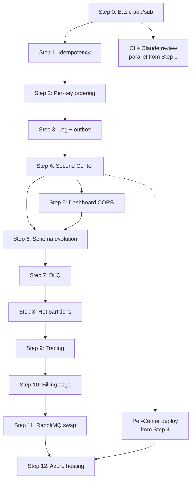

# DuckNet — Detailed Implementation Plan

> **Sources:** [CentersBuildPlan.md](./CentersBuildPlan.md) (what to build, why) and [DuckNetArchitectureSteps.html](./DuckNetArchitectureSteps.html) (architecture per step).
>
> **Goal:** Rebuild Telia-style interconnected-Center complexity in the smallest runnable codebase — toy domain, real seams.

---

## Executive summary

DuckNet is a stepwise .NET 9 learning/production-shaped demo: smart rubber ducks emit `Squeaked` facts; autonomous Centers react without calling each other or sharing databases. Each step adds one distributed-systems concept while keeping the demo runnable end-to-end.

| Phase | Steps | Outcome |
|-------|-------|---------|
| **A — The Kernel** | 0–3 | At-least-once, idempotency, per-key ordering, durable log + outbox |
| **B — Distributed** | 4–6 | Multi-Center Aspire host, CQRS projections, schema evolution |
| **C — Production pain** | 7–11 | DLQ, hot partitions, tracing, sagas, broker swap |
| **D — Cloud & ops** | 12+ | Azure hosting, per-Center CI/CD, CCA-F-aligned agent workflows |

**Interview milestone:** Steps 0–4 before Epiroc interview (~4–5 evenings).

**Parallel from Step 0:** Minimal GitHub Actions CI + Claude headless PR review (see [CI/CD & Claude review](#cicd--deploy-any-center-any-time) and [CCA-F integration](#cca-f-integration--development--cicd--system)).

---

## Non-negotiable rules

These constraints *are* the architecture — do not relax them for convenience:

1. **No Center-to-Center calls.** Integration is events only.
2. **No shared database.** Each Center owns its schema; cross-Center reads go through events or local projections.
3. **Events are past facts**, never commands (`Squeaked`, not `SqueakTheDuck`).
4. **Transport is hostile:** at-least-once delivery and unordered across keys — simulate even in-memory.
5. **Every step stays runnable.** Tag commits per step; never leave main in a broken state.

---

## Solution layout (evolves by step)

### Phase A (Steps 0–3) — single project

```
DuckNet/
├── DuckNet.sln
├── src/
│   └── DuckNet.Kernel/              # Console app; rename/split later
│       ├── Program.cs
│       ├── Domain/
│       │   ├── Events/
│       │   │   └── Squeaked.cs
│       │   └── DuckState.cs
│       ├── Transport/
│       │   ├── IEventBus.cs
│       │   ├── InMemoryEventBus.cs
│       │   ├── HostileBusMiddleware.cs   # dup + shuffle (Steps 1–2)
│       │   └── EventEnvelope.cs
│       ├── Consumer/
│       │   ├── Inbox.cs
│       │   ├── PerKeySequencer.cs
│       │   ├── SqueakCounter.cs
│       │   └── ConsumerOffsetStore.cs
│       ├── Producer/
│       │   ├── DuckSimulator.cs
│       │   └── OutboxDispatcher.cs       # Step 3
│       └── Persistence/
│           ├── EventLogStore.cs          # append-only
│           ├── OutboxStore.cs
│           └── StateStore.cs
└── tests/
    └── DuckNet.Kernel.Tests/
```

### Phase B onward — Aspire multi-project

```
DuckNet/
├── DuckNet.AppHost/                  # Aspire orchestration (Step 4+)
├── src/
│   ├── DuckNet.Contracts/            # Shared event DTOs + versions
│   ├── DuckNet.EventBus/             # IEventBus + in-memory impl
│   ├── DuckNet.TelemetryCenter/
│   ├── DuckNet.AlarmCenter/
│   ├── DuckNet.DashboardCenter/      # Step 5
│   └── DuckNet.BillingCenter/        # Step 10
├── .github/
│   └── workflows/
│       ├── ci.yml                    # build + test (Step 0)
│       ├── claude-review.yml         # ReviewFlow triage + specialists (Step 0)
│       └── deploy-center.yml         # per-Center deploy (Step 4+)
├── infra/
│   ├── bicep/                        # Step 12 — Azure resources
│   └── docker/                       # one Dockerfile per Center
├── CLAUDE.md                         # architecture rules for humans + agents
├── .claude/
│   └── skills/                       # CCA-F-aligned project skills
└── tests/
    ├── DuckNet.Kernel.Tests/         # keep kernel tests
    ├── DuckNet.AlarmCenter.Tests/
    └── ...
```

**Shared library rule:** `DuckNet.Contracts` holds *immutable event shapes and metadata only* — no behavior, no DB access, no HTTP clients. Centers reference it; they never reference each other.

---

## Core abstractions (introduce early, keep stable)

### Event envelope

Every message on the bus carries metadata separate from payload:

```csharp
record EventEnvelope(
    Guid EventId,           // unique per emission — inbox dedup key
    string Type,            // e.g. "Squeaked"
    int Version,            // contract version
    string PartitionKey,    // duckId
    long SequenceNumber,    // per-partition monotonic
    DateTimeOffset OccurredAt,
    string PayloadJson,
    string? TraceId = null,
    string? CausationId = null
);
```

### IEventBus

```csharp
interface IEventBus
{
    Task PublishAsync(EventEnvelope envelope, CancellationToken ct);
    IAsyncEnumerable<EventEnvelope> SubscribeAsync(
        string consumerGroup,
        CancellationToken ct);
}
```

- **Consumer group** = logical subscriber identity (e.g. `alarm-center`, `dashboard-projector`).
- Step 11 adds `RabbitMqEventBus : IEventBus` — Center projects unchanged.

### Hostile transport middleware

Composable pipeline wrapping any bus:

| Middleware | Step | Behavior |
|------------|------|----------|
| `DuplicatorMiddleware` | 1 | Re-enqueue ~10–20% of events after random delay |
| `ShufflerMiddleware` | 2 | Buffer + release in random order (per burst or globally) |
| Both | 3+ | Applied after log replay / dispatcher read |

Make duplication and shuffle **configurable via env vars** for demos and tests.

---

## Domain events (contract catalog)

| Event | Producer | Version | Key fields |
|-------|----------|---------|------------|
| `Squeaked` | TelemetryCenter | v1: `duckId, seq, at` · v2: + `volumeDb` | `duckId` |
| `AlarmRaised` | AlarmCenter | v1: `duckId, rate, windowStart` | `duckId` |
| `AlarmResolved` | AlarmCenter | v1: `duckId, resolvedAt` | `duckId` |
| `FeeReserved` | BillingCenter | v1: `alarmId, duckId, amount, expiresAt` | `alarmId` |
| `FeeReleased` | BillingCenter | v1: `alarmId, reason` | `alarmId` |

Store payloads as JSON in the log; deserialize with version-aware readers from Step 6 onward.

---

## Phase A — The Kernel

### Step 0 — One event, one producer, one consumer

**Architecture:** `DuckSimulator → Channel<Event> → SqueakCounter`

**Implement:**

1. **`Squeaked` record** — `DuckId`, `SequenceNumber`, `OccurredAt`.
2. **`DuckSimulator`** — background loop; N ducks, random squeak intervals; assigns incrementing seq per duck.
3. **`InMemoryEventBus`** — thin wrapper over `Channel<EventEnvelope>` (no hostility yet).
4. **`SqueakCounter`** — subscribes, increments global + per-duck totals, logs every N events.
5. **`Program.cs`** — wire simulator + counter; run until Ctrl+C.

**Acceptance criteria:**

- [x] Counter totals match events produced (deterministic seed optional).
- [x] Producer has zero references to consumer types.
- [x] Solution builds; ~150 lines in kernel project acceptable.

**Git:** branch `step-0` → merge to `main` → tag `step-0`

**Demo script:** Run 30s; show per-duck and total counts.

**Estimated effort:** ~2 hours.

---

### Step 1 — At-least-once + idempotent consumer

**Architecture:** `Simulator → HostileBus (Duplicator) → Inbox → SqueakCounter`

**Implement:**

1. **`DuplicatorMiddleware`** — after publish, with probability `P` (default 0.15), clone envelope with **same `EventId`** and re-enqueue.
2. **`Inbox`** — `HashSet<Guid>` or SQLite table `processed_events(event_id PK)`; check before handle; mark after successful handle.
3. **`SqueakCounter`** — skip if `EventId` already processed.
4. **Mis-demo mode** — flag to disable inbox; show wrong counts live, then fix.

**Acceptance criteria:**

- [x] With `DUPLICATE_RATE=0.20`, counts remain exact over 10k events.
- [x] Duplicate deliveries log at debug: `"Skipping duplicate {EventId}"`.
- [x] Inbox survives in-memory only (Phase A Step 1); persistence comes Step 3.

**Tests:**

- Property-style: publish event twice with same id → handler runs once.
- Integration: 1000 events, 20% dup rate → exact count.

**Estimated effort:** ~1 evening.

---

### Step 2 — Out-of-order delivery + per-key ordering

**Architecture:** `Simulator (+ key, seq) → HostileBus (Duplicator + Shuffler) → PerKeySequencer → Inbox → Counter`

**Implement:**

1. **Extend `Squeaked`** — enforce `PartitionKey = DuckId`, monotonic `SequenceNumber` per duck at producer.
2. **`ShufflerMiddleware`** — collect events in a buffer; flush in shuffled order (windowed shuffle: e.g. shuffle within batches of 50).
3. **`PerKeySequencer`** — per `PartitionKey` state:
   - `nextExpectedSeq`
   - `Dictionary<long, EventEnvelope> buffer`
   - On receive: if `seq == nextExpected`, emit and drain buffer; if `seq > nextExpected`, buffer; if `seq < nextExpected`, treat as duplicate (drop or inbox handles).
4. **Gap policy** — log gap after timeout (e.g. 5s) for demo visibility; document that real systems would DLQ or alert.

**Acceptance criteria:**

- [x] Shuffled + duplicated stream → correct per-duck sequence and totals.
- [x] Explicit comment/doc: *ordering is per-partition-key, never global*.

**Tests:**

- Feed events `{duckA:1, duckB:1, duckA:2}` in order `(B1, A2, A1)` → output `(A1, A2, B1)` or equivalent per-key correct order.

**Estimated effort:** ~1 evening.

---

### Step 3 — Durability: append-only log + outbox

**Architecture:**

```
Producer: Simulator → Tx(state + outbox) → OutboxDispatcher → EventLog
Transport: EventLog → HostileBus → PerKeySequencer → Inbox → Handler
Consumer: Handler → ConsumerOffsetStore
```

**Implement:**

1. **SQLite first** (locked in for Steps 3–7) — single file per Center for simplicity. **PostgreSQL from Step 8** when concurrent writers matter; same schema, connection string swap only.

   **`event_log`** table:
   ```sql
   CREATE TABLE event_log (
     offset INTEGER PRIMARY KEY AUTOINCREMENT,
     event_id TEXT NOT NULL UNIQUE,
     partition_key TEXT NOT NULL,
     type TEXT NOT NULL,
     version INTEGER NOT NULL,
     payload_json TEXT NOT NULL,
     occurred_at TEXT NOT NULL
   );
   ```

   **`outbox`** table:
   ```sql
   CREATE TABLE outbox (
     id INTEGER PRIMARY KEY AUTOINCREMENT,
     event_id TEXT NOT NULL,
     payload_json TEXT NOT NULL,
     published_at TEXT NULL
   );
   ```

   **`consumer_offsets`** table:
   ```sql
   CREATE TABLE consumer_offsets (
     consumer_group TEXT PRIMARY KEY,
     last_offset INTEGER NOT NULL
   );
   ```

   **`inbox`** table (replace in-memory set):
   ```sql
   CREATE TABLE inbox (
     consumer_group TEXT NOT NULL,
     event_id TEXT NOT NULL,
     processed_at TEXT NOT NULL,
     PRIMARY KEY (consumer_group, event_id)
   );
   ```

2. **`StateStore`** — duck aggregate state if needed for simulator realism (last seq per duck).

3. **Transactional publish** — single transaction: update state + insert outbox row.

4. **`OutboxDispatcher`** — background loop: read unpublished outbox rows → append to `event_log` → mark published → push to bus (or bus reads from log tail).

5. **`LogTailReader`** — consumer reads from `last_offset + 1`; hostile middleware applied after read.

6. **Checkpointing** — after successful handle + inbox write, update offset in **same transaction** as inbox insert.

**Acceptance criteria:**

- [x] Kill consumer mid-stream; restart → resumes from offset, no double-count.
- [x] Kill producer mid-transaction → no orphaned dual-write (outbox only commits with state).
- [x] Full log replay from offset 0 reproduces same handler side effects.

**Demo script:**

1. Run until ~500 events.
2. `kill -9` consumer.
3. Restart → counts continue correctly; show offset in DB.

**Phase A tag:** `step-3-kernel-complete`

**Estimated effort:** ~2 evenings.

---

## Phase B — Becoming Distributed

### Step 4 — Second Center, own database (Aspire)

**Architecture:** Aspire AppHost hosts TelemetryCenter + AlarmCenter; shared event log; separate DBs.

**Implement:**

1. **`DuckNet.AppHost`**
   - Add TelemetryCenter + AlarmCenter projects.
   - SQLite/Postgres containers or per-center connection strings.
   - Shared `event_log` — owned by TelemetryCenter *infrastructure* but readable by subscribers via bus abstraction (not direct DB coupling: subscribers consume via `IEventBus` backed by log tail / dispatcher).

2. **`TelemetryCenter`**
   - DuckSimulator + ingest API (optional minimal HTTP health).
   - Own DB: duck registry, outbox, event log writes.
   - Publishes `Squeaked`.

3. **`AlarmCenter`**
   - Own DB: `alarms`, `alarm_rules`, inbox, offsets.
   - Handler: sliding window rate count per duck; if > N/minute → insert alarm + publish `AlarmRaised` via local outbox.
   - Subscribes to `Squeaked` only.

4. **Enforce boundaries**
   - No project references between Centers.
   - Separate connection strings in AppHost.
   - Integration tests spin both centers; assert AlarmCenter never opens Telemetry DB.

**Configuration:**

| Setting | Default | Purpose |
|---------|---------|---------|
| `ALARM_RATE_THRESHOLD` | 10 | squeaks/minute |
| `ALARM_WINDOW_SECONDS` | 60 | sliding window |

**Acceptance criteria:**

- [x] Stop AlarmCenter 60s; TelemetryCenter keeps publishing; restart AlarmCenter → catches up, alarms fire for qualifying ducks.
- [x] No synchronous HTTP between Centers.
- [x] Aspire dashboard shows both services healthy.

**Demo script:** Stop alarm service → squeak storm → restart → alarm backlog drains.

**Estimated effort:** ~2 evenings.

---

### Step 5 — CQRS: disposable read model

**Architecture:** DashboardCenter projects `squeaks_per_duck_per_hour` from log; rebuild command drops and replays.

**Implement:**

1. **`DashboardCenter`**
   - Consumer group: `dashboard-projector`.
   - Read model table:
     ```sql
     CREATE TABLE squeaks_by_duck_hour (
       duck_id TEXT NOT NULL,
       hour_utc TEXT NOT NULL,
       count INTEGER NOT NULL,
       PRIMARY KEY (duck_id, hour_utc)
     );
     ```
   - **`Projector`** — idempotent upsert on `Squeaked` (and later events if needed).
   - **`RebuildHostedService` or CLI command** — truncate read model; reset offset to 0; replay.

2. **Query API** — minimal GET `/dashboard/duck/{id}` or `/dashboard/summary` for demo.

**Acceptance criteria:**

- [x] Delete/truncate read model DB → run rebuild → identical row counts to pre-delete snapshot.
- [x] Projector handles duplicate events (inbox or upsert idempotency).
- [x] DashboardCenter never writes to Telemetry or Alarm DBs.

**Tests:**

- Snapshot read model after 1000 events → rebuild → assert deep equality.

**Estimated effort:** ~1 evening.

---

### Step 6 — Schema evolution across a boundary

**Architecture:** Telemetry emits `Squeaked v2`; log contains mixed v1/v2; upcasters in each consumer.

**Implement:**

1. **`SqueakedV1` / `SqueakedV2`** in Contracts — v2 adds `VolumeDb` (nullable in upcaster default: 0 or estimated).

2. **`IEventUpcaster` chain**
   ```csharp
   interface IEventUpcaster
   {
     bool CanUpcast(string type, int version);
     EventEnvelope Upcast(EventEnvelope source);
   }
   ```

3. **TelemetryCenter** — emit v2 for new events; keep v1 deserializable for replay tests.

4. **AlarmCenter** — upcast v1→v2 before rate handler; handler only sees v2.

5. **DashboardCenter** — upcast; projector stores `volume_db` column (migration adds nullable column).

6. **Test fixture** — seed log with alternating v1/v2 payloads; replay all Centers.

**Acceptance criteria:**

- [x] Mixed log replays cleanly in Alarm + Dashboard without code changes in handlers.
- [x] Upcaster unit tests for v1→v2 defaults.

**Estimated effort:** ~1 evening.

**Phase B tag:** `step-6-three-centers`

---

## Phase C — Production-Shaped Pain

### Step 7 — Poison messages + DLQ

**Architecture:** `Log → RetryPipeline → Handler`; exhausted retries → DLQ; stream continues.

**Implement:**

1. **`RetryPipeline`** — wrap handler; catch exceptions; exponential backoff; max attempts (e.g. 5).

2. **`dead_letter_queue`** table:
   ```sql
   CREATE TABLE dead_letter_queue (
     id INTEGER PRIMARY KEY AUTOINCREMENT,
     consumer_group TEXT,
     event_id TEXT,
     payload_json TEXT,
     error TEXT,
     failed_at TEXT,
     attempts INTEGER
   );
   ```

3. **Poison injector** — test-only HTTP or env flag `INJECT_POISON_EVENT=true` adds one malformed payload.

4. **DLQ replay tool** — CLI: re-enqueue single DLQ entry by id.

**Acceptance criteria:**

- [x] One bad event does not block partition processing.
- [x] DLQ row inspectable (error message, payload).
- [x] Manual replay succeeds after fix or skip.

**Estimated effort:** ~1 evening.

---

### Step 8 — Backpressure + hot partitions

**Architecture:** `LoudDuck (100x) → Log → Key-hash sharding → N workers with bounded channels → lag metrics`

**Implement:**

1. **`LoudDuck` profile** — one duckId with 100x squeak rate in simulator config.

2. **Shard assignment** — `shard = Hash(partitionKey) % ShardCount` (default 3).

3. **Worker pool** — each shard has bounded `Channel`; `TryWrite` failure → backpressure signal (drop simulator rate or block producer in demo).

4. **Metrics** — per-shard lag = `latest_log_offset - last_processed_offset`; expose via `/metrics` or Aspire OpenTelemetry meters.

5. **Before/after demo** — single-thread consumer shows lag spike; sharded shows bounded lag on other ducks.

**Acceptance criteria:**

- [x] Hot key causes measurable lag without sharding.
- [x] With sharding, non-hot ducks stay near real-time.
- [x] Lag metrics visible in logs or dashboard.

**Estimated effort:** ~1–2 evenings.

---

### Step 9 — Distributed tracing

**Architecture:** `traceId + causationId` on every envelope; OTel spans per Center; Aspire dashboard shows E2E trace.

**Implement:**

1. **Envelope propagation** — simulator creates `traceId`; each handler starts span, sets `causationId = parent EventId`.

2. **OpenTelemetry** — `AddOpenTelemetry()` in each Center; Aspire service defaults.

3. **ActivitySource** names — `DuckNet.Telemetry`, `DuckNet.Alarm`, etc.

4. **Baggage** (optional) — `duckId` on span attributes.

**Acceptance criteria:**

- [x] One squeak trace visible: Simulator → Telemetry → Alarm → Dashboard spans linked.
- [x] Trace survives duplicate delivery (same traceId on replays — document idempotent span handling).

**Estimated effort:** ~1 evening.

---

### Step 10 — Saga: cross-Center workflow without transactions

**Architecture:** BillingCenter state machine driven by `AlarmRaised` / `AlarmResolved` + 5-minute timeout compensation.

**Implement:**

1. **`BillingCenter`**
   - Saga table:
     ```sql
     CREATE TABLE billing_sagas (
       alarm_id TEXT PRIMARY KEY,
       duck_id TEXT NOT NULL,
       state TEXT NOT NULL,  -- Reserved | Released | Expired
       amount_cents INTEGER NOT NULL,
       reserved_at TEXT NOT NULL,
       expires_at TEXT NOT NULL
     );
     ```

2. **State machine**
   - `AlarmRaised` → if no row, insert saga `Reserved`, publish `FeeReserved`.
   - `AlarmResolved` before `expires_at` → `Released`, publish `FeeReleased` (compensation).
   - Timeout worker → if still `Reserved` after 5 min → publish `FeeReleased` with reason `Timeout`.

3. **Idempotency** — inbox on `alarm_id` events.

4. **No distributed locks** — duplicate `AlarmRaised` must not double-charge (DB PK + inbox).

**Acceptance criteria:**

- [x] Happy path: alarm → fee reserved → alarm resolved → fee released.
- [x] Timeout path: fee released after 5 min without resolve.
- [x] AlarmCenter and BillingCenter never call each other.

**Demo script:** Fast resolve vs slow resolve side-by-side.

**Estimated effort:** ~2 evenings.

---

### Step 11 (stretch) — Swap the transport

**Architecture:** `IEventBus` → RabbitMQ (Aspire container); in-memory impl removed from production path only.

**Implement:**

1. **`IEventBus` contract tests first** (no RabbitMQ yet). Green on `InMemoryEventBus` before any broker wiring. Today `InMemoryEventBus` ignores `consumerGroup` (one shared channel); the suite must fail until fan-out is real. Add `tests/DuckNet.EventBus.Tests`. Do not put Docker on Center/handler tests.
   - Two consumer groups each receive a copy of one publish.
   - Duplicate `EventId` is still delivered (at-least-once); inbox — not the bus — is the dedupe.
   - Envelope round-trip (`Type`, `PayloadJson`, `TraceId`, `CausationId`).
   - Same suite later runs twice: in-memory + `RabbitMqEventBus` (Testcontainers).
   - Reconnect: stop broker, publish, start, consumer continues (RabbitMQ-only; skip until item 2 exists).
   - Optional CI: Center `.csproj` / handler files must not reference RabbitMQ packages.

2. **`RabbitMqEventBus`**
   - Exchange: topic `ducknet.events`.
   - Routing key: `{type}.{version}` or partition key hash.
   - At-least-once: manual ack after handler + inbox commit; nack → redelivery.
   - Consumer groups → separate queues per group.
   - Plug into the contract suite from item 1; do not call this done on a demo-only check.

3. **AppHost** — RabbitMQ resource; connection string to all Centers.

4. **Event log retention** — log remains source of truth for replay; broker is transport, not system of record.

**Acceptance criteria:**

- [ ] `IEventBus` conformance suite green on `InMemoryEventBus` before RabbitMQ is added.
- [ ] Same suite green on `RabbitMqEventBus` (Testcontainers).
- [ ] Reconnect test: kill broker → consumer recovers.
- [ ] `git diff` on Center `.csproj` and handler code = empty (only AppHost + EventBus project change).
- [ ] Full demo runs on RabbitMQ.
- [ ] Kill broker → Centers retry/reconnect gracefully.

**Estimated effort:** ~3 evenings (contract tests + in-memory fan-out, then adapter, then Aspire).

**Phase C tag:** `step-11-production-shaped`

**Azure note:** Step 11 proves the port locally with RabbitMQ. Step 12 adds `ServiceBusEventBus` for Azure — same empty Center diff constraint applies again.

---

## Phase D — Cloud, CI/CD & certification-shaped ops

### Step 12 (future) — Host on Azure

**Goal:** Same Center boundaries and event-driven seams as local — swap infrastructure implementations, not Center code. This mirrors the Step 11 punchline at cloud scale.

**Learning notes:** options, 2018–2026 industry path, and lab pricing live in [docs/azure-deployment.md](./docs/azure-deployment.md). That file is not an implementation spec — this section remains the locked Azure target.

**Architecture decisions (locked in for Azure path):**

| Local (Steps 3–11) | Azure target | What changes |
|--------------------|--------------|--------------|
| SQLite per Center | **Azure Database for PostgreSQL Flexible Server** — one server, **separate database per Center** (Rule 2 preserved) | Connection strings via Key Vault; EF migrations per Center |
| Telemetry-owned append log | **Azure Event Hubs** (partition key = `duckId`) | Log write path moves from SQL table to Event Hub producer in TelemetryCenter; replay = consume from beginning |
| RabbitMQ | **Azure Service Bus** (topics + subscriptions = consumer groups) | New `ServiceBusEventBus : IEventBus`; Center handlers unchanged |
| Aspire AppHost (local) | **Azure Container Apps** — one app per Center | Container images from CI; KEDA scale on queue lag (Step 8 metrics) |
| OpenTelemetry → Aspire dashboard | **Azure Monitor / Application Insights** | Same OTel SDK; different exporter endpoint |
| DLQ table | **Service Bus dead-letter sub-queue** + optional blob archive for inspection | Retry policy moves to SDK + platform |
| Secrets in appsettings | **Azure Key Vault** + **Managed Identity** | No secrets in repo or GitHub env plaintext |

**What does *not* change:**

- Center `.csproj` projects and handler logic (same constraint as Step 11).
- `DuckNet.Contracts` event shapes.
- Outbox pattern inside each Center (still local DB transaction → publish).
- Consumer inbox, offset store, upcasters, saga state machines.

**Implement:**

1. **`infra/bicep/main.bicep`** (or modular stack):
   - Resource group per environment (`dev`, `prod`).
   - Container Apps Environment + one Container App per Center.
   - Event Hubs namespace + hub `ducknet-events`.
   - Service Bus namespace + topic `ducknet-events` + subscriptions per consumer group.
   - PostgreSQL Flexible Server + databases: `telemetry`, `alarm`, `dashboard`, `billing`.
   - Key Vault + Managed Identities per Container App.
   - Log Analytics + Application Insights.

2. **`DuckNet.EventBus` implementations:**
   - `EventHubsLogWriter` — TelemetryCenter appends to Event Hubs (system of record for replay).
   - `ServiceBusEventBus` — transport to Centers (at-least-once, subscription per group).
   - Keep `RabbitMqEventBus` and `InMemoryEventBus` for local dev — **environment selects implementation**.

3. **Aspire → Azure mapping:**
   - Replace AppHost orchestration with Bicep + Container Apps revision deploys.
   - Optional: keep AppHost for local dev only; `azd` profile for cloud (`azd init` + `azd up`).

4. **Hot partition story (Step 8) on Azure:**
   - Event Hubs partition count = shard count (e.g. 4).
   - `duckId` as partition key → same lesson as Telia Event Hubs/Cosmos.
   - Container Apps KEDA scaler on Service Bus subscription depth.

5. **Environments:**
   - `dev` — min replicas 0–1, smaller SKUs, synthetic ducks only.
   - `prod` — min replicas 1, alerts on DLQ depth and consumer lag.

**Acceptance criteria:**

- [ ] Full demo runs in Azure: squeak → alarm → dashboard → billing with trace in App Insights.
- [ ] Deploy/update **one** Center without redeploying others (see CI/CD below).
- [ ] Stop AlarmCenter Container App → events queue → restart → catches up with no data loss.
- [ ] `git diff` on Center handler projects empty when switching local RabbitMQ ↔ Azure Service Bus.

**Estimated effort:** ~3–5 evenings (IaC + first deploy + wiring). Incremental if Bicep scaffold starts at Step 4.

**Phase D tag:** `step-12-azure`

---

## CI/CD — deploy any Center, any time

**Principle:** Each Center is an independently deployable unit. CI validates the whole solution; CD deploys only what changed.

### Pipeline layout

```
.github/workflows/
├── ci.yml                 # every push + PR
├── claude-review.yml      # PRs only — triage + architecture/security + aggregate
└── deploy-center.yml      # manual dispatch + path-filtered auto deploy
```

### `ci.yml` — add at Step 0 (before any Center exists)

Runs on every push/PR to `main`:

```yaml
# Jobs: build, test, architecture-test
# Matrix: os [ubuntu-latest], dotnet [9.x]
# Steps: restore → build DuckNet.sln → test → (Step 4+) docker build --dry-run
```

**Done when:** red PR if tests fail; green main always deployable.

### `deploy-center.yml` — add at Step 4 (first multi-Center split)

**Triggers:**

1. **Manual `workflow_dispatch`** — inputs: `center` (telemetry | alarm | dashboard | billing | all), `environment` (dev | prod).
2. **Path-filtered auto-deploy to `dev`** on merge to `main`:
   - `src/DuckNet.TelemetryCenter/**` → deploy telemetry only
   - `src/DuckNet.AlarmCenter/**` → deploy alarm only
   - (same pattern for each Center)
   - `src/DuckNet.Contracts/**` or `src/DuckNet.EventBus/**` → deploy **all** Centers (shared contract change)

**Deploy steps (local Docker path, Steps 4–11):**

1. Build Center container image (`infra/docker/DuckNet.{Center}/Dockerfile`).
2. Tag: `{registry}/ducknet-{center}:{git-sha}`.
3. Push to GitHub Container Registry (ghcr.io).
4. Update Compose / Aspire deploy manifest for that Center only.
5. Smoke test: HTTP health + consume one synthetic event.

**Deploy steps (Azure path, Step 12+):**

1. Same build + push to Azure Container Registry.
2. `az containerapp update --name {center} --image ...` (or Bicep what-if + deploy scoped module).
3. Wait for revision healthy; run smoke test against Azure URL.
4. Rollback = redeploy previous image tag (keep last N tags).

### Per-Center Dockerfile pattern

One Dockerfile per Center from Step 4 — multi-stage, ~same shape for all:

```dockerfile
FROM mcr.microsoft.com/dotnet/sdk:9.0 AS build
WORKDIR /src
COPY . .
RUN dotnet publish src/DuckNet.TelemetryCenter -c Release -o /app

FROM mcr.microsoft.com/dotnet/aspnet:9.0
WORKDIR /app
COPY --from=build /app .
ENTRYPOINT ["dotnet", "DuckNet.TelemetryCenter.dll"]
```

### Deployment matrix

| Center | Image | DB | Subscribes | Publishes |
|--------|-------|-----|------------|-----------|
| TelemetryCenter | `ducknet-telemetry` | `telemetry` | — | `Squeaked` |
| AlarmCenter | `ducknet-alarm` | `alarm` | `Squeaked` | `AlarmRaised`, `AlarmResolved` |
| DashboardCenter | `ducknet-dashboard` | `dashboard` | all | — |
| BillingCenter | `ducknet-billing` | `billing` | alarm events | `FeeReserved`, `FeeReleased` |

### Secrets & environments

- GitHub Environments: `dev`, `prod` (prod requires reviewer approval).
- Secrets: `CLAUDE_CODE_OAUTH_TOKEN` (review job), Azure credentials / federated OIDC (`AZURE_CLIENT_ID`, etc.) from Step 12.
- Never store connection strings in repo — inject at deploy from Key Vault or GitHub Environment secrets.

**Acceptance criteria:**

- [ ] Merge to main that only touches AlarmCenter deploys AlarmCenter to dev — nothing else.
- [ ] Manual dispatch can deploy `all` or any single Center to prod.
- [ ] Contract change triggers full redeploy with visible pipeline fan-out.

---

## CCA-F integration — development, CI/CD & system

[Claude Certified Architect – Foundations (CCA-F)](https://claudearchitectcertification.com/exam-guide) tests production-shaped Claude systems across five domains. DuckNet is deliberately structured so **building the system IS studying for the exam** — not a separate course track.

### Domain map: exam ↔ DuckNet

| CCA-F domain | Weight | DuckNet practice |
|--------------|--------|------------------|
| **D1 Agentic architecture & orchestration** | 27% | Centers as autonomous agents; choreography via events (no hub calling slaves); BillingCenter saga as state machine; subagents in CI = specialized review skills per concern |
| **D2 Tool design & MCP** | 18% | MCP servers exposing DuckNet ops: `replay-log`, `inspect-dlq`, `rebuild-dashboard`, `publish-test-squeak` — Claude debugs the live system through tools, not SQL |
| **D3 Claude Code config & CI/CD** | 20% | `CLAUDE.md` hierarchy, project Skills, headless `-p` in GitHub Actions, PostToolUse hooks for formatting |
| **D4 Prompt engineering & structured output** | 20% | Review prompt returns JSON `{ "verdict", "violations[]", "suggestions[]" }`; event schema validation in CI |
| **D5 Context management & reliability** | 15% | Skills load step-specific context; review scopes to PR diff only; idempotent CI jobs; explicit failure modes in prompts |

### Development process (from Step 0)

1. **`CLAUDE.md` at repo root** — encode the five non-negotiable rules, Center isolation, and step tagging convention. This is the agent constitution (D3).

2. **Project Skills (`.claude/skills/`)** — add incrementally:

   | Skill | Introduced | Purpose |
   |-------|------------|---------|
   | `ducknet-kernel` | Step 0 | Inbox, sequencer, hostile bus patterns |
   | `ducknet-center` | Step 4 | Scaffold new Center with own DB + consumer group |
   | `ducknet-event-contract` | Step 6 | Version + upcaster checklist |
   | `ducknet-mcp-ops` | Step 9+ | MCP tool definitions for log/DLQ/rebuild |

3. **Plan mode for steps ≥ 4** — each new Center or infra step starts in Plan mode; implementation follows the step acceptance criteria in this doc (D3 exam pattern).

4. **MCP ops server (Step 9+, optional but high CCA-F value)** — small `DuckNet.Mcp` project exposing:
   - `get_consumer_lag(center, group)`
   - `list_dlq(center, limit)`
   - `replay_event(event_id)`
   - `rebuild_dashboard()`

   Connect in Claude Code settings — you debug distributed squeaks the way the exam expects (D2).

### CI/CD process (CCA-F D3)

| Workflow | CCA-F concept demonstrated |
|----------|------------------------------|
| `ci.yml` | Reliable automation; deterministic builds |
| `claude-review.yml` | Headless Claude Code in CI; `-p` flag; triage writes `review-state.json`, then isolated architecture + security specialists; `jq` aggregates one advisory comment |
| `deploy-center.yml` | Scoped automation; human approval gate on prod |
| PostToolUse hook | Auto `dotnet format` after agent edits locally |

Later / parked ReviewFlow and CI work lives in [docs/ci-policy.md](docs/ci-policy.md) — do not treat it as Step 0 scope.

### Interview / exam soundbite

*"DuckNet isn't just an event-driven demo — it's my CCA-F study lab: MCP tools for ops, headless Claude triaging every PR then running isolated architecture and security specialists through shared review-state JSON, and Centers orchestrated by events instead of a central conductor."*

---

## Claude as CI reviewer from the beginning

**Short answer: No, it's not a lot more work — and yes, it looks cool. Budget ~1–2 hours at Step 0.**

### Why add it early

- **CCA-F D3 (20%)** explicitly covers wiring Claude Code into CI/CD with headless mode — doing this from Step 0 means every later step is practice for the exam.
- **Architecture rules are enforced from day one** — the five non-negotiable rules in `CLAUDE.md` get checked on every PR before you have four Centers to accidentally couple.
- **Demo value** — PR comments like *"AlarmCenter references TelemetryCenter DB — violates Rule 2"* are instant interview material.

### Minimal setup (Step 0, ~1–2 hours)

1. **`CLAUDE.md`** — rules + project layout (~30 min).
2. **`.github/workflows/claude-review.yml`** (~30 min):

   ```yaml
   name: Claude Architecture Review
   on:
     pull_request:
       types: [opened, synchronize, reopened]
   jobs:
     review:
       runs-on: ubuntu-latest
       permissions:
         pull-requests: write
         contents: read
       steps:
         - uses: actions/checkout@v4
           with:
             fetch-depth: 0
         - name: Claude review
           env:
             CLAUDE_CODE_OAUTH_TOKEN: ${{ secrets.CLAUDE_CODE_OAUTH_TOKEN }}
           run: |
             claude -p "$(cat .github/prompts/architecture-review.md)" \
               --allowedTools "Read,Grep,Glob" \
               > review.md
         - uses: actions/github-script@v7
           with:
             script: |
               // post review.md as PR comment
   ```

3. **`.github/prompts/architecture-review.md`** — structured output prompt (D4):

   ```
   Review this PR diff against CLAUDE.md rules.
   Output JSON only: { "verdict": "approve"|"request_changes", "violations": [...], "notes": [...] }
   Fail the build if any violation severity is "critical".
   ```

4. **GitHub secret** `CLAUDE_CODE_OAUTH_TOKEN` — generate with `claude setup-token`, store in repo settings.

5. **Optional PostToolUse hook** (local dev, D3) — `dotnet format` on edited `.cs` files.

### What you defer (not Step 0 work)

See [docs/ci-policy.md](docs/ci-policy.md) for the ReviewFlow later list (nightly, code specialist, cheaper PR CI) and parked platform vision.

| Enhancement | When | Extra effort |
|-------------|------|--------------|
| Block merge on `request_changes` | Parked — Claude stays advisory | branch protection |
| Center-specific review skills | After MVP is boring | ~1 hr per skill |
| MCP-connected review (query test results) | Step 9 | ~2–3 hr |
| Re-introduce code/bug specialist behind triage | After ReviewFlow MVP is boring | prompt already on disk |

### Cost & reliability expectations

- **Cost:** Drafts and docs-only PRs are skipped. Triage is Haiku (~`$0.10`); architecture and security run only if requested (Haiku, ~`$0.15` each). Typical spend is cents per non-draft code PR.
- **Flakiness:** Pin prompt + `--tools ""`; review advises, **`ci.yml` tests decide merge**. Jobs fail only on missing auth, never on a review verdict. Never let Claude be the only gate until prompts are stable.
- **Exam alignment:** Headless CI review + `CLAUDE.md` + Skills = direct D3/D4/D5 study material.

### Recommended timeline

| Step | CI/CD milestone |
|------|-----------------|
| **0** | `ci.yml` + `claude-review.yml` + root `CLAUDE.md` |
| **4** | Dockerfiles + `deploy-center.yml` (local/ghcr) |
| **6** | Contract-change → deploy-all fan-out |
| **9** | MCP ops server for debug + richer review context |
| **12** | Azure OIDC + Container Apps deploy + App Insights |

---

## Cross-cutting concerns

### Configuration reference

| Variable | Used from | Description |
|----------|-----------|-------------|
| `DUPLICATE_RATE` | Step 1+ | 0.0–1.0 hostile redelivery |
| `SHUFFLE_ENABLED` | Step 2+ | Enable order randomization |
| `CONSUMER_GROUP` | Step 3+ | Subscriber identity |
| `SQLITE_PATH` / `ConnectionStrings__*` | Step 3+ | Persistence |
| `SHARD_COUNT` | Step 8+ | Worker parallelism |
| `LOUD_DUCK_ID` | Step 8+ | Hot partition demo |
| `ALARM_RATE_THRESHOLD` | Step 4+ | Alarms/minute |

### Testing strategy

| Layer | Focus |
|-------|--------|
| **Unit** | Inbox, sequencer, upcasters, saga transitions |
| **Integration** | SQLite log + outbox + restart recovery |
| **Architecture tests** | NetArchTest or manual: Centers don't reference each other |
| **Demo tests** | Scriptable `--run-demo --seconds 30` exit code 0 |

### Commit / tagging cadence

**Branch-per-step workflow (mandatory):**

1. Create branch from `main`: `git checkout -b step-N`
2. Implement until acceptance criteria pass locally (`dotnet test`, demo if applicable)
3. Commit on the branch: `feat(step-N): description`
4. Merge to `main`: `git checkout main && git merge step-N --no-ff`
5. Tag on `main`: `git tag step-N`
6. Push when remote exists: `git push origin main --tags`

Never implement the next step on the same branch. Never merge a step with failing tests.

- One git tag per completed step: `step-0` … `step-12`.
- Commit message format: `feat(step-N): short description`.
- Keep `ImplementationPlan.md` checklist updated as steps complete.

### Observability checklist (Step 9+)

- [x] Structured logging with `EventId`, `PartitionKey`, `ConsumerGroup`.
- [x] OTel traces across Centers.
- [x] Lag metrics per shard (Step 8+).
- [x] DLQ depth metric (Step 7+).

---

## Step dependency graph



Steps 5 and 6 can partially overlap after Step 4; Step 6 should not block Step 5 start. Steps 7–9 are mostly independent modules layered onto existing consumers. **CI + Claude review** runs in parallel from Step 0; **per-Center CD** from Step 4; **Azure** after Step 11.

---

## Interview preparation map

| Topic | Show in step | Talking point |
|-------|--------------|---------------|
| Exactly-once is a lie | 1 | Forced duplicates + inbox |
| Partition ordering | 2 | Shuffle + per-duck sequencer |
| Dual-write problem | 3 | Outbox pattern |
| Eventual consistency | 4 | Stop AlarmCenter, catch up |
| CQRS / projections | 5 | Delete DB, rebuild from log |
| Contract versioning | 6 | Mixed v1/v2 replay |
| Poison messages | 7 | DLQ without blocking |
| Hot keys | 8 | LoudDuck + sharding |
| Debuggability | 9 | Single trace across Centers |
| Sagas vs 2PC | 10 | Compensation + timeout |
| Ports & adapters | 11 | Empty Center diff on broker swap |
| Cloud migration | 12 | Same Centers, swap bus/log/DB to Azure |
| AI-native ops | CI + MCP | CCA-F: headless review + MCP debug tools |

**Phase A soundbite:** *"I've forced duplicates and out-of-order delivery on purpose and kept counts correct."*

**Phase B soundbite:** *"Two databases, zero sync calls — I can delete a read model and rebuild from the log."*

**Phase C soundbite:** *"I've reproduced hot-partition starvation and traced one squeak through four services."*

---

## Suggested schedule

| When | Steps | Cumulative capability |
|------|-------|------------------------|
| Evening 1 | 0–1 | Event mindset + idempotency story |
| Evening 2 | 2–3 | Ordering + durable kernel |
| Evening 3–4 | 4 | Multi-Center Aspire demo (**Epiroc ready**) |
| Leisure | 5–6 | CQRS + schema evolution |
| Leisure | 7–9 | Ops-shaped reliability |
| Leisure | 10–11 | Saga + broker swap punchline |
| Leisure | 12 | Azure + full CD pipeline |
| **Step 0 parallel** | CI + Claude review | ~1–2 hr; runs on every PR from day one |

---

## Definition of done (whole project)

- [ ] All steps 0–12 tagged and runnable (local Aspire through Step 11; Azure for Step 12).
- [ ] Architecture tests enforce Center isolation.
- [ ] README with demo commands for each step.
- [ ] `DuckNetArchitectureSteps.html` reflects final architecture (update if implementation diverges).
- [ ] Single-command demo: squeak → alarm → dashboard → billing trace visible in Aspire / App Insights.
- [ ] `ci.yml` green on main; `claude-review.yml` posting one aggregated ReviewFlow comment on PRs.
- [ ] `deploy-center.yml` can deploy any single Center or all to dev/prod.
- [ ] MCP ops tools documented for log replay, DLQ inspect, dashboard rebuild (CCA-F D2).

---

## Architecture decisions (locked in)

Resolved before Step 4 implementation:

| Decision | Choice | Rationale |
|----------|--------|-----------|
| **Database (Steps 3–7)** | **SQLite** per Center | Zero ops locally; file-per-DB keeps Rule 2 obvious |
| **Database (Steps 8+)** | **PostgreSQL** per Center | Hot-partition / concurrent writer demo needs real concurrency; same schema, swap connection string |
| **Database (Step 12 Azure)** | **Azure Database for PostgreSQL** — one server, separate DB per Center | Mirrors local model; no shared schema |
| **Log ownership** | **TelemetryCenter owns the write path** | Other Centers subscribe via `IEventBus` only — never read Telemetry's DB |
| **Log storage (local)** | Append-only table in Telemetry DB (Step 3–11) | Simple replay; same code path as outbox dispatcher |
| **Log storage (Azure)** | **Azure Event Hubs** | Telia-shaped partition key lesson; replay from beginning |
| **Broker (Step 11 local)** | **RabbitMQ** via Aspire container | Simplest local at-least-once broker; proves port/adapter |
| **Broker (Step 12 Azure)** | **Azure Service Bus** topics + subscriptions | Production-shaped; consumer group = subscription name |
| **IaC (Step 12)** | **Bicep** + optional `azd` | Native Azure; `azd`/Aspire emit Bicep; no state backend — see [decision record](docs/decisions/iac-bicep-vs-pulumi.md) |
| **Container hosting** | **Azure Container Apps** | One app per Center — matches deploy-any-Center CI/CD |
| **CI from** | **Step 0** | Cheap insurance; CCA-F D3 practice |
| **Claude PR review from** | **Step 0** | ~1–2 hr setup; high demo + exam value |
| **CD from** | **Step 4** | Needs real Center boundaries to mean anything |

Document any deviation in commit message when implementing the affected step.
