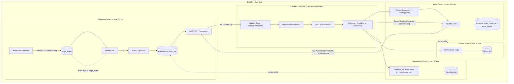
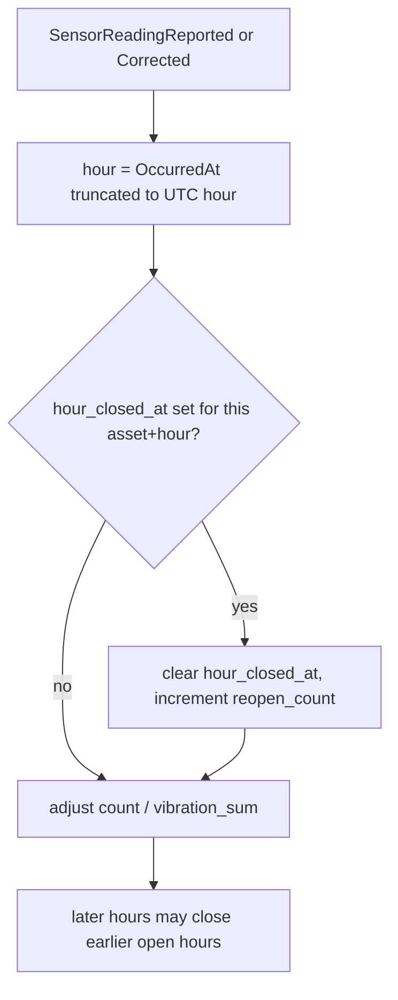

# OrePart-2 — store-and-forward + late data

**Not a numbered DuckNet step.** Lab slice on the existing four Centers. Closes industry-mapping **G1 (partial)** and **G2**: a mine gateway can sit offline; when it reconnects, readings arrive late with **device** `OccurredAt` / `SequenceNumber`.

**Punchline:** hour buckets and health follow event time, not ingest time. A replacement reading is a new fact (`SensorReadingCorrected`, new `EventId`), not a mutated log row.

## Delta vs [orepart-lab-slice](./orepart-lab-slice.md)

| | |
|--|--|
| **Added** | `EdgeBufferStore` (SQLite `edge_buffer` in Telemetry), `UplinkGate` / `UplinkDispatcher`, `SensorReadingCorrected` v1, Dashboard `readings_by_asset_hour` + `reading_facts` keyed by device hour, `hour_closed_at` reopen, Alarm `asset_readings` + re-score on correction |
| **Changed** | Fleet readings go through the edge buffer; `event_log` append happens only while uplink is up. Alarm applies corrections **outside** `PerKeySequencer` (same device seq would otherwise be dropped as late). |
| **Unchanged** | Duck squeaks still use the outbox, not the edge. No Center-to-Center calls. Inbox still keys on `EventId`. Hostile transport after log read. |

**HTML / plan note:** watermarks are not a framework. One `hour_closed_at` column plus “reopen if event-time hour ≤ last closed” is the whole late-data model. No MQTT/OPC-UA, no TSDB.

## Wire types

```text
EventEnvelope
  EventId          Guid                inbox key; correction mints a NEW id
  Type             string              SensorReadingReported | SensorReadingCorrected
  SequenceNumber   long                per-asset DEVICE seq (not log offset)
  OccurredAt       DateTimeOffset      device time; Dashboard hour key
  PartitionKey     string              assetId
  LogOffset        long                assigned at flush into event_log

SensorReadingReported v2   assetId, sequenceNumber, occurredAt,
                           engineHours, vibrationMmS, temperatureC, tenantId
SensorReadingCorrected v1  assetId, sequenceNumber, supersedesEventId, occurredAt,
                           engineHours, vibrationMmS, temperatureC, tenantId
```

Health still emits a **new** `AssetHealthPredicted` (and raise/resolve if thresholds cross). Old prediction rows are not mutated.

## Architecture

`IEventBus` is the only integration seam. The edge buffer and uplink gate live **inside Telemetry**, not a fifth Center. Inbox / sequencer stay on the consumer; they are not inside the bus.



## Execution

Happy path plus the two mis-demo branches this slice actually implements: uplink outage flush, and a quieting correction.

```mermaid
sequenceDiagram
  participant Fleet as AssetFleetSimulator
  participant Edge as edge_buffer
  participant Gate as UplinkGate
  participant Log as event_log
  participant Health as AlarmCenter
  participant Dash as DashboardCenter

  Fleet->>Edge: SensorReadingReported (device OccurredAt)
  Note over Gate: UPLINK_OUTAGE_SECONDS or POST /ingest/uplink/down
  Gate-->>Edge: hold
  Gate->>Log: flush burst, original OccurredAt + seq kept
  Log->>Health: tail + hostile bus
  Health->>Health: score vs previous vibration
  Health->>Log: AssetHealthPredicted / HealthAlertRaised
  Log->>Dash: project hour = device hour, not flush hour

  Note over Fleet,Dash: Correction (new EventId, same asset+seq)
  Fleet->>Log: SensorReadingCorrected
  Log->>Health: bypass PerKeySequencer
  Health->>Health: re-score that seq
  Health->>Log: new AssetHealthPredicted (maybe HealthAlertResolved)
  Log->>Dash: adjust same hour bucket; reopen if hour_closed_at set
```

Handler decision on Dashboard hour buckets:



Mis-demo / failure branches this slice implements:

- `UPLINK_OUTAGE_SECONDS` or `POST /ingest/uplink/down` → readings stay in `edge_buffer`; flush preserves device time
- Duplicate `EventId` on flush → `INSERT OR IGNORE`, inbox skip
- `SensorReadingCorrected` for a hot reading that becomes quiet → `HealthAlertResolved` (or score drop) and hour bucket updated
- Same device `SequenceNumber` on a **reported** reading still hits the sequencer (late drop); corrections skip that gate on purpose

## How to test

```bash
dotnet test --filter "FullyQualifiedName~EdgeBuffer|FullyQualifiedName~HealthCorrection|FullyQualifiedName~LateData"
dotnet test
```

Aspire: `FLEET_SIMULATOR=true`. `POST /ingest/uplink/down` then `/up`, `POST /ingest/correction`, Dashboard `GET /dashboard/readings`.
