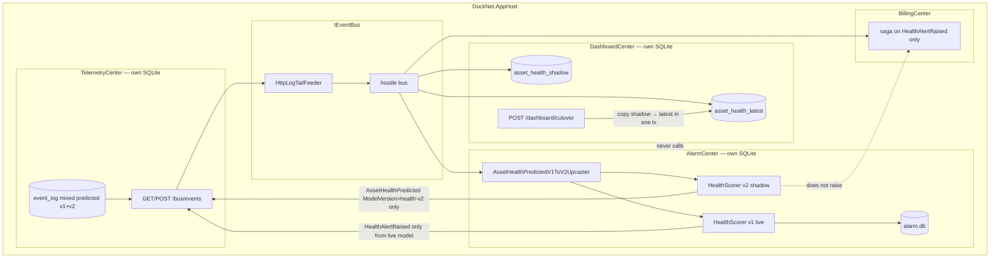
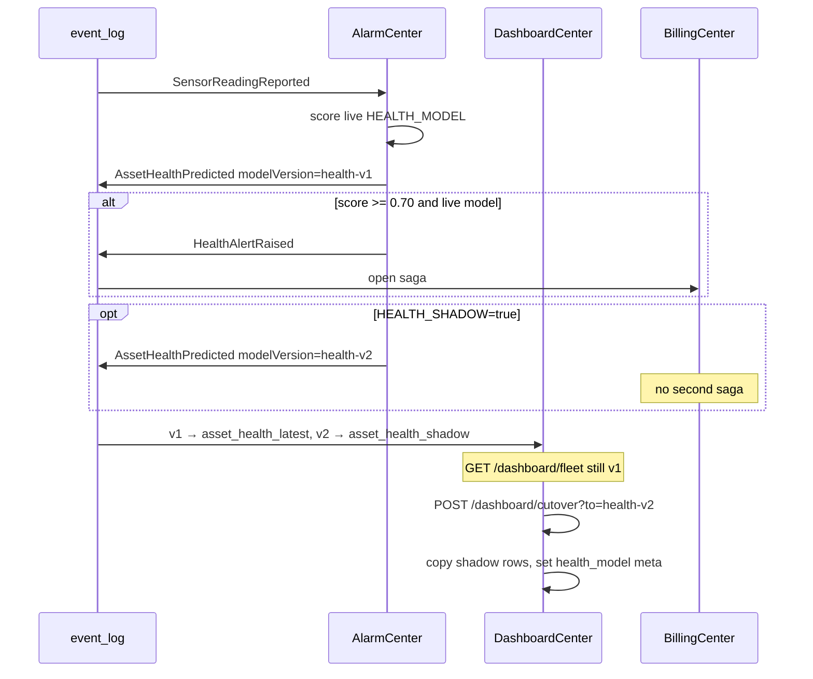
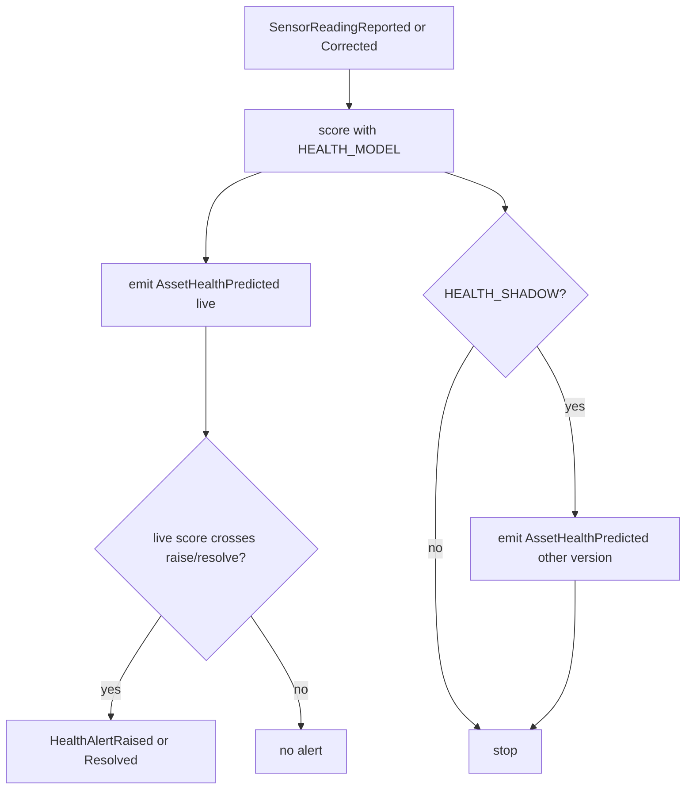

# OrePart-3 — versioned health + dual-run rebuild

**Not a numbered DuckNet step.** Lab slice after [orepart-2](./orepart-2.md). Closes industry-mapping **G3** (versioned scoring, not a trained model) and the event-backbone half of replay tooling.

**Punchline:** the product promise is “a model,” but the lab proves **versioned scoring + shadow + cutover**. Live queries keep hitting v1 until an explicit cutover.

## Delta vs [orepart-2](./orepart-2.md)

| | |
|--|--|
| **Added** | `AssetHealthPredicted` v2 `ModelVersion` (default `health-v1`), frozen `AssetHealthPredictedV1` + upcaster, `HealthScorer` v2 weights (0.60 / 0.25 / 0.15 vibration / temp / hours), `HEALTH_MODEL` / `HEALTH_SHADOW`, Dashboard `asset_health_shadow`, `POST /dashboard/cutover?to=` |
| **Changed** | Alarm may emit a **shadow** `AssetHealthPredicted` for the other model. Shadow never raises a second `HealthAlertRaised`. Dashboard routes live vs shadow by `health_model` meta. |
| **Unchanged** | Duck path. Inbox / sequencer / outbox. `POST /dashboard/rebuild` still **truncates and replays** (Step 5 path) so existing rebuild tests pass. |

**Plan divergence:** the roadmap sketched side-table rebuild (`?to=fleet-v2` then swap names). As-built dual-run is **health-only**: shadow predictions land in `asset_health_shadow` while live queries read `asset_health_latest`; cutover copies matching shadow rows in one transaction. Rebuild `?to=` is accepted on the route but does not build a second full projection.

No training loop. Weights are constants in `HealthScorer`.

## Wire types

Upcast does **not** mint a new `EventId`. Handlers parse v2 only.

```text
AssetHealthPredicted v1    assetId, score, predictedFailureAt, recommendedService,
                           vibrationMmS, temperatureC, engineHours
AssetHealthPredicted v2    …same…, modelVersion   // default health-v1 on upcast

HealthModels.V1 = "health-v1"
HealthModels.V2 = "health-v2"
```

Config:

```text
HEALTH_MODEL=v1|v2     which version may raise / resolve alerts (default v1)
HEALTH_SHADOW=true     also emit the other version; no second HealthAlertRaised
```

Aspire Alarm sets `HEALTH_SHADOW=true`.

## Architecture

Shadow scoring is an Alarm **outbox fact**, not a Dashboard HTTP call. Billing still keys sagas on `HealthAlertRaised.EventId`; a second prediction with a different `ModelVersion` does not open a second hold.



## Execution



Handler decision (Alarm):



Mis-demo / failure branches this slice implements:

- Mixed log: old `AssetHealthPredicted` v1 upcasts; `EventId` / `TraceId` preserved
- Shadow v2 does not double-create Billing sagas
- Cutover is explicit; live fleet scores stay v1 until `POST /dashboard/cutover`
- Rebuild truncate-replay (Step 5) still works; duck hour buckets unchanged

## How to test

```bash
dotnet test --filter "FullyQualifiedName~OrePartUpcaster|FullyQualifiedName~HealthCorrection|FullyQualifiedName~LateData"
dotnet test
```

Aspire: Alarm `HEALTH_SHADOW=true`. Compare Dashboard fleet vs shadow after a degraded `TRK-001` run, then `POST /dashboard/cutover?to=health-v2`.
