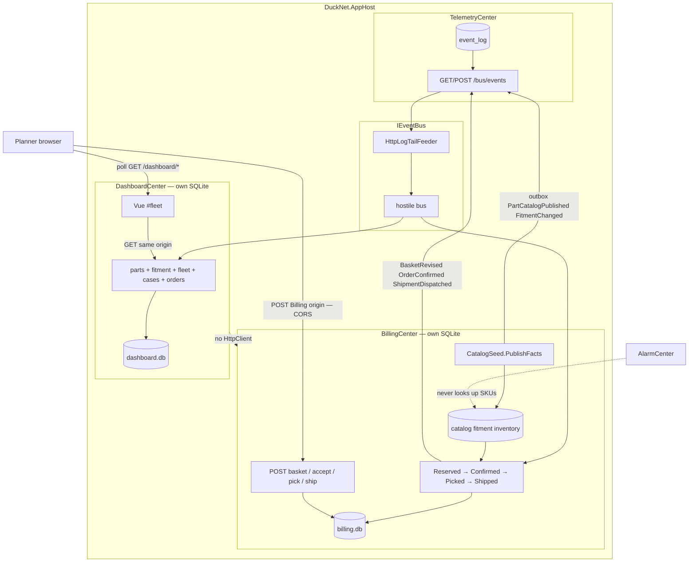
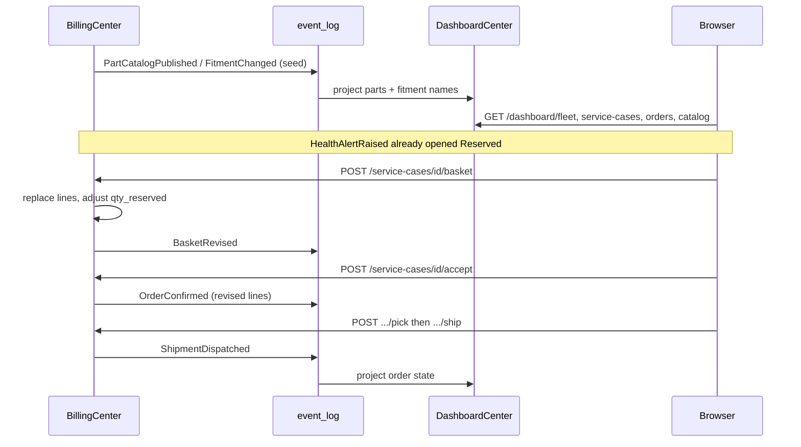
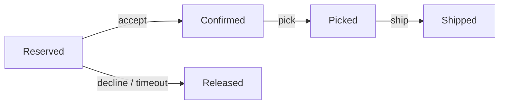

# OrePart-4 — catalog events, planner UI, fulfilment

**Not a numbered DuckNet step.** Lab slice after [orepart-3](./orepart-3.md). Closes industry-mapping **G4 leftover, G6, G7, G8**: Billing owns catalog and inventory; everyone else who needs part names **projects events**. Humans interrupt the saga. Confirm is not the end of the process.

**Punchline:** Dashboard `#fleet` polls Dashboard JSON, then the **browser** POSTs accept / decline / pick / ship to Billing. The Dashboard **process** never opens an HttpClient to Billing.

## Delta vs [orepart-3](./orepart-3.md)

| | |
|--|--|
| **Added** | `PartCatalogPublished` / `FitmentChanged` (Billing outbox on seed), Dashboard `parts` / `fitment` projections, `POST /service-cases/{id}/basket`, `BasketRevised`, saga `Confirmed` → `Picked` → `Shipped`, `POST .../pick` and `.../ship`, `ShipmentDispatched`, Vue `FleetView` at `#fleet` |
| **Changed** | Accept still consumes the hold as today; basket revise while `Reserved` adjusts `inventory.qty_reserved`. Timeout worker still expires **Reserved** only — it does not auto-ship. |
| **Unchanged** | Alarm still must not look up SKUs. No CommandCenter. CORS already on Billing. Duck `FeeReserved` path. |

Fulfilment stayed in this slice (under the ~10-file split threshold for a `orepart-4b`).

No catalog search, ERP, invoicing, picking-warehouse, or returns. Seeded SKUs + fitment already existed; this slice publishes them as facts and adds basket edit + two post-confirm states.

## Wire types

```text
PartCatalogPublished v1   sku, name, unitCents     // partition key: sku
FitmentChanged v1         equipmentModel, sku, quantity
BasketRevised v1          alarmId, assetId, lines[], totalCents
ShipmentDispatched v1     orderId, alarmId, assetId, shippedAt

OrderConfirmed v1         unchanged; lines match the basket at accept time
```

Commands (Billing HTTP, not events):

```text
POST /service-cases/{id}/basket   replace lines while Reserved
POST /service-cases/{id}/accept   Reserved → Confirmed (existing)
POST /service-cases/{id}/decline  Reserved → released (existing)
POST /service-cases/{id}/pick     Confirmed → Picked
POST /service-cases/{id}/ship     Picked → Shipped + ShipmentDispatched
```

Illegal transitions return conflict. Timeout does not pick or ship.

## Architecture

Catalog facts travel on the bus. Dashboard projects names for display. Planner commands never leave the browser → Billing origin.



## Execution



Saga states:



Mis-demo / failure branches this slice implements:

- Basket revise while not `Reserved` → conflict; no double-reserve on the same SKU
- Pick from `Reserved` or ship from `Confirmed` → conflict
- Dashboard shows SKU **names** after catalog events without opening `billing.db`
- Duplicate catalog EventIds (deterministic seed ids) → inbox skip

## How to test

```bash
dotnet test --filter FullyQualifiedName~BasketAndFulfilment
dotnet test
```

Aspire: Dashboard `#fleet`. Accept / decline / pick / ship buttons call the Billing base URL from `GET /catalog` (browser), not DashboardCenter.
