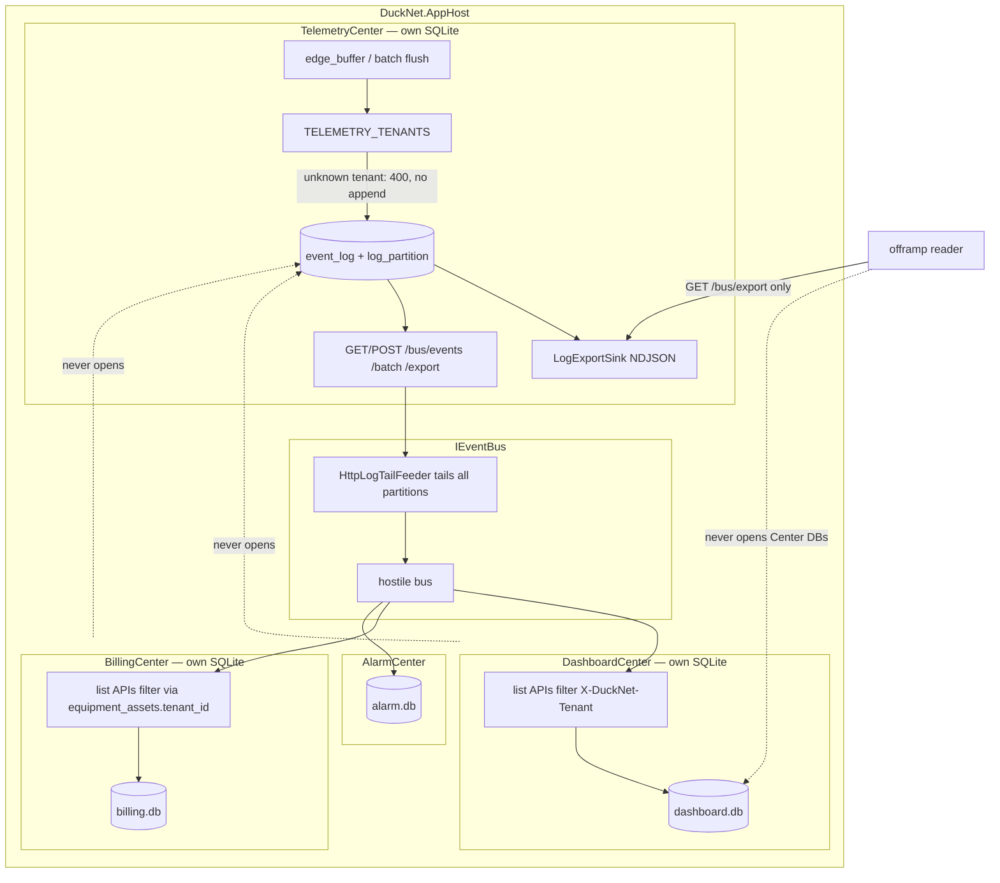
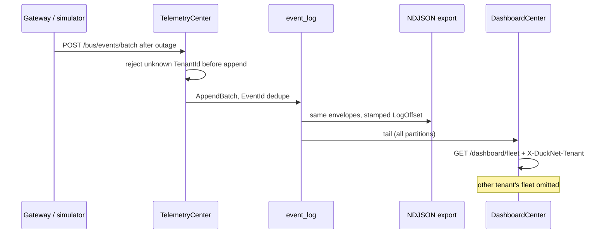
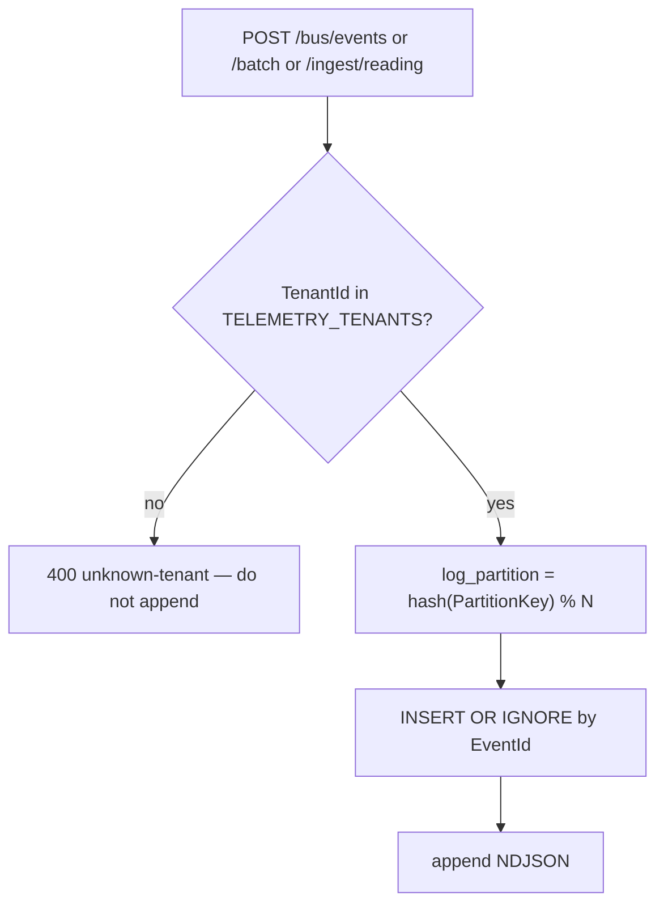

# OrePart-5 — partitioned ingest, tenant header, log export

**Not a numbered DuckNet step.** Lab slice after [orepart-4](./orepart-4.md). Closes industry-mapping **G1 rest, G5, G9**: owned partitions instead of a second writer; analytics reads an export from the log owner; tenancy is a header + payload field after the single-tenant loop is boring.

**Punchline:** Telemetry still owns the log. `hash(PartitionKey) % N` is the **local** analog of Event Hubs. Do not turn on Azure Event Hubs here (that is Step 12c). Other Centers never read the NDJSON file.

## Delta vs [orepart-4](./orepart-4.md)

| | |
|--|--|
| **Added** | `event_log.log_partition`, `LOG_PARTITION_COUNT` (Aspire default 4), `GET /bus/events?partition=`, `POST /bus/events/batch`, `TenantId` on `SensorReadingReported` v2 (upcast v1 → `tenant-default`), `TELEMETRY_TENANTS` allow-list, `X-DuckNet-Tenant` on Dashboard/Billing list APIs, `LogExportSink` NDJSON + `GET /bus/export?fromOffset=` |
| **Changed** | Unknown tenant on ingest is **rejected before append** (does not poison another tenant’s key). List APIs filter when the header is present; missing header returns all (tests / local demo). |
| **Unchanged** | Global autoincrement `LogOffset` so `ConsumerOffsetStore` still works. Duck path. No JWT / Entra. No lakehouse. Isolation: Dashboard/Billing still must not open telemetry SQLite. |

**Plan note:** `LogOffset` is **not** per-partition in this SQLite analog — a global offset plus a `log_partition` column keeps existing tailers simple. Per-partition offsets would break Step 3 checkpoint tests. Azure Event Hubs remains 12c.

## Wire types

```text
SensorReadingReported v1   no tenantId  → upcast TenantId = "tenant-default"
SensorReadingReported v2   …, tenantId
SensorReadingCorrected v1  …, tenantId

EventEnvelope.LogOffset    global SQLite autoincrement
event_log.log_partition    hash(PartitionKey) % LOG_PARTITION_COUNT
```

HTTP (Telemetry):

```text
POST /bus/events/batch     atomic tx; per-item INSERT OR IGNORE (EventId)
GET  /bus/events?after=&partition=
GET  /bus/export?fromOffset=
```

HTTP (Dashboard / Billing lists):

```text
X-DuckNet-Tenant: tenant-default | acme | …
```

Aspire Telemetry: `LOG_PARTITION_COUNT=4`, `TELEMETRY_TENANTS=tenant-default,acme`.

## Architecture

Partitions are a column on Telemetry’s owned log, not a shared bus concern. Export is Telemetry-owned append-only NDJSON next to the log.



## Execution



Ingest decision:



Mis-demo / failure branches this slice implements:

- Two tenants never appear on each other’s `/dashboard/fleet` when the header is set
- Batch flush after outage still dedupes by `EventId`
- Export contains the same envelopes as `event_log` for a captured offset range
- Unknown tenant does not land on another tenant’s partition key

## How to test

```bash
dotnet test --filter "FullyQualifiedName~EdgeBuffer|FullyQualifiedName~LateData"
dotnet test
```

Kernel tests cover partition assignment, batch append, and export round-trip. Dashboard tests cover tenant-filtered fleet lists.
