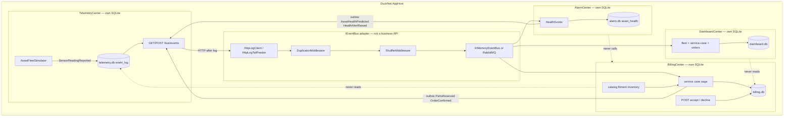
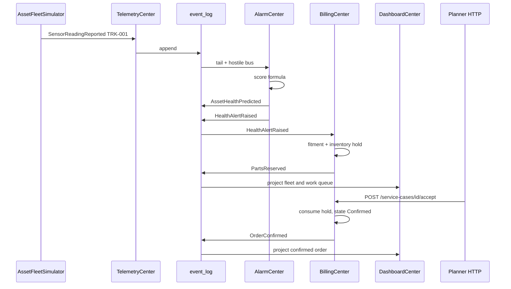

# OrePart lab slice — as-built

**Not a numbered DuckNet step.** This is a domain clone on the Step 12b machinery: a small seeded fleet, a transparent health model, and planner commands on BillingCenter. Later lab slices close the industry-mapping gaps: [orepart-2](./orepart-2.md) (late data), [orepart-3](./orepart-3.md) (versioned health), [orepart-4](./orepart-4.md) (catalog + fulfilment UI), [orepart-5](./orepart-5.md) (partitions + tenant + export).

**Punchline:** `TRK-001` degrades → `SensorReadingReported` → `AssetHealthPredicted` / `HealthAlertRaised` → parts hold → `POST /service-cases/{id}/accept` → `OrderConfirmed`, with `TraceId` / `CausationId` from reading to order.

## Delta vs Step 12b

| | |
|--|--|
| **Added** | `AssetFleetSimulator`, `SensorReadingReported`, `AssetHealthPredicted`, `HealthAlertRaised` / `HealthAlertResolved`, `PartsReserved` / `PartsReleased`, `OrderConfirmed`, `HealthScorer`, Billing catalog/fitment/inventory, `POST /service-cases/{id}/accept|decline`, Dashboard fleet / service-case / order projections |
| **Changed** | Aspire Telemetry runs the fleet simulator (`FLEET_SIMULATOR=true`). AlarmCenter scores readings in addition to the squeak rate window. BillingCenter still handles `AlarmRaised` / `FeeReserved` for the duck path. |
| **Unchanged** | No Center-to-Center business HTTP. No shared DB. Hostile transport after log read. Inbox, sequencer, outbox, DLQ, shards. Duck `Squeaked` contracts remain frozen. |

## Later slices (gaps closed as lab approximations)

This file stays the as-built for the first clone. Follow-on as-builts:

- [orepart-2.md](./orepart-2.md) — edge buffer, `SensorReadingCorrected`, event-time hour reopen
- [orepart-3.md](./orepart-3.md) — `AssetHealthPredicted` v2 + shadow + cutover
- [orepart-4.md](./orepart-4.md) — catalog facts, basket revise, pick/ship, Vue `#fleet`
- [orepart-5.md](./orepart-5.md) — partitioned `event_log`, `X-DuckNet-Tenant`, NDJSON export

Still not built (production, not lab): MQTT/OPC-UA, Influx/ClickHouse, a trained model, Entra ID, ERP, CMMS, warehouse returns, lakehouse, Azure Event Hubs (12c).

## Wire types

```text
SensorReadingReported v1   assetId, sequenceNumber, occurredAt, engineHours, vibrationMmS, temperatureC
AssetHealthPredicted v1    assetId, score, predictedFailureAt, recommendedService, vibrationMmS, temperatureC, engineHours
HealthAlertRaised v1       assetId, score, predictedFailureAt, recommendedService
HealthAlertResolved v1     assetId, resolvedAt
PartsReserved v1           alarmId, assetId, lines[], totalCents, expiresAt
PartsReleased v1           alarmId, reason   // AlarmResolved | Timeout | Declined
OrderConfirmed v1          orderId, alarmId, assetId, lines[], totalCents, confirmedAt
```

`HealthAlertRaised.EventId` is the service-case / saga id (same pattern as `AlarmRaised`). Partition key for ingest and health events is **asset id**; for commerce events it is **alarm id**.

Health score (not ML): `0.45 * vibrationNorm + 0.35 * tempNorm + 0.20 * hoursNorm`, plus `0.10` if vibration is rising. Raise at `>= 0.70`, resolve below `0.50`.

## Architecture



## Execution



Mis-demo / failure branches this slice actually implements:

- Duplicate `HealthAlertRaised` / reading `EventId` → inbox skip, no second hold
- No stock for fitted SKU → fee reserved, no `PartsReserved`, accept returns conflict
- Timeout or decline while `Reserved` → `FeeReleased` + `PartsReleased`, accept is a no-op
- Duck `Squeaked` / `AlarmRaised` / `FeeReserved` path still works without catalog fitment

## How to test

```bash
dotnet test
dotnet run --project src/DuckNet.AppHost
```

Then: Alarm `GET /predictions`, Billing `GET /service-cases`, `POST /service-cases/{alarmId}/accept`, Dashboard `GET /dashboard/fleet` and `GET /dashboard/orders`.
