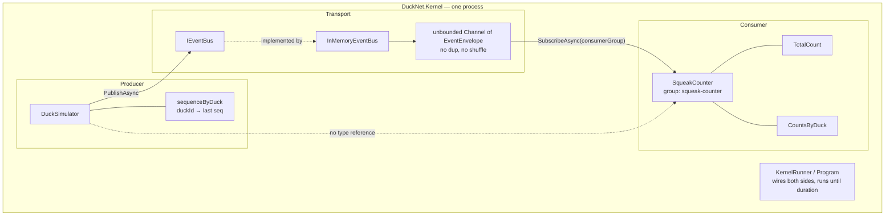
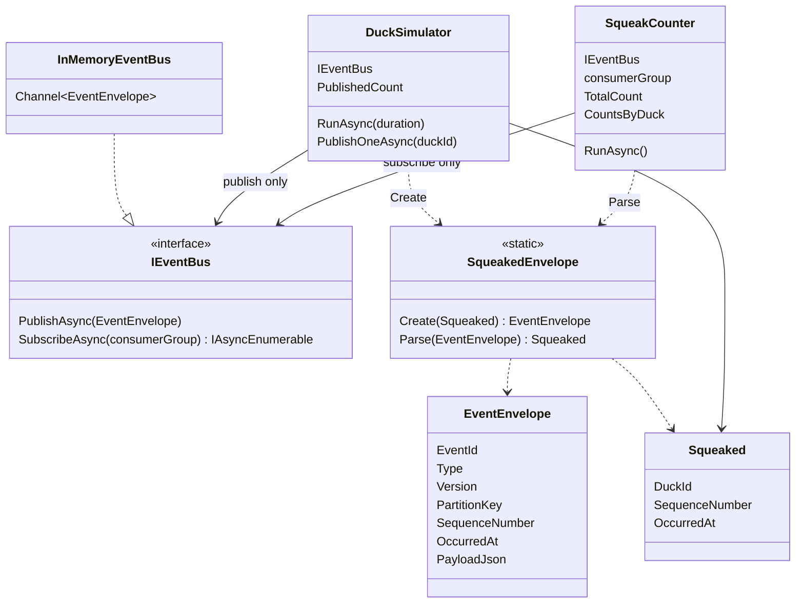
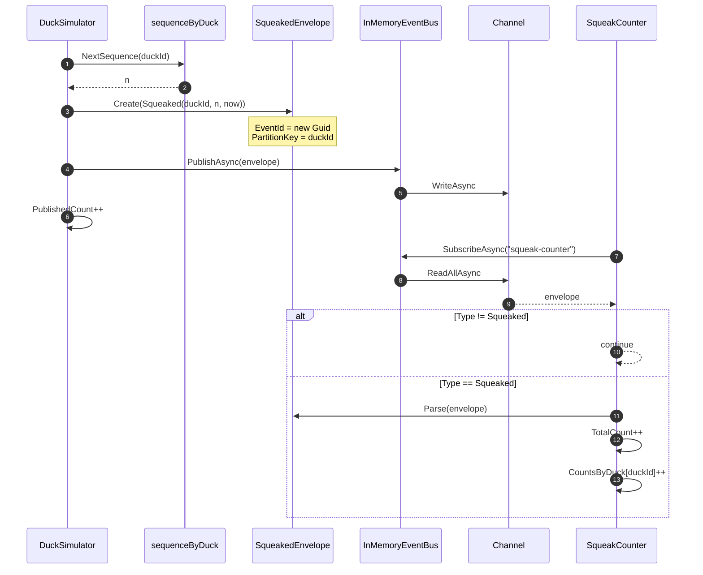
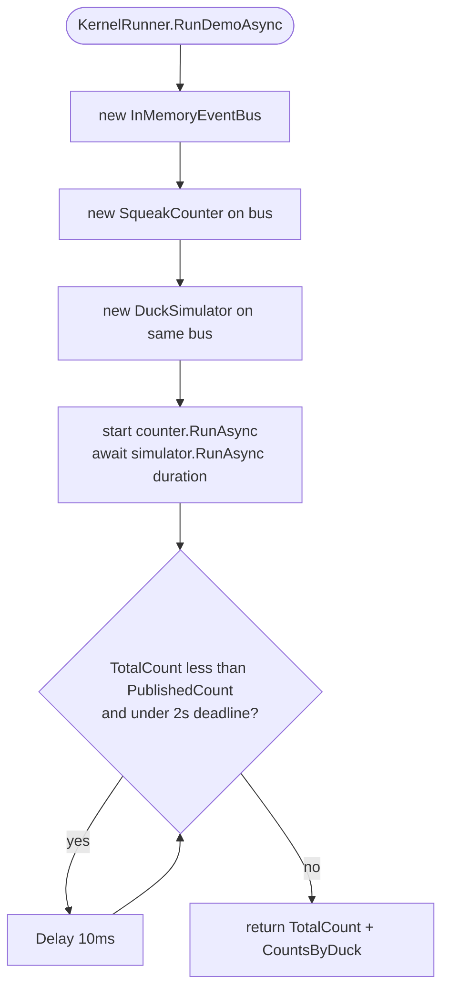
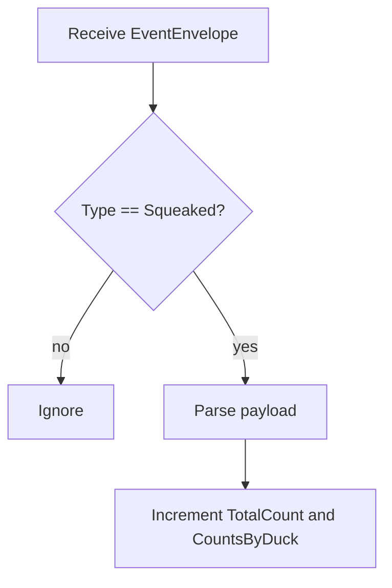

# Step 0 — as-built architecture

**Branch:** `step-0` → `main`  
**Punchline:** one producer, one consumer, counts match. Producer has zero references to consumer types.

Single process. No hostility, no inbox, no log, no second Center.

## Delta vs previous step

There is no previous step.

| | |
|--|--|
| **Added** | `Squeaked`, `EventEnvelope`, `IEventBus` / `InMemoryEventBus`, `DuckSimulator`, `SqueakCounter`, `KernelRunner` |
| **Changed** | — |
| **Unchanged** | — |

## Wire types

`EventEnvelope` is the only thing on the bus. Payload is JSON; domain type stays in `Domain/Events/`.

```text
EventEnvelope
  EventId          Guid     unique per emission (unused for dedup until Step 1)
  Type             string   "Squeaked"
  Version          int      1
  PartitionKey     string   duckId
  SequenceNumber   long     per-duck, assigned by producer
  OccurredAt       DateTimeOffset
  PayloadJson      string   Squeaked { DuckId, SequenceNumber, OccurredAt }
  TraceId          string?  unused
  CausationId      string?  unused
```

## Architecture

Producer and consumer share a process and an `IEventBus`. They do not share types: `DuckSimulator`’s constructor takes only `IEventBus`. The channel is unbounded and honest (exactly-once *in this step* only because nothing duplicates).





**Intentionally absent:** duplicator, inbox, sequencer, outbox, event log, second Center, persistence.

## Execution — one squeak



## Execution — demo lifecycle



Consumer has no end-of-stream: the runner waits until counts catch up (or 2s), then the process ends / tests cancel the subscription.

## Handler decision



No inbox: every delivered `Squeaked` increments the counter. That is correct only while the bus does not redeliver.
