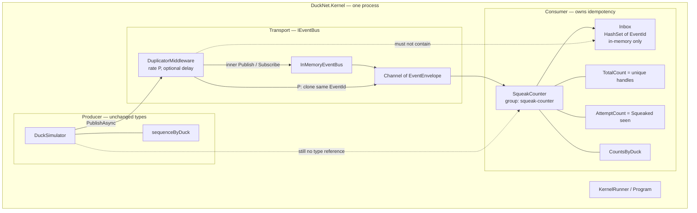
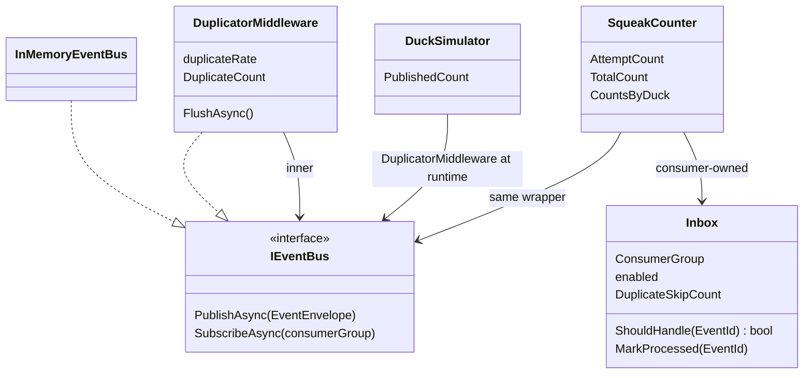
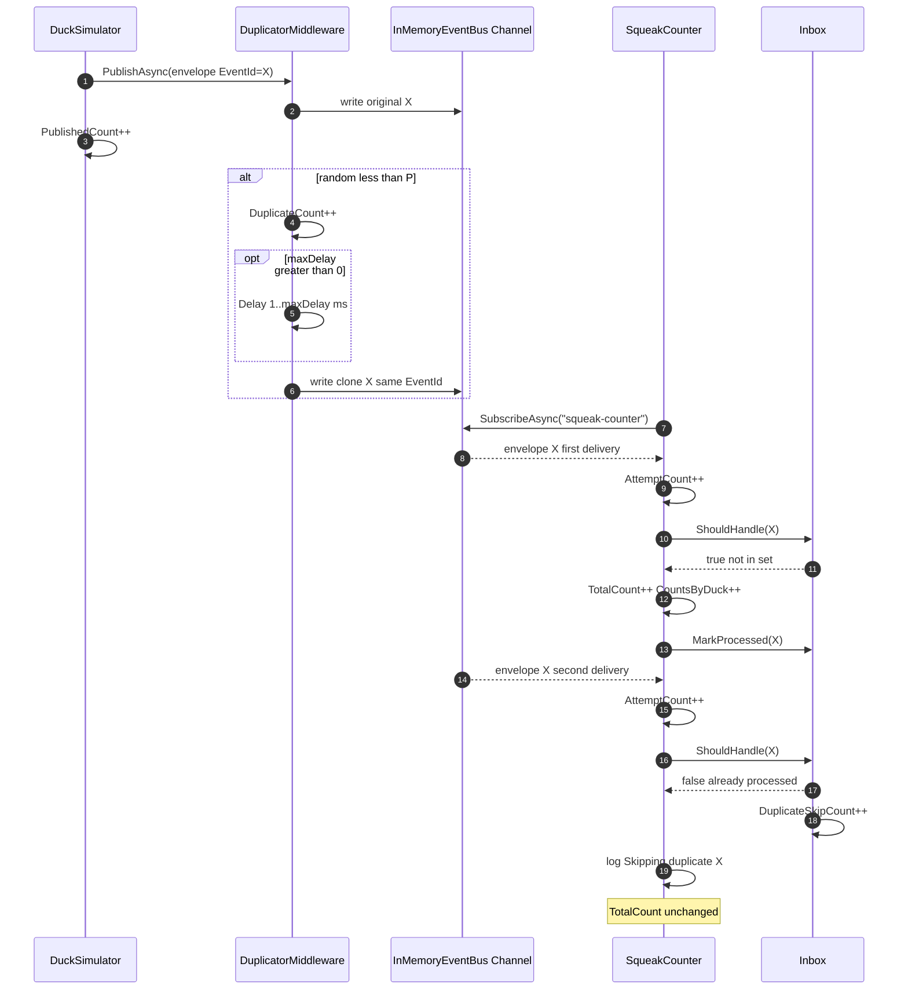
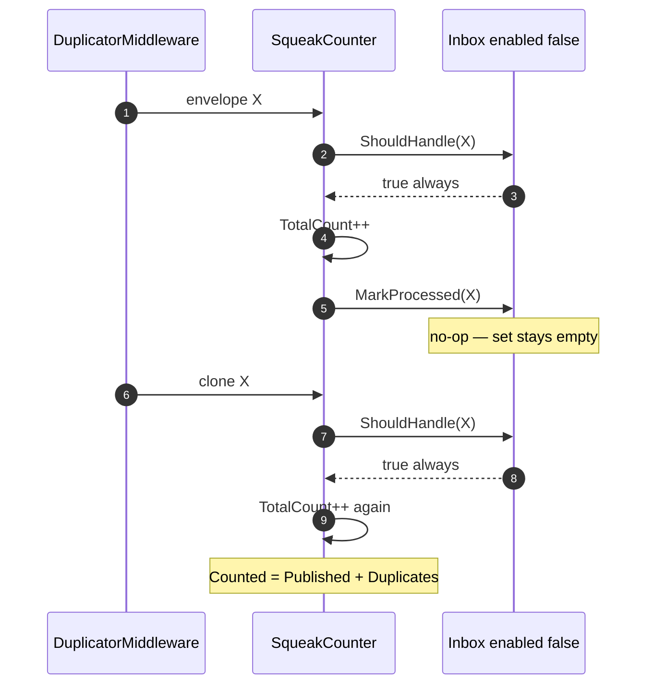
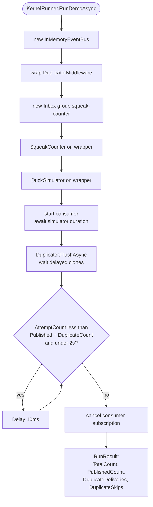
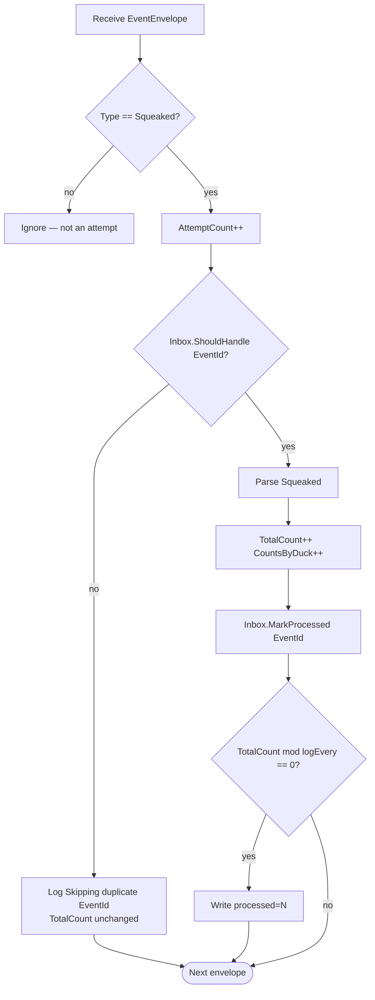

# Step 1 — as-built architecture

**Branch:** `step-1` → `main`  
**Punchline:** transport lies (at-least-once); the consumer does not. Counts stay exact under duplicates. `--mis-demo` turns the inbox off so totals drift on purpose.

Single process. Hostility is **duplication only** (same `EventId`). No shuffle, no sequencer, no durable log.

**HTML roadmap note:** [DuckNetArchitectureSteps.html](../../DuckNetArchitectureSteps.html) draws `Hostile bus → Duplicator` as two boxes. In code, `DuplicatorMiddleware` *is* the `IEventBus` the producer talks to; it wraps `InMemoryEventBus`. Inbox lives on the consumer, not on the bus.

## Delta vs Step 0

| | |
|--|--|
| **Added** | `DuplicatorMiddleware` (wraps `IEventBus`), `Inbox` (`HashSet<Guid>`, per consumer group, in-memory), mis-demo flag, skip log `Skipping duplicate {EventId}` |
| **Changed** | `SqueakCounter` consults inbox before counting; `KernelRunner` / `Program` wrap the bus, flush delayed clones, wait on `AttemptCount`, cancel consumer after drain |
| **Unchanged** | `DuckSimulator` (still `IEventBus` only), `EventEnvelope` shape, `InMemoryEventBus` channel, no Center-to-Center, no shared DB |

## Wire types

Dedup key is **`EventId`**, never payload or duck id. Clones are the same envelope instance (same id).

```text
EventEnvelope                          Step 1 use
  EventId          Guid                inbox key; duplicates keep this id
  Type             string              "Squeaked" — others ignored
  Version          int                 1
  PartitionKey     string              duckId — not used for ordering yet
  SequenceNumber   long                per-duck — not enforced yet
  OccurredAt       DateTimeOffset
  PayloadJson      string              Squeaked v1
```

Config that changes behavior:

| Knob | Default | Effect |
|------|---------|--------|
| `DUPLICATE_RATE` / `--duplicate-rate` | 0.15 | Probability of a second `PublishAsync` with the same `EventId` |
| delayed re-enqueue | 40ms max in live demo; 0 in tests | Clone after `Task.Delay`; `FlushAsync` waits for pending clones |
| inbox enabled | on | `--mis-demo` / `--disable-inbox` / `INBOX_ENABLED=false` always handles |

## Architecture

Inbox is consumer-owned. Putting dedup inside the bus would break the later bus swap (Step 11).





**Intentionally absent:** `ShufflerMiddleware`, `PerKeySequencer`, SQLite inbox/outbox/log, second Center.

## Execution — unique squeak then duplicate delivery

Happy path (inbox on). The second delivery is the duplicator, not the producer.



## Execution — mis-demo (inbox disabled)

Same duplicator. `ShouldHandle` always returns true; `MarkProcessed` is a no-op. Totals include clones.



## Execution — demo lifecycle



Invariant with inbox on: `TotalCount == PublishedCount` and `DuplicateSkips == DuplicateDeliveries`.  
Mis-demo at rate 1.0: `TotalCount == PublishedCount * 2`, `DuplicateSkips == 0`.

## Handler decision



`ShouldHandle` false only when the inbox is enabled **and** `EventId` is already in the set. Mark happens **after** a successful handle so a crash mid-handle would retry (in-memory crash still loses the set — persistence is Step 3).
