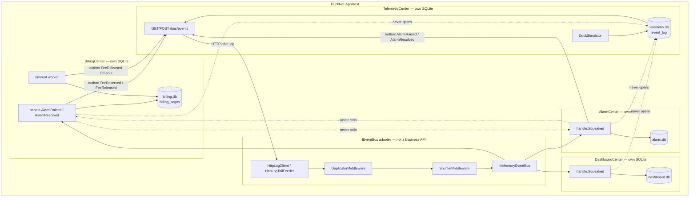
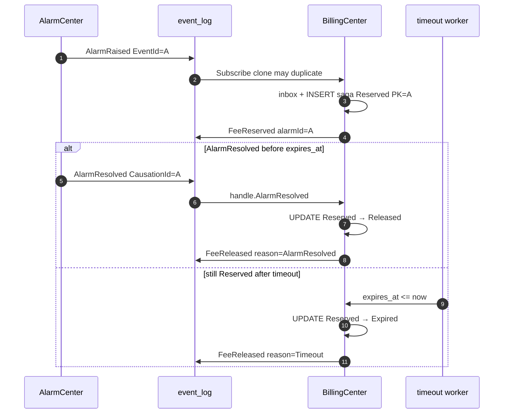
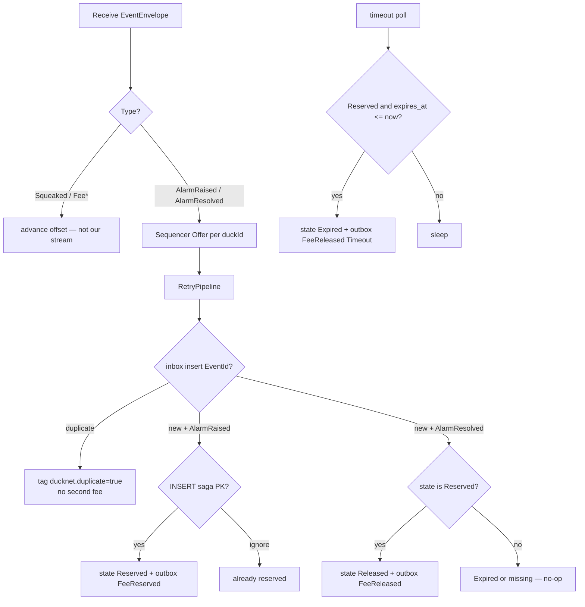
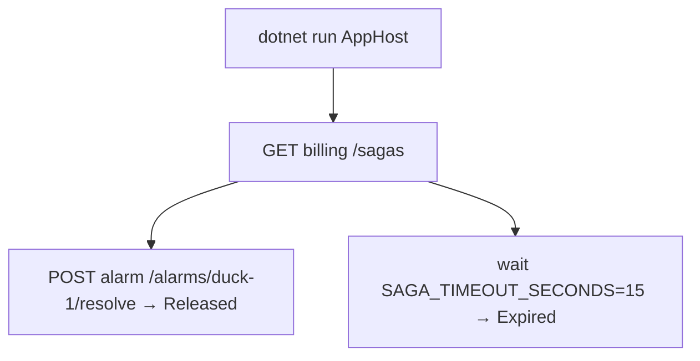

# Step 10 — as-built architecture

**Branch:** `step-10`  
**Punchline:** a fee is reserved and released without a distributed transaction. BillingCenter owns a saga row. AlarmCenter never calls it. Time is the compensator: `AlarmResolved` before expiry → `FeeReleased` (reason `AlarmResolved`); still `Reserved` after 5 minutes → `FeeReleased` (reason `Timeout`). Duplicate `AlarmRaised` cannot double-charge (inbox `EventId` + saga PK `alarm_id`).

**HTML roadmap note:** [DuckNetArchitectureSteps.html](../../DuckNetArchitectureSteps.html) draws BillingCenter + compensating events. In code `alarm_id` is the `AlarmRaised` `EventId` (the catalog has no separate alarm id). Aspire sets `SAGA_TIMEOUT_SECONDS=15` so the timeout path is visible; the default is 5 minutes. Fast resolve is `POST /alarms/{duckId}/resolve` on AlarmCenter (operator fact, not a Center-to-Center call).

## Delta vs Step 9

| | |
|--|--|
| **Added** | BillingCenter (own SQLite, `billing_sagas`, timeout worker), `AlarmResolved` / `FeeReserved` / `FeeReleased`, `POST /alarms/{duckId}/resolve`, `GET /sagas` |
| **Changed** | AlarmCenter publishes `AlarmResolved` when the event-time window drops below threshold (or on operator resolve). `AlarmRaised` still sticky per duck. |
| **Unchanged** | No Center-to-Center business HTTP. No shared DB. Hostile transport after log read. Upcast, inbox, sequencer, retry, DLQ, shards, envelope `TraceId`. |

## Wire types

Dedup key is still **`EventId`**. Saga identity is **`AlarmRaised.EventId`** stored as `billing_sagas.alarm_id`.

```text
EventEnvelope                          Step 10 use
  EventId          Guid                inbox key; AlarmRaised EventId = alarm_id
  Type             string              AlarmRaised | AlarmResolved | FeeReserved | FeeReleased
  PartitionKey     string              duckId (alarm events) / alarmId (fee events)
  SequenceNumber   long                per-duck alarm seq; fee events 1 then 2 per alarm
  TraceId          string?             copied AlarmRaised → FeeReserved
  CausationId      string?             AlarmResolved ← AlarmRaised EventId
                                       FeeReserved  ← AlarmRaised EventId
                                       FeeReleased  ← AlarmResolved EventId (or alarm_id on timeout)

AlarmRaised v1     duckId, rate, windowStart
AlarmResolved v1   duckId, resolvedAt
FeeReserved v1     alarmId, duckId, amountCents, expiresAt
FeeReleased v1     alarmId, reason   // AlarmResolved | Timeout
```

Saga states: `Reserved` | `Released` | `Expired`. Timeout and resolve race on `UPDATE … WHERE state='Reserved'` in this Center's SQLite — not a distributed lock.

## Architecture

`IEventBus` is still the only integration seam. Billing never opens Alarm SQLite. Alarm never opens Billing SQLite.



**Intentionally absent:** RabbitMQ, MCP ops server, Azure Monitor exporter.

## Execution — happy path vs timeout



## Handler decision



## Demo lifecycle



Open the Aspire dashboard. `telemetry`, `alarm`, `dashboard`, and `billing` should be healthy. `GET /sagas` on billing lists rows. Fast path: `POST /alarms/{duckId}/resolve` on alarm after a raise. Slow path: leave the alarm active; after 15s the timeout worker publishes `FeeReleased` with reason `Timeout`.
