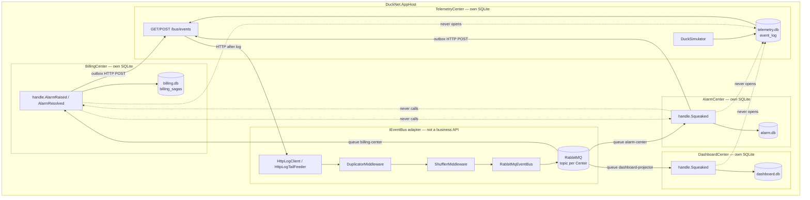
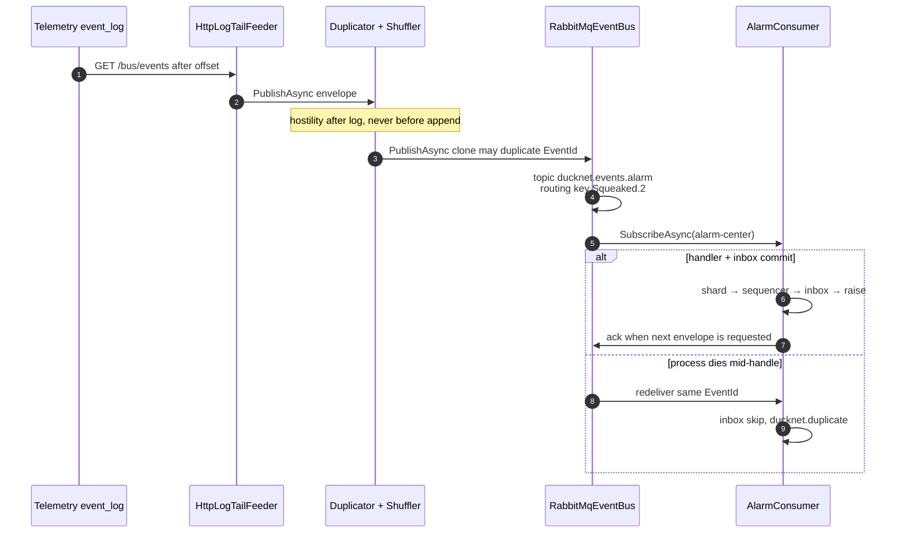
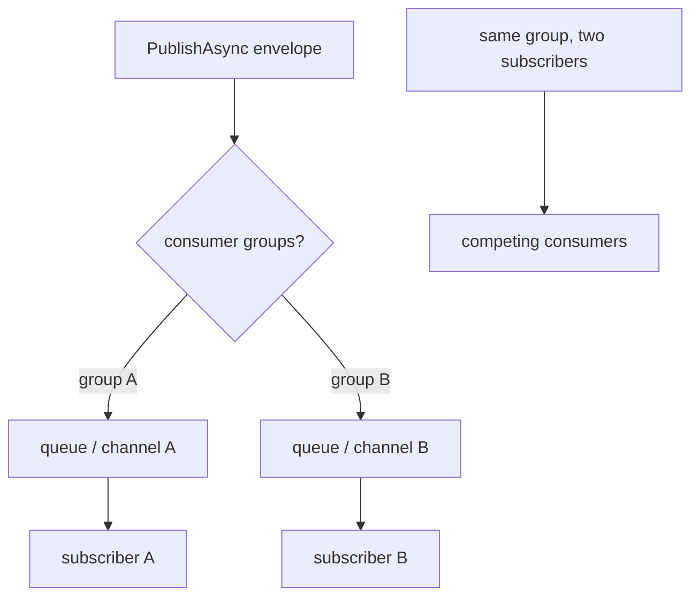
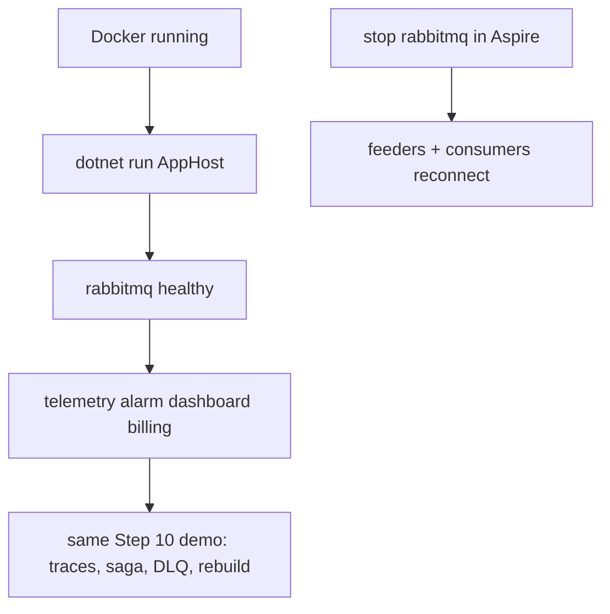

# Step 11 — as-built architecture

**Branch:** `step-11`  
**Punchline:** `IEventBus` is a port. Aspire Centers talk to RabbitMQ through `EventBusFactory.Create()`; kernel tests and Center tests still get `InMemoryEventBus` when no connection string is set. Handlers, inbox, sequencer, and Center `.csproj` files do not reference RabbitMQ. The log is still the system of record. The broker is transport.

**HTML roadmap note:** [DuckNetArchitectureSteps.html](../../DuckNetArchitectureSteps.html) draws a shared `LOG → MQ → Centers` live path and an empty Center-project diff. In code the HTTP log tail is still how Centers catch up and how producers append (`GET`/`POST /bus/events`). Each Center's `HttpLogTailFeeder` publishes onto **its own** topic exchange (`ducknet.events.{center}`) so three feeders do not triple-publish onto one queue set. `EventBusFactory.Create()` is the one-line composition change in `*App.cs`. Handlers (`*Consumer.cs`, stores) are unchanged. Kernel keeps `new InMemoryEventBus()`.

## Delta vs Step 10

| | |
|--|--|
| **Added** | `tests/DuckNet.EventBus.Tests` conformance suite, `InMemoryEventBus` per-group fan-out, `RabbitMqEventBus`, `EventBusFactory`, Aspire RabbitMQ container |
| **Changed** | Center composition roots call `EventBusFactory.Create()`. AppHost `WithReference(rabbit)` + `DUCKNET_BUS_EXCHANGE` per Center |
| **Unchanged** | No Center-to-Center business HTTP. No shared DB. Hostile middleware after log read. Inbox/sequencer/shards not inside the bus. Envelope fields |

## Wire types

Same `EventEnvelope` as Step 10. The bus round-trips `Type`, `PayloadJson`, `TraceId`, `CausationId`, `EventId`, `Version`, `PartitionKey`, `SequenceNumber`, `OccurredAt`, `LogOffset`. Duplicate `EventId` is still delivered (at-least-once). Inbox remains the dedupe.

```text
IEventBus
  PublishAsync(envelope)
  SubscribeAsync(consumerGroup)   // fan-out: one copy per group

RabbitMQ
  exchange     topic ducknet.events  (or DUCKNET_BUS_EXCHANGE)
  routing key  {type}.{version}      e.g. Squeaked.2
  queue        ducknet.{exchange}.{consumerGroup}
  ack          when the subscriber requests the next envelope
```

Ack is after `DispatchAsync` enqueue, not after inbox commit. Shard workers must not block the subscribe loop (Step 8). Crash mid-handle → redelivery → inbox skip. Changing `IEventBus` to carry an ack token would be a handler change.

## Architecture

`IEventBus` is the only integration seam. RabbitMQ is not a business API. Inbox and sequencer stay on the consumer. Centers never open each other's SQLite. `WithReference(rabbit)` is infrastructure, not a Center-to-Center client.



**Intentionally absent:** Azure Service Bus (`ServiceBusEventBus` is Step 12), MCP ops server.

## Execution — one squeak onto the broker



## Fan-out vs shared Channel



`InMemoryEventBus` used one shared `Channel` and ignored `consumerGroup`. The conformance suite failed until fan-out was real. Late in-memory subscribers also get a backlog (kernel tests race `RunAsync` vs `PublishAsync`). RabbitMQ late subscribers miss messages unless the queue already exists — Subscribe declares the durable queue before consume.

## Demo lifecycle



Open the Aspire dashboard. `rabbitmq`, `telemetry`, `alarm`, `dashboard`, and `billing` should be healthy. Kill the broker in Aspire: Centers retry publish/consume (`AutomaticRecoveryEnabled`). The event log is unchanged — replay is still HTTP tail / rebuild, not the broker.

```bash
dotnet test --filter FullyQualifiedName~EventBus
dotnet test
dotnet run --project src/DuckNet.AppHost
```
