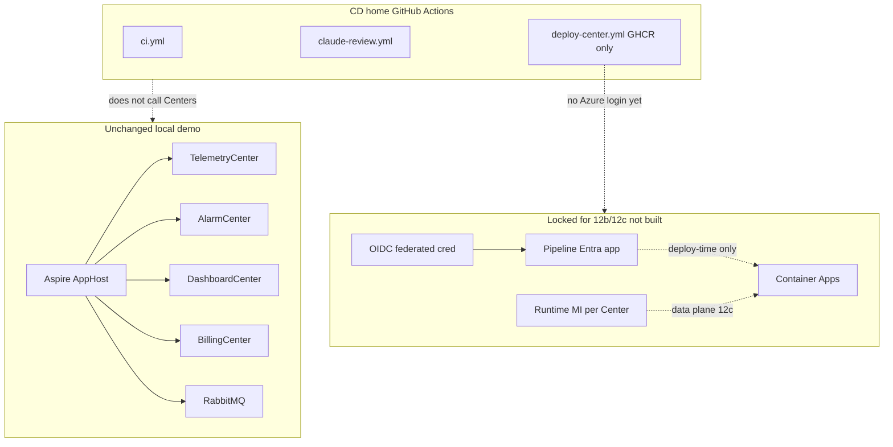
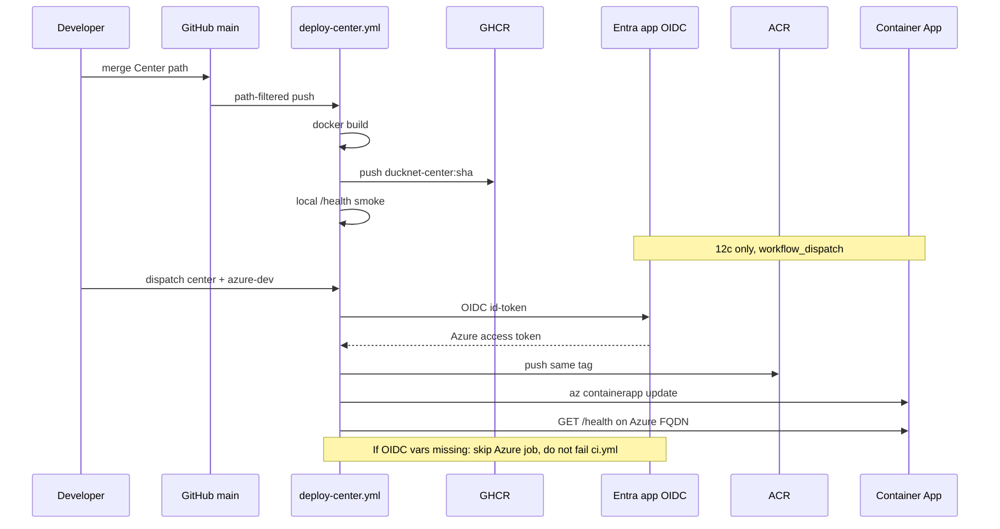

# Step 12a as-built — Cloud CD contract

Docs and decisions only. No Azure resources, no Bicep, no Center or EventBus code changes. Local demo is still Step 11 (Aspire + SQLite + HTTP `event_log` + RabbitMQ).

Target roadmap: [DuckNetArchitectureSteps.html](../../DuckNetArchitectureSteps.html). Full Phase D split: [ImplementationPlan.md](../../ImplementationPlan.md#phase-d--cloud-cicd--certification-shaped-ops). Spec: [CD contract](../cd-contract.md). Decision: [GitHub Actions vs Azure DevOps](../decisions/cd-github-actions-vs-azure-devops.md).

## Architecture

Identity and CD only. Centers, DBs, and the bus are unchanged (still local). The pipeline Entra app does **not** sit on the data plane; Container App managed identities do not exist yet (12c). Azure DevOps is not in the picture.

What does **not** connect:

- No Center-to-Center calls (unchanged).
- No shared database (unchanged).
- GitHub Actions does not reach Postgres / Service Bus / Event Hubs.
- Azure DevOps is not a second pipeline host.
- `deploy-center.yml` does not call `azure/login` (12c).

## Execution

How a Center image is produced today, and how 12c will attach Azure **without** moving CD out of GitHub. Hostile-transport and mis-demo branches are still the Step 11 local ones; this step adds a **missing-OIDC skip** branch for future Azure jobs (specified, not implemented).

## Delta vs Step 11

**Added**

- Phase D split: 12a contract → 12b Azure-ready → 12c first environment.
- [CD contract](../cd-contract.md): two identity planes, OIDC subjects, GitHub Environments `azure-dev` / `azure-prod`, GHCR vs ACR, bootstrap vs app CD, dispatch-gated Azure mutate.
- [Decision](../decisions/cd-github-actions-vs-azure-devops.md): CD stays in GitHub Actions.

**Changed**

- [ImplementationPlan.md](../../ImplementationPlan.md) Phase D and the CI/CD section: Azure path is no longer one blob.

**Unchanged**

- All Center handlers, `IEventBus`, Aspire, SQLite, RabbitMQ, `ci.yml`, GHCR push, ReviewFlow.
- Bicep still absent (`infra/bicep/` is 12b).
- IaC choice still Bicep ([existing decision](../decisions/iac-bicep-vs-pulumi.md)).

## Wire types

No envelope or payload change. `EventEnvelope` is not on this step’s seam. The new “wire” is the **OIDC token subject**:

`repo:muxare/DuckNet:environment:azure-dev` (and `azure-prod`).

GitHub identifiers (not secrets): `AZURE_CLIENT_ID`, `AZURE_TENANT_ID`, `AZURE_SUBSCRIPTION_ID`, `AZURE_RESOURCE_GROUP`.

## Divergence from HTML target

[DuckNetArchitectureSteps.html](../../DuckNetArchitectureSteps.html) still shows one Azure landing. This step does not draw Container Apps, Event Hubs, or Service Bus as if they exist. 12b will add IaC + adapters; 12c will match the HTML compute/messaging story.
