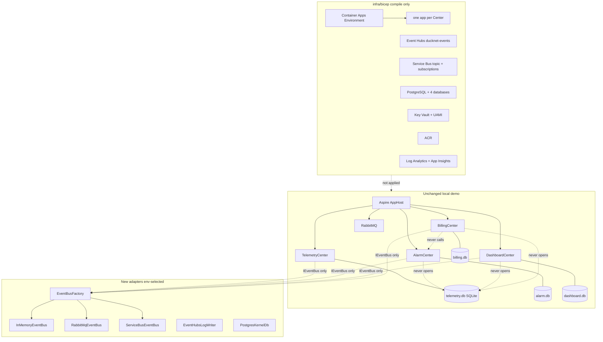
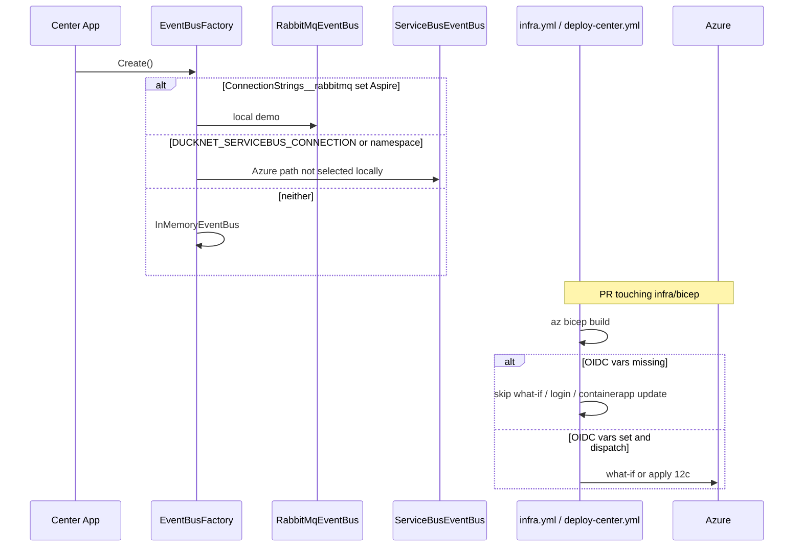

# Step 12b as-built — Azure-ready (no live deploy)

**Branch:** `step-12b`  
**Punchline:** Bicep compiles, `ServiceBusEventBus` and a Postgres provider exist behind env flags, and Azure workflow jobs **skip** when OIDC vars are missing. Local demo is still Step 11 (Aspire + SQLite + HTTP `event_log` + RabbitMQ). No Azure subscription is required. No Container Apps run.

Target roadmap: [DuckNetArchitectureSteps.html](../../DuckNetArchitectureSteps.html). Spec: [CD contract](../cd-contract.md). IaC decision: [Bicep vs Pulumi](../decisions/iac-bicep-vs-pulumi.md).

## Architecture

Adapters live in `DuckNet.EventBus` and `DuckNet.Kernel`. Centers still call `EventBusFactory.Create()` and `KernelDb.Open` — handlers do not reference Service Bus, Event Hubs, or Npgsql. Inbox, sequencer, and per-Center DBs stay outside the bus. IaC is compile-only.



What does **not** connect:

- No Center-to-Center calls.
- No shared database (Postgres is one server, **four databases**).
- Inbox / sequencer / DLQ table are not inside Service Bus or Event Hubs.
- GitHub Actions does not reach Postgres / Service Bus / Event Hubs as a data-plane client.
- AppHost does not provision Azure resources.

## Execution

One squeak on the **local** path is unchanged (HTTP log → hostile middleware → RabbitMQ). The new branches are factory selection and the skip-safe Azure jobs.



Handler decision (unchanged): inbox skip on duplicate `EventId`. Service Bus complete/abandon is the same ack shape as RabbitMQ — after the subscriber requests the next envelope, not after inbox commit.

Mis-demo / failure this step **actually implements**:

- Missing OIDC → Azure jobs skip, `ci.yml` still green.
- Missing Service Bus / Event Hubs connection → those tests `Assert.Skip`.
- Postgres Testcontainers prove schema + event_log/inbox/outbox DML without Azure.

## Delta vs Step 12a

**Added**

- [`infra/bicep/`](../../infra/bicep/) modules + `dev`/`prod` parameter files.
- [`infra.yml`](../../.github/workflows/infra.yml) — compile always; Azure mutate on dispatch if OIDC vars exist.
- `ServiceBusEventBus`, `EventHubsLogWriter`, factory env branch in `DuckNet.EventBus`.
- `PostgresSchema` / `PostgresKernelDb` / `PostgresPersistence` + Testcontainers tests.
- Azure job on `deploy-center.yml` that no-ops without OIDC or without an ACR in the RG.

**Changed**

- `EventBusFactory` prefers Service Bus when that env is set, else RabbitMQ, else in-memory.
- Center isolation tests also forbid Service Bus / Event Hubs / Npgsql package references on Center `.csproj` and handler files.

**Unchanged**

- Center handlers, Center `.csproj` PackageReferences, `DuckNet.Contracts`, Aspire + SQLite + RabbitMQ local demo.
- Outbox / inbox / sequencer / upcasters / saga state machines.
- `ci.yml` never logs in to Azure.

## Wire types

Same `EventEnvelope` as Step 11. Service Bus body is `EnvelopeJson`; `MessageId` is unique per publish so a duplicate `EventId` is still delivered (inbox is the dedupe). Event Hubs partition key = `envelope.PartitionKey` (`duckId`).

```text
IEventBus
  PublishAsync(envelope)
  SubscribeAsync(consumerGroup)

Service Bus (Azure path)
  topic          ducknet-events
  subscription   alarm-center | dashboard-projector | billing-center
  complete       when subscriber requests next envelope
  dead-letter    platform sub-queue after maxDeliveryCount 10

Event Hubs (Azure log)
  hub            ducknet-events
  partitions     4
  partition key  duckId
```

## Divergence from HTML target

The HTML draws a live Azure landing. This step has the IaC graph and adapters only. Container Apps, namespaces, and Postgres are **not deployed**. 12c applies `dev` and wires env so the same binaries use Service Bus + Event Hubs + Postgres.

Local shard default is still 3 (`PartitionShard.DefaultCount`). Event Hubs Bicep uses **4** partitions as the plan’s example; 12c can align shard count to partition count.
