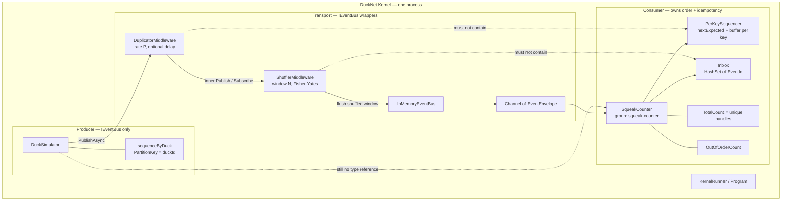
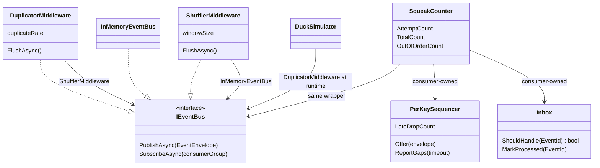
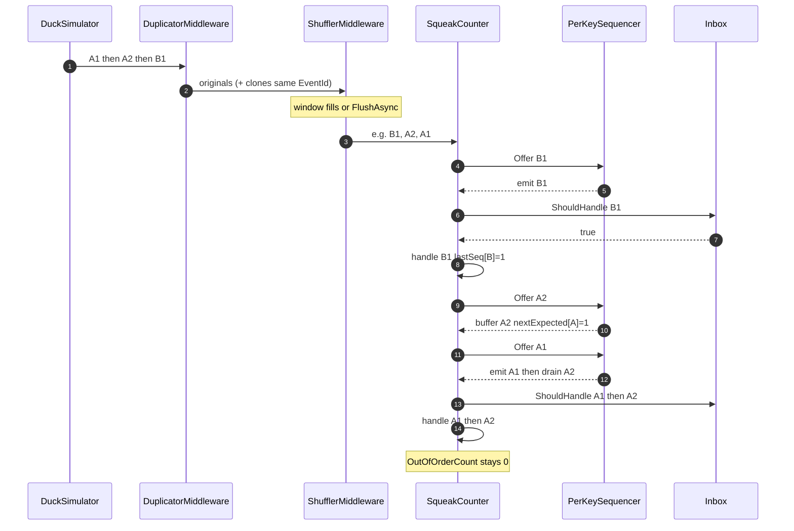
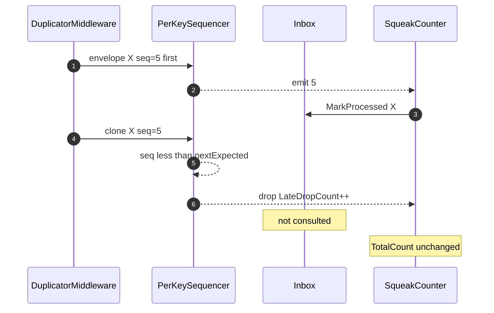
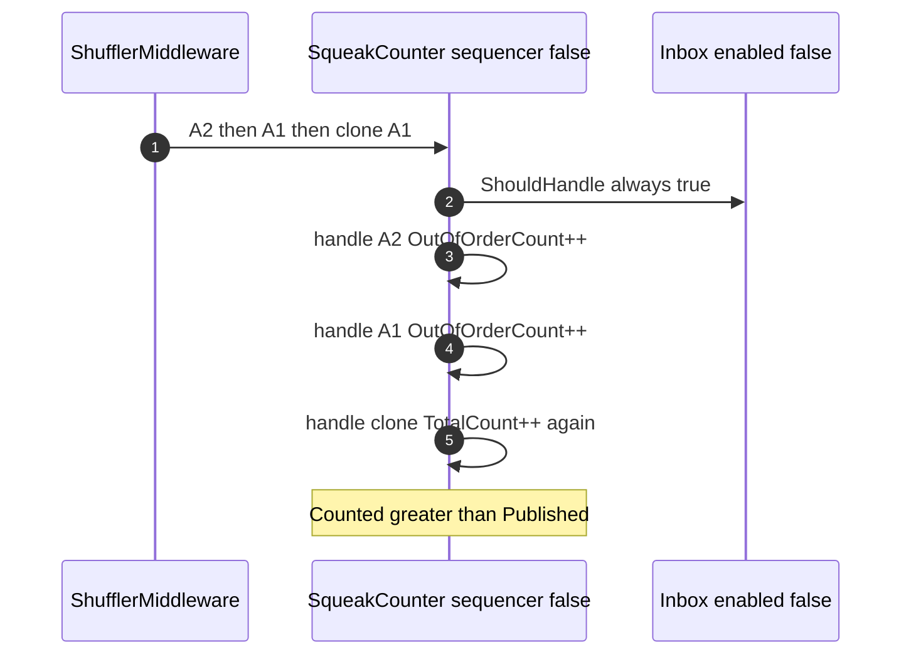
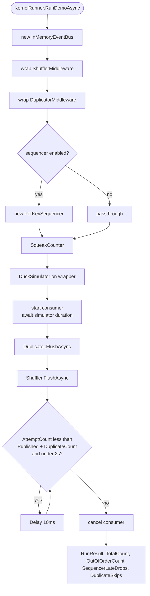
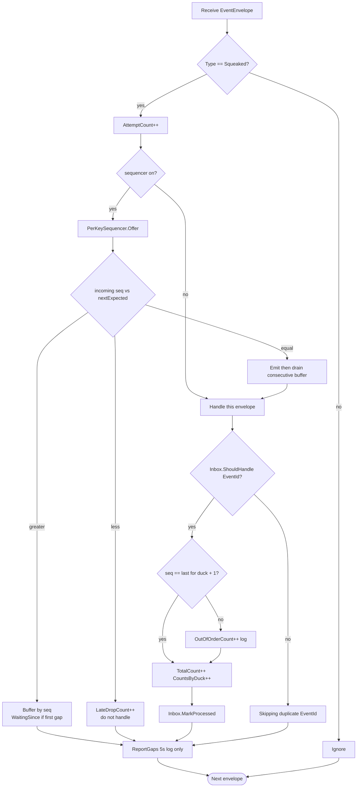

# Step 2 — as-built architecture

**Branch:** `step-2`  
**Punchline:** transport also lies about order. The consumer restores per-`PartitionKey` sequence. Counts stay exact; per-duck seq stays monotonic. `--mis-demo` turns inbox **and** sequencer off so totals drift and handles go out of order.

Single process. Hostility is **duplication + windowed shuffle**. Ordering is **per partition key, never global**. No durable log, no outbox.

**HTML roadmap note:** [DuckNetArchitectureSteps.html](../../DuckNetArchitectureSteps.html) draws `Hostile bus → Duplicator` and `Shuffler` as sibling boxes. In code, `DuplicatorMiddleware` wraps `ShufflerMiddleware`, which wraps `InMemoryEventBus`. Sequencer and inbox live on the consumer, not on the bus.

## Delta vs Step 1

| | |
|--|--|
| **Added** | `ShufflerMiddleware` (windowed shuffle + `FlushAsync`), `PerKeySequencer` (buffer / emit / late-drop / gap log), `OutOfOrderCount`, `--no-shuffle` / `--shuffle-window` / `--disable-sequencer` |
| **Changed** | `SqueakCounter` offers each delivery to the sequencer *then* the inbox; `KernelRunner` / `Program` compose duplicator→shuffler, flush clones then the shuffle remainder; `--mis-demo` now disables inbox **and** sequencer |
| **Unchanged** | `DuckSimulator` (`IEventBus` only; `PartitionKey` = duck id, seq per duck), `EventEnvelope` shape, `InMemoryEventBus` channel, inbox still in-memory `HashSet<Guid>`, no Center-to-Center, no shared DB |

## Wire types

Dedup key is still **`EventId`**. Order key is **`PartitionKey` + `SequenceNumber`** (per key, never a global clock).

```text
EventEnvelope                          Step 2 use
  EventId          Guid                inbox key; duplicates keep this id
  Type             string              "Squeaked" — others ignored
  Version          int                 1
  PartitionKey     string              duckId — sequencer key
  SequenceNumber   long                per-duck monotonic, starts at 1
  OccurredAt       DateTimeOffset
  PayloadJson      string              Squeaked v1
```

Config that changes behavior:

| Knob | Default | Effect |
|------|---------|--------|
| `DUPLICATE_RATE` / `--duplicate-rate` | 0.15 | Probability of a second `PublishAsync` with the same `EventId` |
| `SHUFFLE_ENABLED` / `--no-shuffle` | on | Windowed shuffle of the publish stream |
| `SHUFFLE_WINDOW` / `--shuffle-window` | 50 | Shuffle batch size; remainder shuffled on `FlushAsync` |
| sequencer | on | `--disable-sequencer` / `SEQUENCER_ENABLED=false` pass-through |
| inbox | on | `--disable-inbox` / `INBOX_ENABLED=false` always handles |
| `--mis-demo` | defenses on | Disables **inbox and sequencer** (naive consumer) |
| gap timeout | 5s | Log only; do not invent or skip the missing seq |

## Architecture

Inbox and sequencer are consumer-owned. Putting either inside the bus would break the later bus swap (Step 11). Shuffle randomizes **across** keys; the sequencer only promises order **within** a key.





**Intentionally absent:** SQLite inbox/outbox/log, second Center, DLQ, global ordering.

## Execution — shuffled deliveries restored per key

Happy path. Cross-key order is not constrained (`B1` may land before `A1`).



## Execution — late duplicate (sequencer before inbox)

Clones keep the same `EventId` **and** the same `SequenceNumber`. After that seq has been emitted, the sequencer drops the clone; the inbox often never sees it (`Inbox skips` may stay 0). Buffered clones overwrite the same seq slot instead.



## Execution — mis-demo (inbox and sequencer off)

Same hostile bus. Handles follow shuffled delivery order. Totals include clones.



## Execution — demo lifecycle



Invariant with defenses on: `TotalCount == PublishedCount` and `OutOfOrderCount == 0`.  
Mis-demo: `TotalCount > PublishedCount` when duplicates were injected; `OutOfOrderCount` is usually &gt; 0 with shuffle on.

## Handler decision



Gap after 5s: log `Gap on {key}: waiting for seq N, buffered [...]`. Do not invent the missing event and do not skip the gap. Real systems would DLQ or alert (Step 7).
