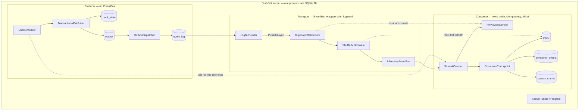
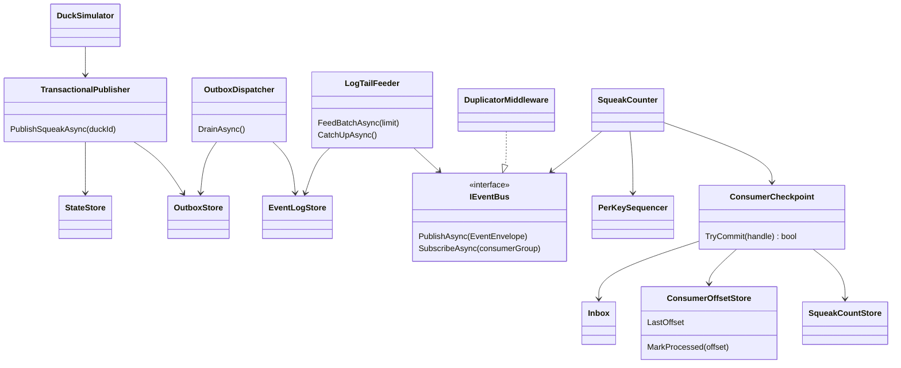
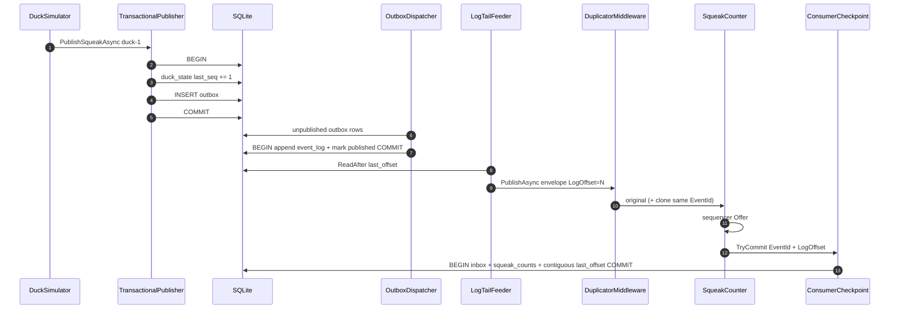
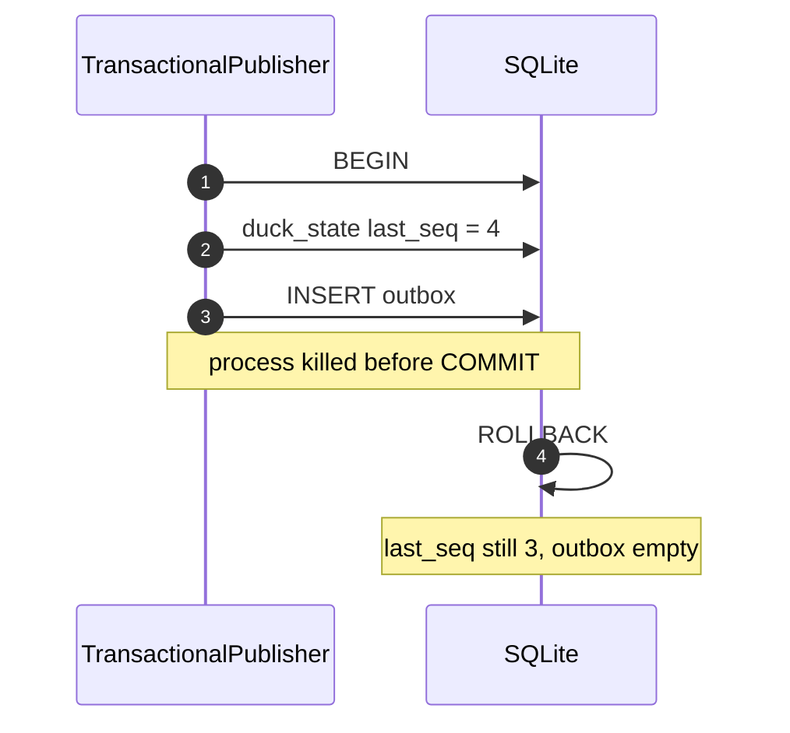
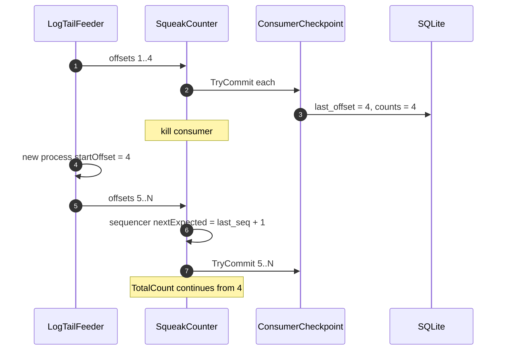
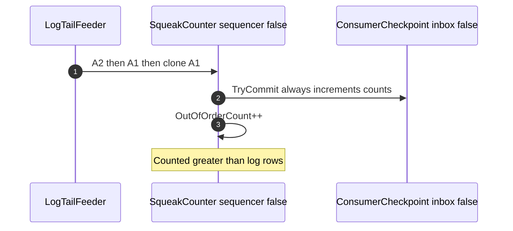
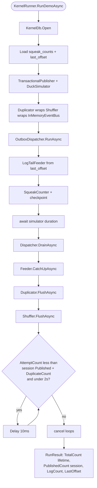
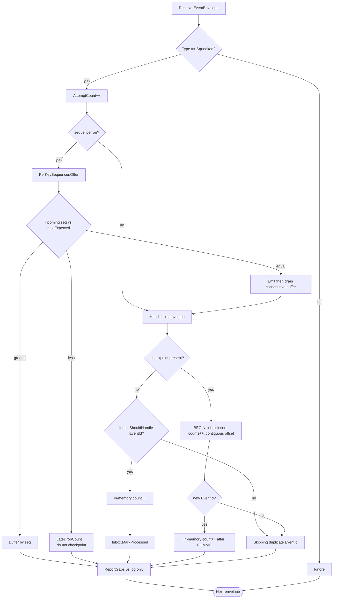

# Step 3 — as-built architecture

**Branch:** `step-3`  
**Punchline:** the log is the source of truth. The producer writes **state + outbox** in one transaction; a dispatcher appends the log; a tail feeder publishes through the hostile bus. The consumer checkpoints **inbox + counts + offset** in one transaction. Kill + restart resumes; no loss, no double-count.

Single process. One SQLite file is this Center’s database (until Step 4). Hostility (dup + shuffle) is applied **after** log read, never before append.

**HTML roadmap note:** [DuckNetArchitectureSteps.html](../../DuckNetArchitectureSteps.html) draws dispatcher → log → hostile bus. In code, `OutboxDispatcher` only appends `event_log`; `LogTailFeeder` publishes each new row onto `DuplicatorMiddleware` → `ShufflerMiddleware` → `InMemoryEventBus`. Inbox, sequencer, and offset live on the consumer, not on the bus.

**Schema delta vs the plan:** `event_log` also stores `sequence_number` (needed to rebuild `EventEnvelope` without payload-type switching). Handler totals live in `squeak_counts` so a restart can continue counts. `last_offset` is a **contiguous prefix** of processed log offsets, because shuffle after log-read can deliver offsets out of order.

## Delta vs Step 2

| | |
|--|--|
| **Added** | SQLite (`KernelDb`), `duck_state` + `outbox` + `event_log` + `inbox` + `consumer_offsets` + `squeak_counts`, `TransactionalPublisher`, `OutboxDispatcher`, `LogTailFeeder`, `ConsumerCheckpoint`, `--db` / `--reset-db` |
| **Changed** | `DuckSimulator` writes through the outbox, not `IEventBus`. `SqueakCounter` checkpoints inbox+counts+offset in one transaction when a DB is present. `PerKeySequencer` can be seeded from persisted last seq. Demo default file is `ducknet-kernel.db` (survives `kill -9`) |
| **Unchanged** | `EventEnvelope` shape (plus `LogOffset` assigned at log append), hostile wrappers, per-key ordering, no Center-to-Center, no shared DB across Centers |

## Wire types

Dedup key is still **`EventId`**. Order key is **`PartitionKey` + `SequenceNumber`**. Resume key is **`LogOffset`** (contiguous prefix).

```text
EventEnvelope                          Step 3 use
  EventId          Guid                inbox key; duplicates keep this id
  Type             string              "Squeaked" — others ignored
  Version          int                 1
  PartitionKey     string              duckId — sequencer key
  SequenceNumber   long                per-duck monotonic, from duck_state in the same tx as outbox
  OccurredAt       DateTimeOffset
  PayloadJson      string              Squeaked v1
  LogOffset        long                0 until appended; then event_log.offset
```

Config that changes behavior:

| Knob | Default | Effect |
|------|---------|--------|
| `--db` / `DUCKNET_DB` | `ducknet-kernel.db` | SQLite path (tests use a unique temp file) |
| `--reset-db` | off | Delete the DB file before start |
| `DUPLICATE_RATE` / `--duplicate-rate` | 0.15 | Probability of a second `PublishAsync` with the same `EventId` **after** log read |
| `SHUFFLE_ENABLED` / `--no-shuffle` | on | Windowed shuffle of the tail-feeder stream |
| `SHUFFLE_WINDOW` / `--shuffle-window` | 50 | Shuffle batch size |
| sequencer | on | `--disable-sequencer` / `SEQUENCER_ENABLED=false` pass-through |
| inbox | on | `--disable-inbox` / `INBOX_ENABLED=false` always handles |
| `--mis-demo` | defenses on | Disables **inbox and sequencer** (naive consumer) |

## Architecture

The producer never references consumer types. The bus never owns inbox, sequencer, or offsets. Hostile middleware wraps **publish from the log tail**, not the outbox write.





**Intentionally absent:** second Center, Aspire, PostgreSQL, DLQ, global ordering.

## Execution — transactional publish then log then hostile bus

Happy path. Cross-key order is not constrained after shuffle.



## Execution — producer crash mid-transaction

Neither seq nor outbox row survives. Retry assigns the same next seq.



## Execution — consumer kill then restart

Offset is a contiguous prefix. Sequencer is reseeded from `squeak_counts.last_seq`. Inbox prevents double-count of already-committed EventIds.



## Execution — mis-demo (inbox and sequencer off)

Same durable log. Handles follow shuffled delivery order. Totals include clones. Offset still advances.



## Execution — demo lifecycle



Invariant with defenses on: `TotalCount == LogCount` and `OutOfOrderCount == 0`. On a fresh DB, `PublishedCount == TotalCount`. A second session on the same file continues lifetime counts.

Mis-demo: `TotalCount > LogCount` when duplicates were injected; `OutOfOrderCount` is usually &gt; 0 with shuffle on.

## Handler decision



Gap after 5s: log only. Do not invent the missing event. Real systems would DLQ or alert (Step 7).
