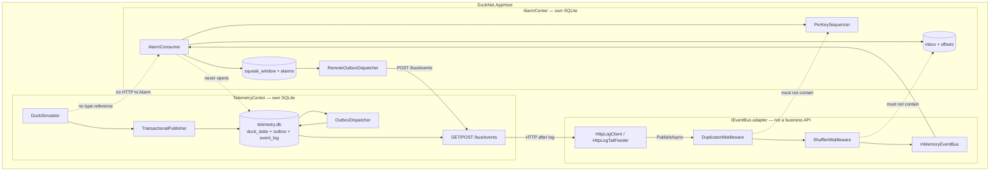
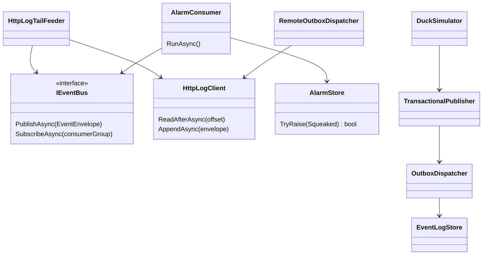
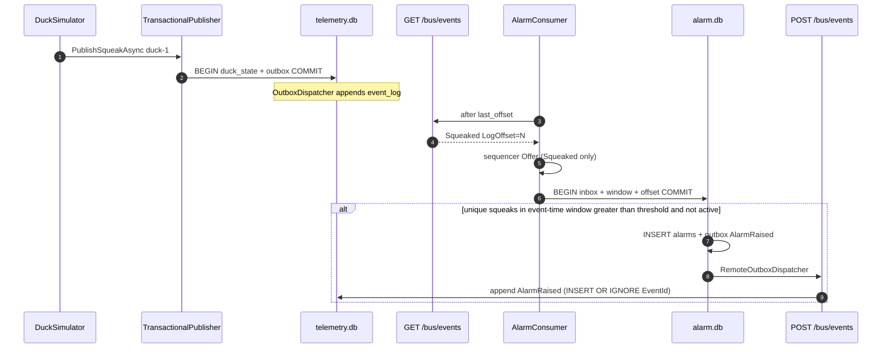
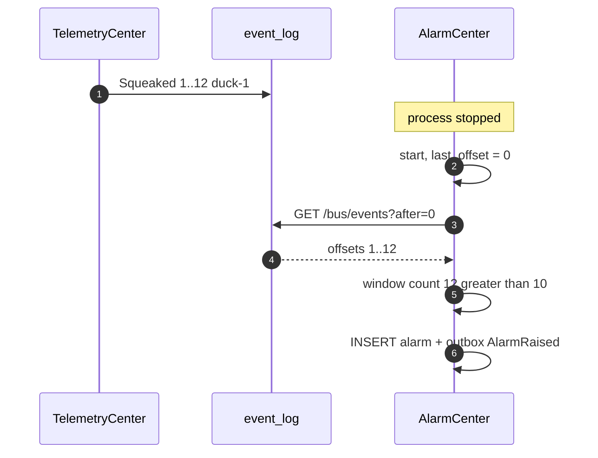
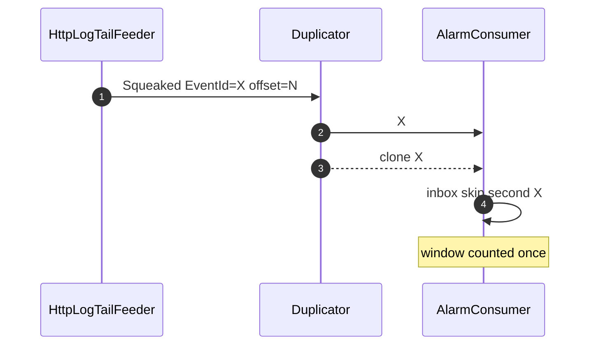
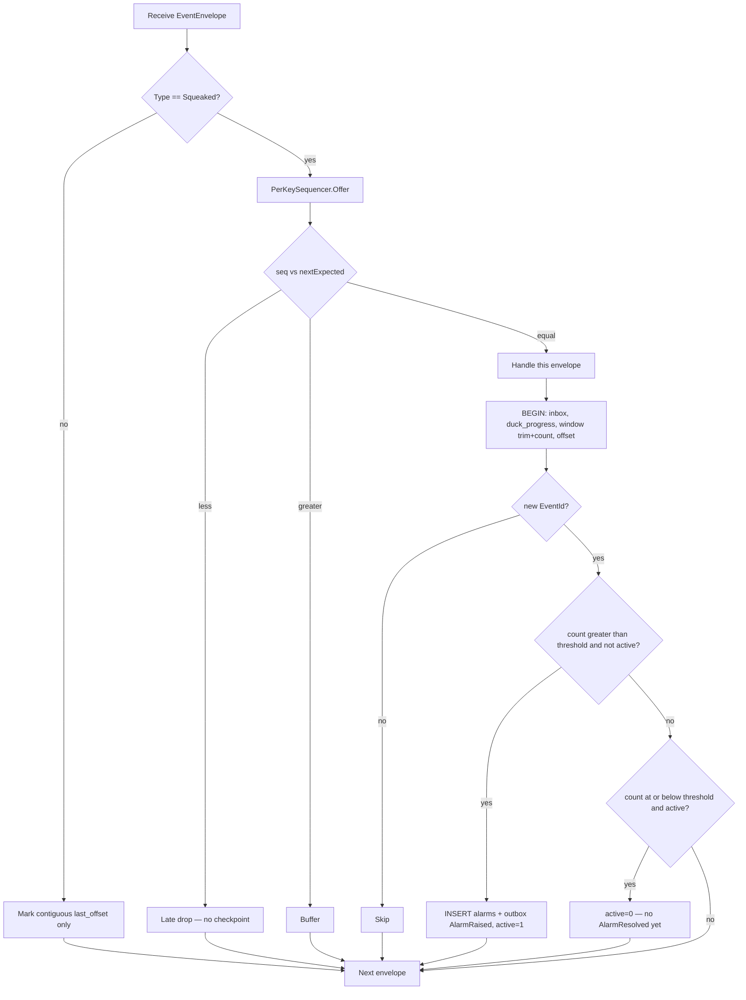
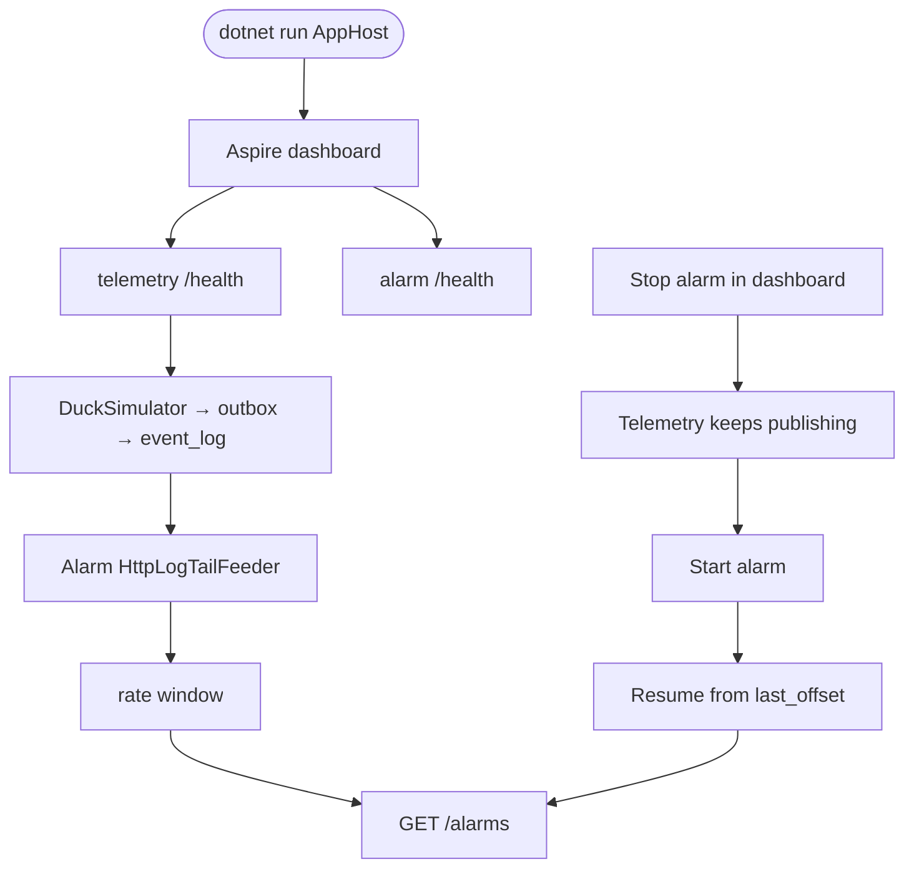

# Step 4 — as-built architecture

**Branch:** `step-4`  
**Punchline:** two processes, two SQLite files. TelemetryCenter owns the log write path. AlarmCenter subscribes only through `IEventBus` (HTTP log tail). Stop AlarmCenter, keep publishing, restart — it catches up and raises `AlarmRaised` for ducks that crossed the rate threshold.

Aspire AppHost runs both services. There is still no Center-to-Center business call and no shared database.

**HTML roadmap note:** [DuckNetArchitectureSteps.html](../../DuckNetArchitectureSteps.html) draws a shared `Event log` box both Centers write to. In code the log table lives in Telemetry's SQLite. AlarmCenter **never opens that file**. It tails and appends through `GET/POST /bus/events` — the `IEventBus` adapter until RabbitMQ (Step 11). Hostility (dup + shuffle) is applied on AlarmCenter **after** that read.

**Schema delta vs the plan:** Alarm sliding window uses **event time** (`OccurredAt`), not wall clock, so catch-up after downtime still sees a burst as a burst. `AlarmRaised` fires once per duck per threshold crossing (sticky `duck_alarm_state.active`) so a storm does not emit one alarm per extra squeak. `AlarmResolved` is not implemented yet (Step 10).

## Delta vs Step 3

| | |
|--|--|
| **Added** | `DuckNet.Contracts`, `DuckNet.EventBus`, `DuckNet.TelemetryCenter`, `DuckNet.AlarmCenter`, `DuckNet.AppHost`, HTTP log adapter (`HttpLogClient`, `HttpLogTailFeeder`), Alarm schema + rate window, `/health` + `/alarms`, Dockerfiles, `deploy-center.yml` |
| **Changed** | Kernel is the durable primitives library (still a Step 3 console). `EventEnvelope` / `IEventBus` / hostile middleware live in Contracts + EventBus. `KernelDb` takes a per-Center schema. |
| **Unchanged** | Outbox + log + inbox + contiguous offset, per-key sequencer, hostile transport after log read, no Center-to-Center business HTTP, no shared DB |

## Wire types

Dedup key is still **`EventId`**. Order key is **`PartitionKey` + `SequenceNumber`**. Resume key is **`LogOffset`** on Telemetry's log, checkpointed in Alarm's `consumer_offsets`.

```text
EventEnvelope                          Step 4 use
  EventId          Guid                inbox key; duplicates keep this id
  Type             string              "Squeaked" | "AlarmRaised"
  Version          int                 1
  PartitionKey     string              duckId
  SequenceNumber   long                per-type per-duck; Alarm sequencer only offers Squeaked
  OccurredAt       DateTimeOffset      event-time window for the rate rule
  PayloadJson      string              Squeaked v1 or AlarmRaised v1
  CausationId      string?             AlarmRaised ← Squeaked EventId
  LogOffset        long                telemetry event_log.offset
```

```text
Squeaked v1        duckId, sequenceNumber, occurredAt
AlarmRaised v1     duckId, rate (squeaks/minute in the window), windowStart
```

Config that changes behavior:

| Knob | Default | Effect |
|------|---------|--------|
| `ALARM_RATE_THRESHOLD` | 10 | raise when unique squeaks in the window **>** this |
| `ALARM_WINDOW_SECONDS` | 60 | event-time sliding window |
| `EVENT_LOG_URL` | (required for Alarm) | Telemetry base URL for `/bus/events` |
| `DUCKNET_DB` | `telemetry.db` / `alarm.db` | per-Center SQLite path |
| `DUPLICATE_RATE` / shuffle | same as Step 3 | applied on AlarmCenter after log read |
| `--reset-db` / `RESET_DB` | off | kernel demo; Centers use `RESET_DB=true` |

## Architecture

`IEventBus` is the only integration seam. Inbox, sequencer, offsets, and alarm rows live on AlarmCenter. Telemetry does not call Alarm. Alarm does not open `telemetry.db`.





**Intentionally absent:** DashboardCenter, PostgreSQL, RabbitMQ, `AlarmResolved`, DLQ.

## Execution — squeak to AlarmRaised

Happy path. Cross-key order is not constrained after shuffle.



## Execution — AlarmCenter down then catch-up

Telemetry keeps appending. Alarm's offset stays put. On restart the HTTP tail resumes; the rate window uses `OccurredAt`, so a storm during the gap still qualifies.



## Execution — hostile transport (Alarm consumer)

Same as Step 3, on the subscriber: duplicator clones keep `EventId`; shuffle is not global order; inbox and sequencer are on AlarmCenter.



## Handler decision



## Demo lifecycle


