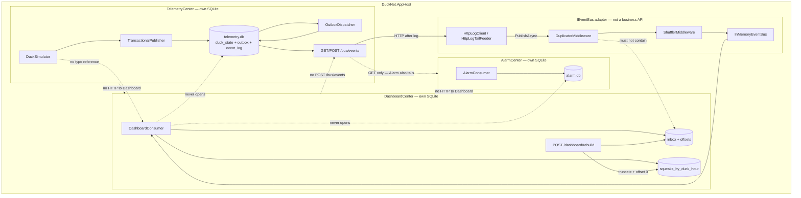
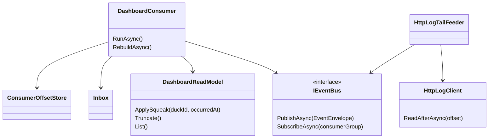
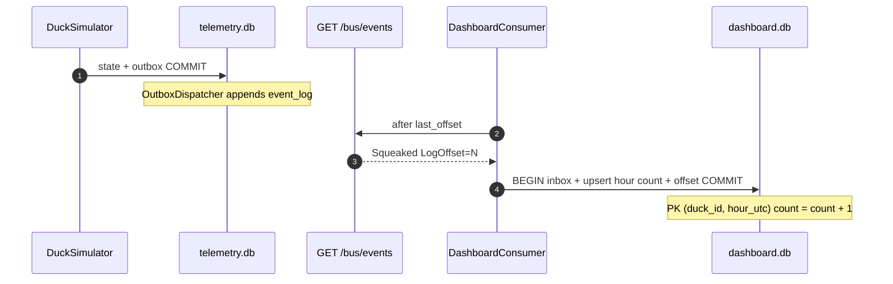
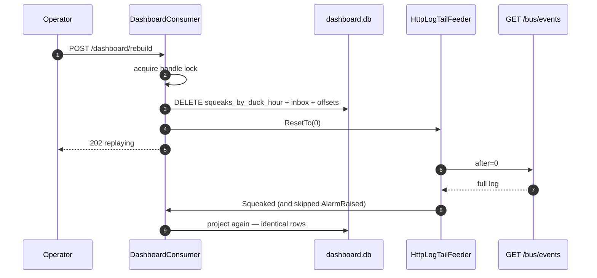
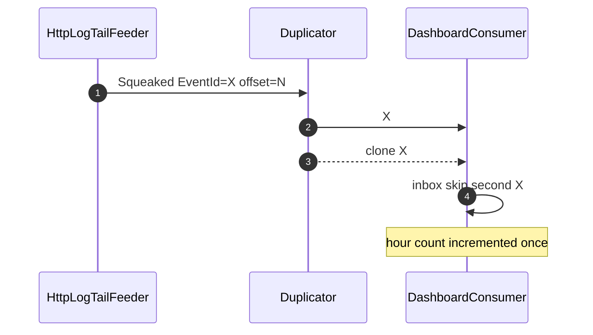
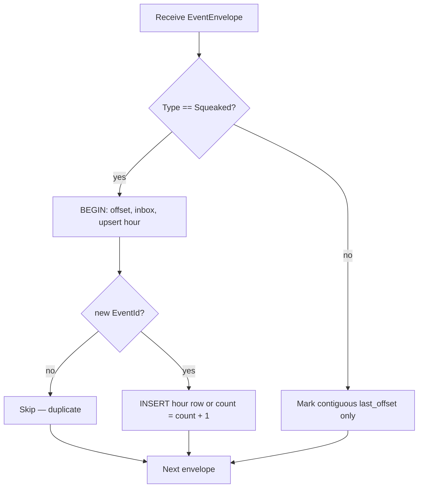
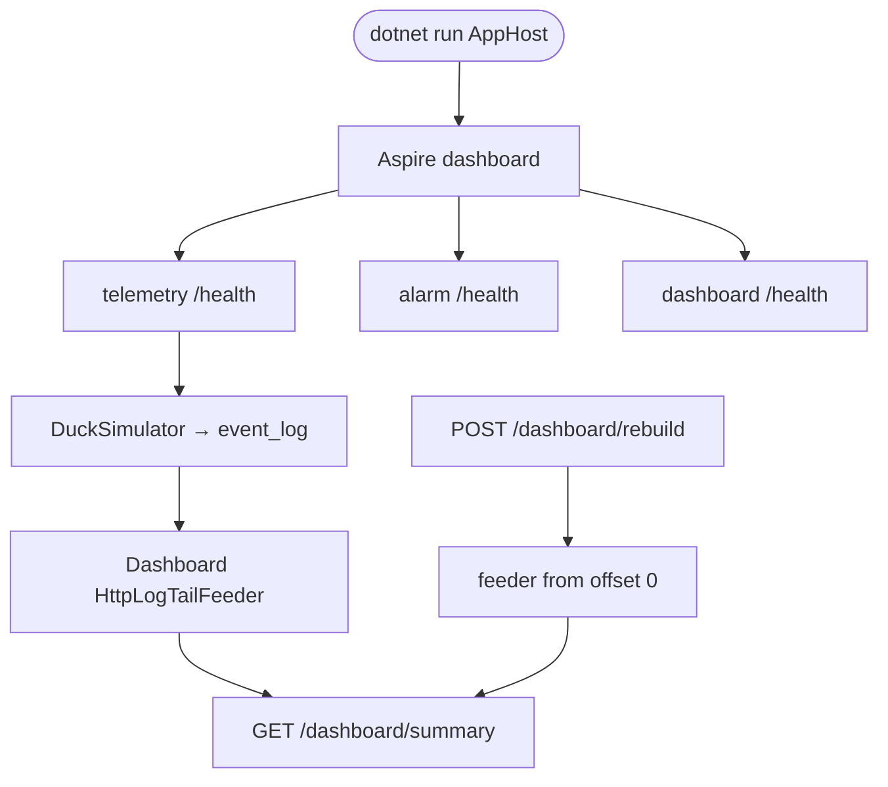

# Step 5 — as-built architecture

**Branch:** `step-5`  
**Punchline:** the dashboard is cattle, the log is the pet. DashboardCenter projects `squeaks_by_duck_hour` from `Squeaked` only. Truncate the read model, `POST /dashboard/rebuild`, replay from offset 0 — identical rows.

Aspire now hosts three services. DashboardCenter never publishes, never opens Telemetry or Alarm SQLite, and never calls another Center. Integration is still `IEventBus` (HTTP log tail).

**HTML roadmap note:** [DuckNetArchitectureSteps.html](../../DuckNetArchitectureSteps.html) draws a shared `Event log` that Alarm also writes to. In code the log table lives in Telemetry's SQLite. DashboardCenter **never opens that file** and **does not POST** `/bus/events` — it is a projector only. Hostility (dup + shuffle) is applied on DashboardCenter **after** the HTTP read.

**Schema delta vs the plan:** no `outbox` (nothing to publish). No `PerKeySequencer` — hour counts are commutative, so inbox + contiguous `last_offset` is enough under shuffle. `hour_utc` is the UTC hour of `OccurredAt` (`yyyy-MM-ddTHH:00:00Z`).

## Delta vs Step 4

| | |
|--|--|
| **Added** | `DuckNet.DashboardCenter`, `squeaks_by_duck_hour` read model, `POST /dashboard/rebuild`, `GET /dashboard/summary` + `/dashboard/duck/{id}`, consumer group `dashboard-projector`, Dockerfile + deploy path |
| **Changed** | AppHost runs three projects. Kernel inbox/offset and `HttpLogTailFeeder` gained reset hooks so rebuild can replay from 0. |
| **Unchanged** | Telemetry owns `event_log` writes. AlarmCenter rate window + `AlarmRaised`. No Center-to-Center business HTTP. No shared DB. Hostile transport after log read. |

## Wire types

Dedup key is still **`EventId`**. Resume key is **`LogOffset`** on Telemetry's log, checkpointed in Dashboard's `consumer_offsets`. Hour bucket key is **`duck_id` + `hour_utc`**.

```text
EventEnvelope                          Step 5 use
  EventId          Guid                inbox key; duplicates keep this id
  Type             string              project "Squeaked"; skip others (offset only)
  Version          int                 1
  PartitionKey     string              duckId (not ordered here)
  SequenceNumber   long                unused by the projector
  OccurredAt       DateTimeOffset      truncated to UTC hour
  PayloadJson      string              Squeaked v1
  LogOffset        long                telemetry event_log.offset
```

```text
Squeaked v1        duckId, sequenceNumber, occurredAt
```

```text
squeaks_by_duck_hour
  duck_id TEXT
  hour_utc TEXT        e.g. 2026-08-27T12:00:00Z
  count INTEGER
  PRIMARY KEY (duck_id, hour_utc)
```

Config that changes behavior:

| Knob | Default | Effect |
|------|---------|--------|
| `EVENT_LOG_URL` | (required) | Telemetry base URL for `/bus/events` |
| `DUCKNET_DB` | `dashboard.db` | Dashboard SQLite path |
| `DUPLICATE_RATE` / shuffle | same as Step 4 | applied on DashboardCenter after log read |
| `--reset-db` / `RESET_DB` | off | delete the Dashboard file on start |

## Architecture

`IEventBus` is the only integration seam. The read model, inbox, and offsets live on DashboardCenter. Telemetry does not call Dashboard. Dashboard does not open `telemetry.db` or `alarm.db`. Dashboard does not write the log.





**Intentionally absent:** `PerKeySequencer` on Dashboard, Dashboard outbox, `volume_db` (Step 6), BillingCenter, RabbitMQ, DLQ.

## Execution — squeak to hour bucket

Happy path. Cross-key order is not constrained after shuffle. Counts are commutative.



## Execution — rebuild from offset 0

The read model is disposable. Truncate + clear inbox + reset contiguous offset + feeder `ResetTo(0)`. Replay produces the same rows.



## Execution — hostile transport (Dashboard consumer)

Same as Step 4, on the subscriber: duplicator clones keep `EventId`; shuffle is not global order; inbox is on DashboardCenter. The upsert itself is **not** idempotent — inbox is.



## Handler decision



## Demo lifecycle


