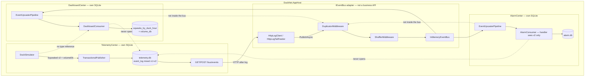
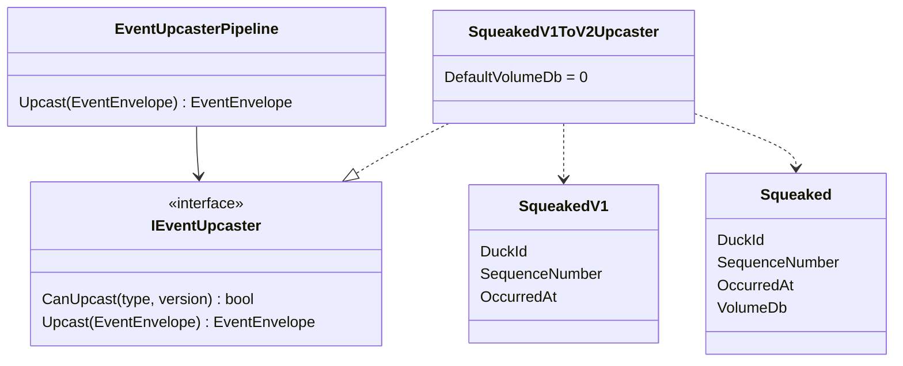
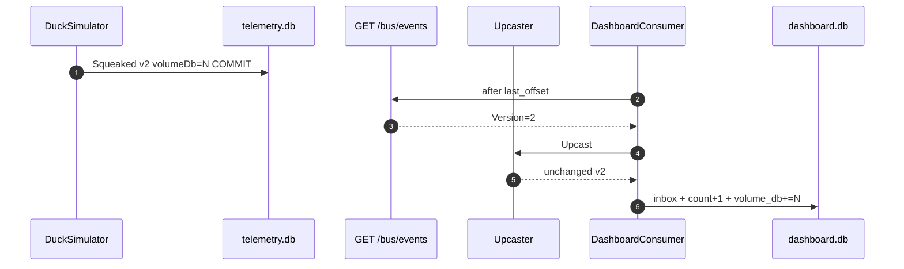
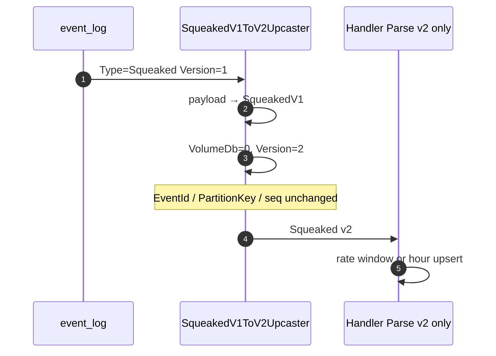
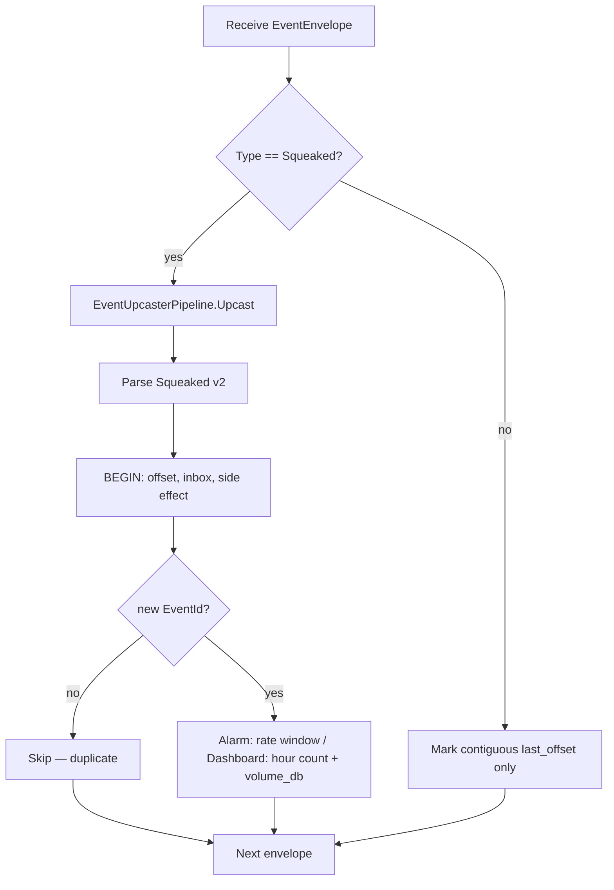
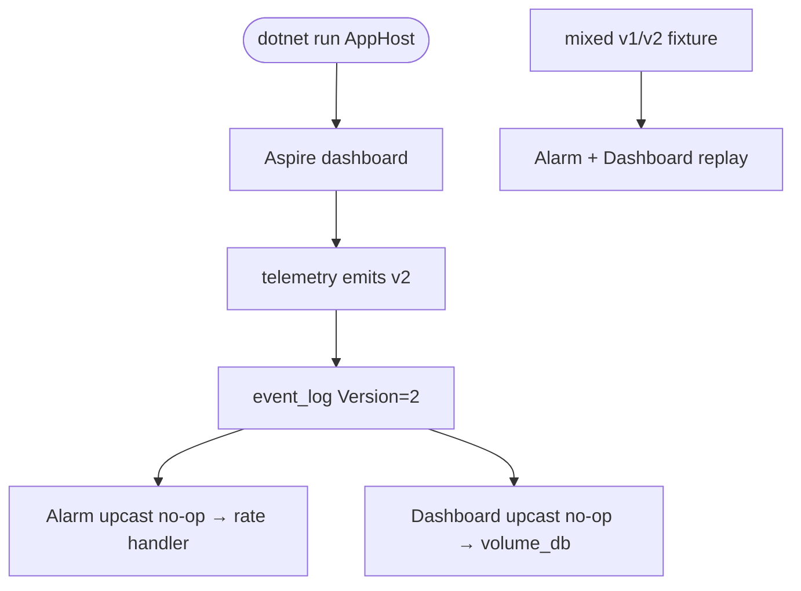

# Step 6 — as-built architecture

**Branch:** `step-6`  
**Punchline:** the log is mixed on purpose. Telemetry emits `Squeaked` v2 (`volumeDb`). Old v1 rows stay in the log. Each consumer upcasts v1→v2 *before* the handler; handlers parse v2 only.

Aspire still hosts three services. Integration is still `IEventBus` (HTTP log tail). The upcaster is not in the bus — it sits in the consumer, next to inbox and sequencer.

**HTML roadmap note:** [DuckNetArchitectureSteps.html](../../DuckNetArchitectureSteps.html) draws a shared `Event log`. In code the log table lives in Telemetry's SQLite. Upcasters run **inside each Center**, not inside `HttpLogTailFeeder`. Alarm's rate handler did not grow a v1 branch — it only sees `Squeaked` v2 after upcast. Dashboard stores `volume_db` (sum per hour); v1 contributes `0` (unknown), not an estimate.

## Delta vs Step 5

| | |
|--|--|
| **Added** | `SqueakedV1` frozen wire type, `Squeaked` v2 + `VolumeDb`, `IEventUpcaster` / `EventUpcasterPipeline`, `SqueakedV1ToV2Upcaster`, Dashboard `volume_db` column + Step 5 migration, `CreateV1` for mixed-log tests, skill `ducknet-event-contract` |
| **Changed** | Telemetry emits envelope `Version: 2`. `SqueakedEnvelope.Parse` rejects v1. Alarm, Dashboard, and kernel `SqueakCounter` upcast before parse. |
| **Unchanged** | No Center-to-Center business HTTP. No shared DB. Hostile transport after log read. Inbox / sequencer / rebuild. Alarm rate rule still uses duck id + event time only. |

## Wire types

Dedup key is still **`EventId`**. Upcast does **not** mint a new id — it rewrites `Version` and `PayloadJson` on the same envelope.

```text
EventEnvelope                          Step 6 use
  EventId          Guid                inbox key; duplicates keep this id
  Type             string              "Squeaked" | "AlarmRaised"
  Version          int                 1 (historical Squeaked) or 2 (current)
  PartitionKey     string              duckId
  SequenceNumber   long                per-key; Alarm sequencer still uses this
  OccurredAt       DateTimeOffset      event time
  PayloadJson      string              Squeaked v1 or v2, or AlarmRaised v1
  LogOffset        long                telemetry event_log.offset
```

```text
Squeaked v1        duckId, sequenceNumber, occurredAt
Squeaked v2        duckId, sequenceNumber, occurredAt, volumeDb
```

Upcast default: `volumeDb = 0` (unknown). New telemetry events use a real volume (simulator 50–90 dB; ingest default 60).

```text
squeaks_by_duck_hour
  duck_id TEXT
  hour_utc TEXT
  count INTEGER
  volume_db REAL       sum of VolumeDb in the hour; nullable for Step 5 files
  PRIMARY KEY (duck_id, hour_utc)
```

Config that changes behavior: same as Step 5. No new env knobs — mixed v1/v2 is a log fact, not a flag.

## Architecture

`IEventBus` is the only integration seam. Upcasters, inbox, and offsets live on the consumer. Telemetry does not call Alarm or Dashboard. Neither opens `telemetry.db`.





**Intentionally absent:** estimated volume, per-Center fork of `Squeaked`, BillingCenter, RabbitMQ, DLQ, tracing.

## Execution — v2 squeak to hour bucket

New events are v2. Upcaster is a no-op. Projector adds `volumeDb` into the hour sum.



## Execution — mixed log, v1 row

Historical v1 has no `volumeDb`. Same `EventId`. Handler never deserializes v1.



## Handler decision



Alarm's rate rule is unchanged: it still ignores `VolumeDb`. Dashboard stores it. That is the point — N consumers, one upcast seam, no handler version forks.

## Demo lifecycle



Live Aspire emits v2 only. Mixed v1/v2 is the test fixture (`CreateV1` + `POST /bus/events`), matching years of old events in a real log.
