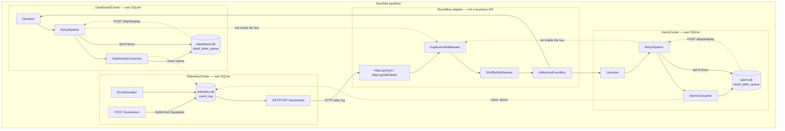
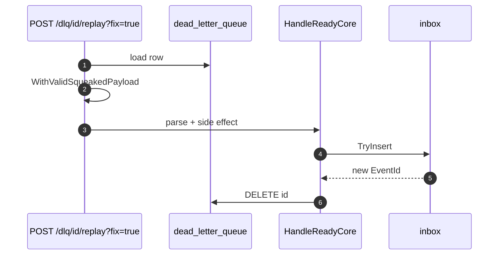
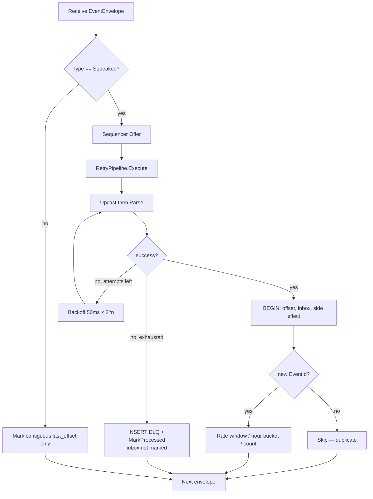
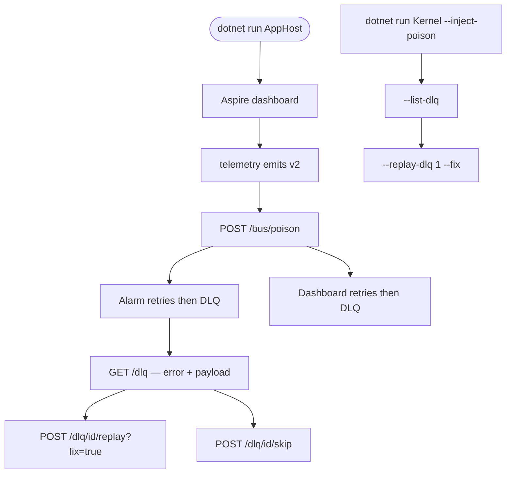

# Step 7 — as-built architecture

**Branch:** `step-7`  
**Punchline:** one poison message never blocks the partition. The handler is wrapped in `RetryPipeline`; exhausted retries write this Center's `dead_letter_queue` and still advance `last_offset`. The stream continues. Inspect and replay are consumer tools, not bus operations.

Aspire still hosts three services. Integration is still `IEventBus` (HTTP log tail). Retry and DLQ sit in the consumer, next to inbox, sequencer, and upcasters — not inside the bus.

**HTML roadmap note:** [DuckNetArchitectureSteps.html](../../DuckNetArchitectureSteps.html) draws a shared dead-letter store. In code each Center owns its own `dead_letter_queue` table (kernel demo uses the Telemetry schema file). Poison is a well-formed `EventEnvelope` whose `PayloadJson` is not JSON. Replay with `fix=true` rewrites a valid `Squeaked` v2 payload from envelope metadata; skip deletes the row. Inbox is not marked on DLQ so replay can apply.

## Delta vs Step 6

| | |
|--|--|
| **Added** | `RetryPipeline` (max 5, exponential backoff), `dead_letter_queue` per Center, `PoisonEvents`, Telemetry `POST /bus/poison` + `INJECT_POISON_EVENT`, kernel `--inject-poison` / `--list-dlq` / `--replay-dlq` / `--skip-dlq`, Alarm and Dashboard `GET /dlq` + `POST /dlq/{id}/replay` + `POST /dlq/{id}/skip` |
| **Changed** | Alarm, Dashboard, and kernel `SqueakCounter` catch handler failures, dead-letter, and continue. Offset advances on DLQ. `last_seq` on replay is `MAX` so a skipped seq does not regress progress. |
| **Unchanged** | No Center-to-Center business HTTP. No shared DB. Hostile transport after log read. Upcast still before parse. Inbox still dedups on `EventId`. |

## Wire types

Dedup key is still **`EventId`**. Resume key is still **`LogOffset`**. DLQ stores the full envelope JSON plus the error.

```text
EventEnvelope                          Step 7 use
  EventId          Guid                inbox key; not marked on DLQ
  Type             string              poison is still "Squeaked"
  Version          int                 2 (poison uses current version)
  PartitionKey     string              duckId; sequencer already advanced
  SequenceNumber   long                per-key; later seq must still run
  OccurredAt       DateTimeOffset      copied into a fixed payload on replay
  PayloadJson      string              valid Squeaked or "{not-json"
  LogOffset        long                marked even when dead-lettered
```

```text
dead_letter_queue
  id INTEGER PK
  consumer_group TEXT
  event_id TEXT            unique per group
  payload_json TEXT        serialized EventEnvelope
  error TEXT
  failed_at TEXT
  attempts INTEGER
```

Config that changes behavior:

| Knob | Default | Effect |
|------|---------|--------|
| `INJECT_POISON_EVENT` | off | Telemetry appends one malformed `Squeaked` at startup |
| `--inject-poison` | off | Kernel demo appends one poison row after the simulator |
| `POST /bus/poison` | | Telemetry appends one poison row to `event_log` |
| Retry | 5 attempts, 50ms × 2^(n-1) | Hosted Centers. Kernel tests use zero delay. |

## Architecture

`IEventBus` is the only integration seam. Retry and DLQ live on the consumer. Telemetry does not call Alarm or Dashboard. Neither opens `telemetry.db`. The bus does not know about retries.



**Intentionally absent:** shared DLQ, DLQ inside `IEventBus`, BillingCenter, RabbitMQ, tracing, hot-partition sharding.

## Execution — poison then next event

Parse throws. Five attempts. DLQ row. Offset advances. The next envelope on the same key still runs because the sequencer already released it.

```mermaid
sequenceDiagram
  autonumber
  participant Log as event_log
  participant Seq as PerKeySequencer
  participant RT as RetryPipeline
  participant H as Handler Parse
  participant Dlq as dead_letter_queue
  participant Off as last_offset

  Log->>Seq: Squeaked seq N poison
  Seq->>RT: released (nextExpected = N+1)
  loop attempts 1..5
    RT->>H: Parse
    H-->>RT: JsonException
  end
  RT->>Dlq: insert envelope + error
  RT->>Off: MarkProcessed
  Note over Seq,H: seq N+1 already released — HandleReady still runs
```

## Execution — replay after fix

Inbox was never marked. Replay bypasses the sequencer, rewrites a valid v2 payload, applies the side effect, deletes the DLQ row.



## Handler decision



## Demo lifecycle



Live Aspire does not inject poison unless `INJECT_POISON_EVENT=true` on Telemetry. `POST /bus/poison` is the interactive injector. Kernel `--inject-poison` writes one row after the simulator so `Log rows == Counted + 1` and `DLQ rows == 1`.
