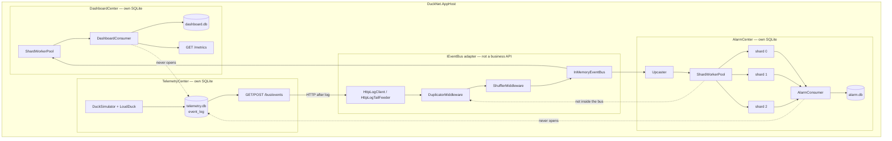
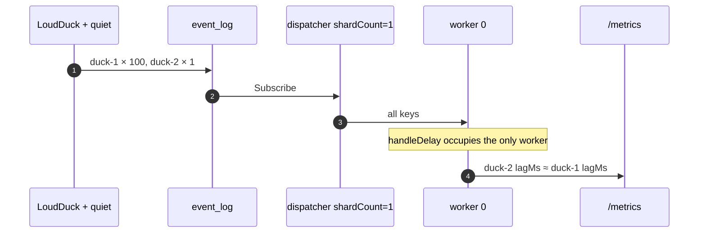
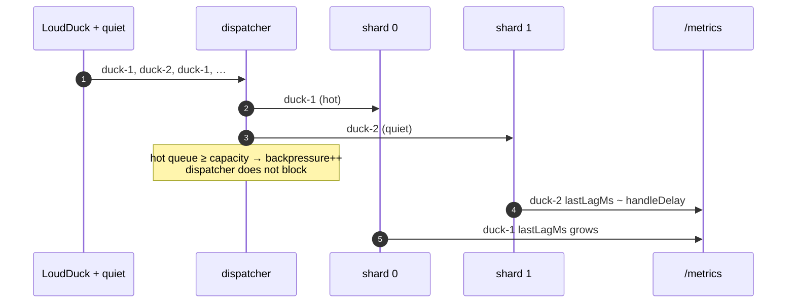
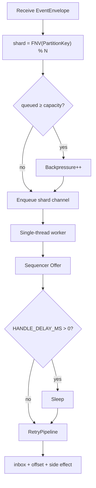
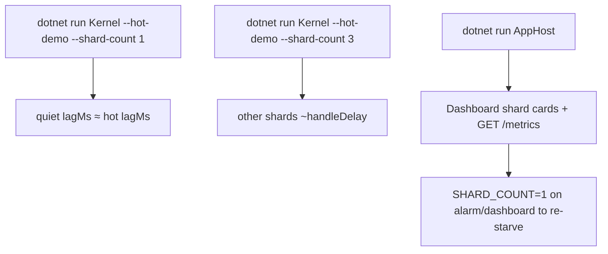

# Step 8 — as-built architecture

**Branch:** `step-8`  
**Punchline:** one LoudDuck does not have to starve the rest. `PartitionKey` hashes to a shard; each shard has its own worker. The hot key fills one queue. Keys on other shards stay near real-time. Lag is a consumer metric, not a bus feature.

Aspire still hosts three services. Integration is still `IEventBus` (HTTP log tail). Sharding sits in the consumer, next to sequencer, inbox, retry, and DLQ — not inside the bus.

**HTML roadmap note:** [DuckNetArchitectureSteps.html](../../DuckNetArchitectureSteps.html) draws bounded shard channels. In code each shard is an **unbounded** channel with a **soft capacity**. `queued ≥ capacity` increments backpressure. The dispatcher does **not** block on a full hot shard — blocking `WriteAsync` would HOL-block quiet keys on the single subscribe loop. SQLite is unchanged (locked Postgres swap is deferred: starvation is at the worker/channel layer; `KernelDb` already serializes writes).

## Delta vs Step 7

| | |
|--|--|
| **Added** | `LoudDuck` (100× weight), `PartitionShard` (FNV-1a), `ShardWorkerPool`, `ShardMetrics`, kernel `--hot-demo` / `--shard-count` / `--loud-duck` / `--handle-delay-ms`, Center `GET /metrics`, Dashboard shard lag cards |
| **Changed** | Alarm, Dashboard, and kernel `SqueakCounter` dispatch through shard workers. Same key always hits the same shard, so per-key order still holds. |
| **Unchanged** | No Center-to-Center business HTTP. No shared DB. Hostile transport after log read. Upcast, inbox, sequencer, retry, DLQ. |

## Wire types

Dedup key is still **`EventId`**. Order is still per **`PartitionKey`**. Shard index is `Hash(PartitionKey) % ShardCount`.

```text
EventEnvelope                          Step 8 use
  EventId          Guid                inbox key
  PartitionKey     string              duckId → shard
  SequenceNumber   long                per-key; preserved because one worker per shard
  LogOffset        long                per-shard lag = maxOffset - lastOffset
  OccurredAt       DateTimeOffset      per-key lagMs = now - occurredAt at handle
```

Config that changes behavior:

| Knob | Default | Effect |
|------|---------|--------|
| `LOUD_DUCK_ID` | off (Aspire: `duck-1`) | that duck gets weight 100 vs 1 for each other duck |
| `SHARD_COUNT` | 3 | `1` is the starvation demo |
| `HANDLE_DELAY_MS` | 0 (Aspire: 12) | fake handler work so lag is visible |
| `SHARD_CAPACITY` | 32 | backpressure when that shard's queue is this deep |
| `--hot-demo` | off | loud duck + 8ms handle + fast emits |

## Architecture

`IEventBus` is the only integration seam. The shard pool lives on the consumer. Telemetry does not call Alarm or Dashboard. Neither opens `telemetry.db`. The bus does not know about shards.



**Intentionally absent:** Postgres per Center, tracing, BillingCenter, RabbitMQ, shard assignment inside `IEventBus`.

## Execution — hot key without sharding

One worker. LoudDuck fills the queue. Quiet ducks wait behind it.



## Execution — sharded workers

Same hash for a key always. LoudDuck occupies shard 0. Quiet keys on 1 and 2 complete in ~handleDelay.



## Handler decision



## Demo lifecycle



Kernel `--hot-demo --shard-count 3`: LoudDuck on shard 0 shows multi-second `maxLagMs`; ducks that hash to shards 1–2 stay around the handle delay. A quiet duck that hashes onto shard 0 still starves — that is the partition-key lesson.
