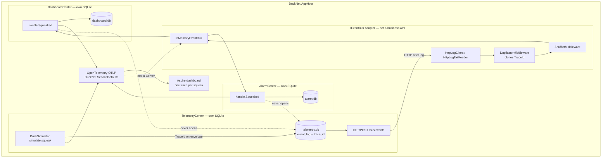
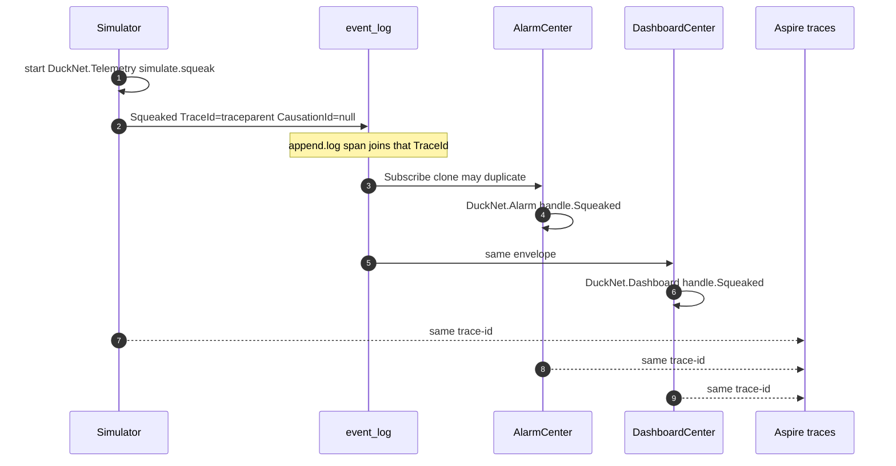
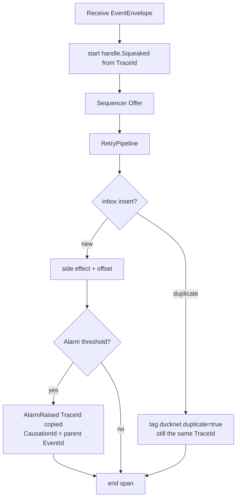
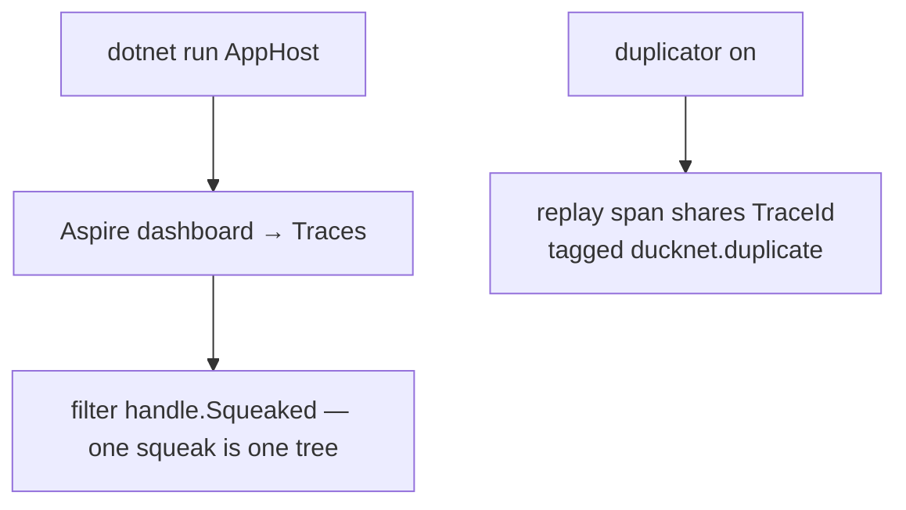

# Step 9 — as-built architecture

**Branch:** `step-9`  
**Punchline:** one squeak is one trace. `TraceId` (W3C traceparent) rides on the envelope because Centers never call each other. Aspire’s dashboard groups Simulator → Telemetry → Alarm → Dashboard spans by that id. Replays keep the same `TraceId`; each delivery is still a span. Inbox, not the tracer, is idempotent.

**HTML roadmap note:** [DuckNetArchitectureSteps.html](../../DuckNetArchitectureSteps.html) draws an OpenTelemetry exporter box. In code that is `DuckNet.ServiceDefaults`: `AddOpenTelemetry()` + OTLP when `OTEL_EXPORTER_OTLP_ENDPOINT` is set (Aspire injects it). Service defaults are **OTel only** — no HTTP resilience (PollingLoop already retries) and no remapped `/health` (Centers already own that route). `event_log` now stores `trace_id` / `causation_id`; without those columns the ids died at append.

## Delta vs Step 8

| | |
|--|--|
| **Added** | `DuckNetTracing` + per-Center `ActivitySource`, `DuckNet.ServiceDefaults`, `event_log.trace_id` / `causation_id`, producer/consumer/dispatcher spans, `duckId` baggage |
| **Changed** | Simulator and `/ingest/squeak` stamp `TraceId`. `AlarmRaised` copies it and sets `CausationId` to the parent `EventId`. |
| **Unchanged** | No Center-to-Center business HTTP. No shared DB. Hostile transport after log read. Upcast, inbox, sequencer, retry, DLQ, shards. |

## Wire types

Dedup key is still **`EventId`**. Correlation is **`TraceId`**. Causation is **`CausationId`** (parent `EventId`), not an OTel span id.

```text
EventEnvelope                          Step 9 use
  EventId          Guid                inbox key
  TraceId          string?             W3C traceparent (00-{trace}-{span}-{flags})
  CausationId      string?             parent EventId; null on origin Squeaked
  PartitionKey     string              duckId → span tag + baggage
  Type             string              span name handle.{Type}
```

Origin `Squeaked`: simulator (or ingest) creates a producer span, stamps `TraceId = Activity.Id`. `CausationId` is null.  
`AlarmRaised`: same `TraceId`, `CausationId = Squeaked.EventId`.  
Duplicate delivery: duplicator clones the envelope, so `TraceId` is identical. The second handle span is tagged `ducknet.duplicate=true` when inbox skips.

## Architecture

`IEventBus` is still the only integration seam. Tracing is envelope metadata plus process-local `ActivitySource`s. The OTLP exporter is not a business API.



**Intentionally absent:** BillingCenter, RabbitMQ, MCP ops server, Azure Monitor exporter.

## Execution — one squeak, linked spans



## Handler decision



## Demo lifecycle



Open the Aspire dashboard URL, then **Traces**. The Name column is `{resource}: {span}` (`alarm: handle.Squeaked`), not the ActivitySource (`DuckNet.Alarm`). Type `handle.Squeaked` in Filter, or pick Resource `alarm` / `dashboard` / `telemetry`. Do not type `DuckNet.*` — that string is not in the display name. Click a handle row: `simulate.squeak` / `ingest.squeak`, `append.log`, and both Centers’ `handle.Squeaked` share one `TraceId`. A duplicate delivery is a second `handle.Squeaked` on that trace with `ducknet.duplicate`. HTTP `GET` rows (log tail, `/metrics`) are usually their own traces.
