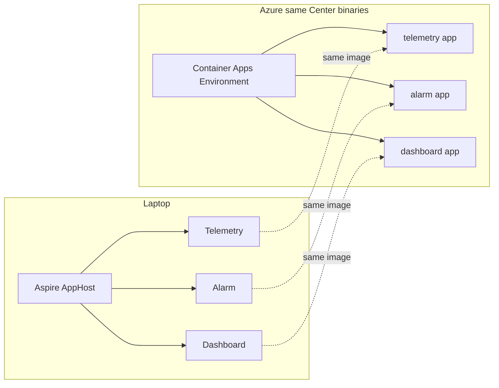
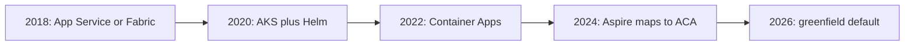
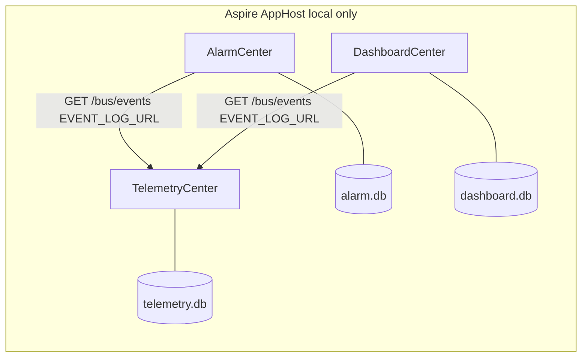
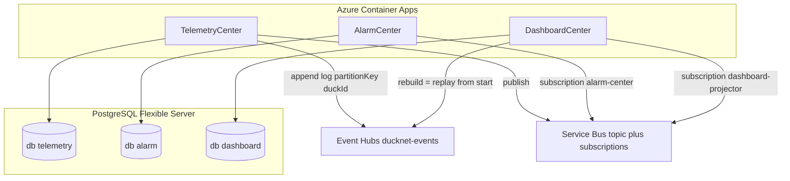

# Azure deployment — learning notes

Learning document, not as-built. DuckNet today runs on Aspire + SQLite + an HTTP log tail. Azure is **not implemented** (`infra/bicep/` does not exist yet). Step 12 in [ImplementationPlan.md](../ImplementationPlan.md) is the production-shaped target. This file explains **how** a system like this maps to Azure, **what** is industry-standard in 2026 given the Aspire inner loop, **how** that standard moved since 2018, and **what it costs** as a lab.

You do **not** break the system apart to put it on Azure. It is already three processes, three databases, and one integration seam (`IEventBus`). Aspire is the local orchestrator; the HTTP log tail in [`HttpLogTailFeeder.cs`](../src/DuckNet.EventBus/HttpLogTailFeeder.cs) is a stand-in for a broker. Azure replaces those stand-ins.

## Industry standard given this Aspire setup

**The standard landing zone for a solution shaped like DuckNet is Azure Container Apps: one Container App per Center.** That is what Aspire was built to publish to. Local `AddProject("alarm")` becomes a cloud revision of `ducknet-alarm`. AppHost stays on the laptop; `azd` or Bicep replaces it in Azure.

That is the greenfield .NET answer in 2025–2026. It is not App Service, not Functions, and not AKS — unless those older or heavier platforms already exist in the estate.

How the rest of the stack maps, in order of how common it is in industry:

- **Compute — Container Apps (standard for this shape).** Independent deploy, KEDA scale on queue depth, no cluster to own. App Service is still the most common *existing* Azure host for .NET web apps, but it is a 2015-era fit: one plan, Always On, hosted services as WebJobs. AKS is standard when a platform team already runs Kubernetes for 20+ services; for three Centers it is extra tax. Functions are standard for *triggered* glue (one message → one execution); they fight this codebase’s always-on inbox/outbox/sequencer loop.
- **Messaging — Service Bus topics + subscriptions (standard for .NET business events).** One topic, one subscription per consumer group (`alarm-center`, `dashboard-projector`). That is what NServiceBus/MassTransit default to on Azure. Event Hubs is standard for high-throughput *logs* (IoT, telemetry, replay, partition keys) — the Telia lesson — not for the median three-service domain. **Using both** (Hubs as system of record, Service Bus as fan-out) is a valid CQRS pattern and matches Step 12, but it is heavier than most shops this size. HTTP `EVENT_LOG_URL` is a teaching stand-in, not a production bus.
- **Data — Azure SQL or PostgreSQL Flexible Server, database per Center (standard).** One server, separate databases, is normal. Cosmos is the standard when partition key / RU / global distribution is the point. SQLite is local-only.
- **Identity / telemetry — Managed Identity + Key Vault + Application Insights (standard).** Connection strings are not in GitHub secrets long-term; OpenTelemetry already in Aspire just changes exporter.
- **CI/CD — GitHub Actions OIDC → ACR → update one Container App (standard).** That is the shape of [`deploy-center.yml`](../.github/workflows/deploy-center.yml). `azd up` is Microsoft’s shortcut from AppHost; many enterprises still write Bicep/Terraform by hand. Independent per-Center deploy is the microservice norm; deploying the whole compose stack as one unit is the exception (Option A below).

**Aspire-native path vs enterprise-legacy path**

- Greenfield .NET 8+ / Aspire shop: Container Apps + Service Bus + Postgres or Azure SQL + App Insights. That is Option C’s *compute*, usually with **Service Bus only** for messaging.
- Large Nordic enterprise (Telia-like): often AKS + Kafka or Event Hubs + SQL/Cosmos + Azure DevOps. Same Center boundaries, heavier platform. DuckNet’s Step 12 dual-product (Event Hubs + Service Bus) is closer to this teaching story than to the median startup.
- Older Azure shop: App Services + Azure SQL + Service Bus. Works; same 1 Center = 1 app = 1 DB mapping; worse independent scale.

Do **not** break Centers into extra App Services, queues-as-apps, and Functions. Industry standard is still 1 service = 1 deployable. Queues and databases are attachments, not applications.

## How the standard moved (January 2018 → August 2026)

The **architecture of a DuckNet-shaped system barely changed**. Database per service, events not RPC, outbox + inbox, independent deploy — that was already Sam Newman / Udi Dahan / NServiceBus gospel in 2018. What flipped is **where you run it and how you run it on a laptop**.

What a Telia-like “Centers + events + own DBs” stack looked like in each era:

### 2018–2019 — PaaS or Microsoft’s own orchestrator

- **Local:** Visual Studio, IIS Express, maybe `docker-compose`. No Aspire. Multi-service on a laptop was painful; many teams still developed one service at a time against shared Azure-dev.
- **Host:** Azure App Service (Web Apps + WebJobs for consumers) was the default for “a .NET service.” **Service Fabric** was Microsoft’s recommended *microservices* platform (reliable services, actors) — especially in large C# shops. Azure Container Service (Swarm/Mesos/K8s) was being replaced; **AKS went GA June 2018** and had not yet won.
- **Bus:** Azure Service Bus topics/subscriptions already standard for .NET business events (NServiceBus commercial, MassTransit OSS). RabbitMQ on VMs common. Event Hubs for IoT/telemetry (the partition-key story already existed). Kafka was rising outside Microsoft shops.
- **Data:** Azure SQL per service, or one SQL server many catalogs. Cosmos starting to appear for globality. DTC/MSDTC still hoped for; cloud brokers do not do distributed transactions, so **outbox was already the correct answer** — just not yet universally implemented.
- **CI/CD:** VSTS → **Azure DevOps (September 2018)**. ARM JSON. Octopus Deploy still common. Deploy-the-whole-release more common than per-service CD.
- **DuckNet equivalent:** three App Services (or three Service Fabric services) + three SQL DBs + one Service Bus namespace. Same boundaries as today. Local story much worse.

### 2019–2021 — Kubernetes won, then everyone paid the tax

- **Local:** Docker Desktop + compose + Helm values. **Project Tye** (Build 2020) was Microsoft’s first “run my microservices together” tool — spiritual ancestor of Aspire; later archived.
- **Host:** **AKS became the industry default** for “real” microservices. Docker Swarm faded. Service Fabric Mesh was announced and then killed; Service Fabric retreated to existing estates. Istio/service-mesh hype. Helm 3 (2019, Tiller gone).
- **Bus:** Kafka exploded (Confluent, Event Hubs Kafka protocol). Service Bus stayed the .NET default. **Dapr 1.0 (February 2021)** offered pub/sub as a sidecar.
- **Data:** Postgres on Azure became respectable (Flexible Server). Cosmos + Event Hubs = typical telco/IoT “hot partition” stack.
- **CI/CD:** **GitHub Actions GA November 2019**; by 2021 many greenfield teams left Azure DevOps. Terraform dominant for IaC; **Bicep GA late 2021**.
- **Observability:** proprietary App Insights SDK → **OpenTelemetry** (traces 1.0 in 2021).
- **Culture:** peak “everything must be a microservice on K8s,” then modular-monolith backlash and K8s fatigue. Outbox/inbox stopped being exotic.
- **DuckNet equivalent:** three Deployments in AKS, three databases, Service Bus or Kafka, Helm + pipeline. Platform team required. Same Center code.

### 2022–2023 — Serverless containers: K8s without the cluster

- **Host:** **Azure Container Apps GA May 2022** (Build). Built on AKS + **KEDA + Dapr + Envoy**, no kube API. Microsoft’s docs start saying: start here unless you *need* the Kubernetes API. App Service remains the bulk of *existing* .NET websites. Functions remain for trigger-glue, not always-on Centers.
- **Ship:** **azd 1.0 May 2023**. GitHub Actions for Container Apps GA 2023. OIDC/workload identity federation: stop storing Azure passwords in GitHub.
- **Local:** still compose/Tye; the laptop/cloud gap is the pain Aspire will target.
- **DuckNet equivalent:** one Container App per Center, KEDA scale on subscription depth, Postgres, Service Bus. This is already today’s shape — missing only the Aspire AppHost.

### 2024–2026 — Aspire closes the laptop/cloud gap

- **Local:** **Aspire GA 21 May 2024** (preview with .NET 8, November 2023). AppHost + dashboard + OpenTelemetry + service discovery. Replaces compose/Tye for .NET. **.NET 9 (2024) / .NET 10 (November 2025)** — DuckNet’s current SDK.
- **Host:** Aspire → **ACA via azd** is the first-party path. AKS remains standard *inside* companies that already have a platform team (Telia-like). AKS Automatic (2024–25) tries to shrink that gap. Dedicated Container Apps workload profiles for always-on consumers.
- **Bus:** still Service Bus for domain events; Event Hubs/Kafka for logs. MassTransit transactional outbox is a product feature, not a blog post. Dapr-on-ACA is optional; DuckNet’s explicit `IEventBus` is the teaching version of the same seam.
- **CI/CD:** path-filtered per-service deploy (what [`deploy-center.yml`](../.github/workflows/deploy-center.yml) already is) is normal. Independent revision per Container App.
- **DuckNet equivalent:** exactly Option C’s compute. Step 12’s Event Hubs *plus* Service Bus is the 2019–2021 telco pattern layered on the 2024 hosting standard.

### What did not become standard

- Splitting one Center into “API App Service + queue processor Function + separate DB app” — 2018 Functions-era thinking. Occasional scale split later; not the starting topology.
- Shared database “for simplicity” — fought since 2014; still the most common real-world violation.
- HTTP between Centers as the integration — easy locally; becomes a distributed monolith. The industry learned this the hard way 2018–2020 (sync chains, cascading failures). DuckNet’s rule 1 is that lesson.
- Deploying the whole compose stack as one unit — fine for a lab VM; opposite of microservice CD.

**Through-line:** 2018 same services on App Service or Fabric → 2020 same services on AKS → 2022 same services on Container Apps → 2024 same services with Aspire on the laptop mapping to ACA in Azure.

DuckNet is practicing 2018 messaging correctness on a 2024–2026 inner loop.

## What you have today (Step 5)

- Three ASP.NET apps, each with its own SQLite file and Dockerfile under [`infra/docker/`](../infra/docker/).
- Alarm and Dashboard **do not call each other**. They poll Telemetry’s bus HTTP (`EVENT_LOG_URL`). That is the transport adapter, not a business API.
- Shared code (`Contracts`, `Kernel`, `EventBus`) is compiled **into each image**. There is no shared runtime or shared DB.
- [`deploy-center.yml`](../.github/workflows/deploy-center.yml) already builds and pushes per-Center images to GHCR. It does **not** yet talk to Azure.

Consumers are **always-on background loops** (poll about every 20 ms). They are not request-driven Functions. That constraint drives hosting and price: scale-to-zero misses events unless a real queue with a scaler is in front.

## What “deploy to Azure” actually swaps

| Local today | Azure equivalent | Must the Center code change? |
|---|---|---|
| `DuckNet.AppHost` | Container Apps Environment, App Service Plan, or one VM | No — AppHost stays for laptop demos |
| SQLite files | PostgreSQL (one **database** per Center) or Azure Files for SQLite | Connection string / provider; schemas stay owned per Center |
| `GET /bus/events` HTTP tail | Keep it (lift-and-shift) **or** Service Bus / Event Hubs behind `IEventBus` | Only [`DuckNet.EventBus`](../src/DuckNet.EventBus/) if you swap transport |
| Aspire dashboard / OpenTelemetry | Application Insights | Exporter endpoint |
| Env vars in AppHost | Key Vault + Container App settings | No handler changes |

Rule 2 stays: one PostgreSQL **server** with separate databases (`telemetry`, `alarm`, `dashboard`) is fine. One **shared schema** is not.

You would **not** split AlarmCenter into “an App Service + a queue app + a DB app”. Each Center stays one deployable unit that happens to expose HTTP **and** run a consumer. Queues and DBs are **infrastructure the Center uses**, not extra applications you carve out of it.

## Option A — Cheapest lab: one VM or Container Instance

Run the three containers (or even Aspire) on a single `B1s`/`B2s` Linux VM or an Azure Container Instance group. SQLite on disk. Keep `EVENT_LOG_URL` as internal HTTP.

- **Azure resources:** 1 VM (or ACI), public IP, maybe a storage disk. Optional: GitHub Actions SSH deploy.
- **Code change:** none.
- **Price:** roughly **$8–20/month** if left on; near **$0** if you deallocate between demos.
- **Tradeoff:** does not prove independent Center deploys or managed messaging. Fine for “it runs in the cloud.”

## Option B — Lift-and-shift: three Container Apps, keep HTTP bus + SQLite

Map [`AppHost Program.cs`](../src/DuckNet.AppHost/Program.cs) 1:1: one Container App per Center, inject `EVENT_LOG_URL` to Telemetry’s internal URL. Mount Azure Files so SQLite survives restarts (`minReplicas: 1` because of the poll loop).

- **Azure resources:** Resource group, Container Apps Environment, 3 Container Apps, Azure Files, Log Analytics, ACR (or GHCR), optional App Insights.
- **Code change:** almost none. Persistence path via `DUCKNET_DB`. Networking so Alarm/Dashboard can reach Telemetry.
- **CI:** extend `deploy-center.yml` with `az containerapp update --image ...` (already sketched for Step 12).
- **Price (always-on, 0.25–0.5 vCPU / 0.5–1 GiB each):** roughly **$25–50/month** (compute + files + logs). Scale-to-zero is unsafe here: the consumer would stop polling.
- **Tradeoff:** still no real broker. SQLite on Azure Files is OK for a toy, not for concurrent writers. Independent deploy **does** work.

App Service variant of B: one Linux **B1** plan (~$13) hosting three Web Apps, Always On, SQLite under `/home`. Cheaper compute, less “one Center = one scale unit.” Same HTTP wiring.

## Option C — Production-shaped (locked in as Step 12)

This is the roadmap in [ImplementationPlan.md](../ImplementationPlan.md) § Step 12. Same Center boundaries; swap implementations behind `IEventBus`.

**Resources (dev):**

- Container Apps Environment + 3 apps (later 4 with Billing)
- Azure Database for PostgreSQL Flexible Server **B1ms**, databases per Center
- Event Hubs (system of record / replay, partition key = `duckId`)
- Service Bus Standard: topic `ducknet-events`, one subscription per consumer group
- Key Vault + managed identities
- Log Analytics + Application Insights
- ACR
- Optional: Bicep in `infra/bicep/` + `azd` from Aspire

**What changes in code:** new `ServiceBusEventBus` / Event Hubs log writer in EventBus. Center handlers, inbox, outbox, sequencer stay. Same empty-diff constraint as the RabbitMQ step (Step 11).

**Simpler messaging variant:** Event Hubs **only** (consumer groups = DuckNet consumer groups). One product instead of Hubs + Service Bus. Loses Service Bus DLQ/sessions; keeps the Telia partition-key lesson. Cheaper and fewer moving parts for a lab.

**Price (dev, left running, West Europe / Sweden Central ballpark):**

- 3 always-on small Container Apps: **$25–45**
- PostgreSQL B1ms + 32 GB: **$15–25**
- Service Bus Standard base: **~$10**
- Event Hubs Basic 1 TU: **~$11** (skip this line if you use Hubs-only **or** keep the HTTP log)
- ACR Basic + Key Vault + App Insights (toy volume): **$5–15**

**Total Option C: ~$60–110/month** if you never turn it off. Stop Container Apps + PostgreSQL between demos and it drops hard. A “prod-shaped” SKU (Service Bus Premium, HA Postgres) jumps to hundreds.

These are order-of-magnitude USD figures, not a quote. Recalc in the [Azure pricing calculator](https://azure.microsoft.com/pricing/calculator/) for your region.

## Do you wire App Services + queues + DBs as separate apps?

**No extra app per queue.** The mapping is:

- **1 Center = 1 compute resource** (Container App or App Service)
- **1 Center = 1 database** (not 1 server)
- **1 bus** (HTTP URL today, or one topic / one hub) with **subscriptions / consumer groups**
- Outbox, inbox, offsets stay **inside** the Center’s DB

What you configure in Azure Portal / Bicep is connection strings and identities, not a rewrite that extracts Alarm’s rate window into a Function and its HTTP API into another App Service. You *could* do that later (KEDA scale-out, separate API replicas) — that is an ops split, not required by the architecture.

Aspire (`azd up`) can provision Option B/C from the existing AppHost. Bicep is the explicit, interview-friendly version already chosen for Step 12.

## What to pick

- **Industry-standard cloud shape for this repo:** Container Apps (one per Center) + Service Bus topic/subscriptions + Postgres or Azure SQL per Center + App Insights. That is Option C’s compute, with **Service Bus only** unless you specifically want the Event Hubs partition-key lesson.
- **Prove “it runs in Azure” this weekend:** Option A or B. Keep HTTP `EVENT_LOG_URL`. Do not introduce Service Bus yet.
- **Prove the Telia-shaped story (independent deploy, broker, replay, no shared DB):** Option C after Step 11 (local RabbitMQ first, then Azure bus). That is the planned path; doing it now would skip Steps 6–11 and mix lessons.
- **Skip AKS** for this repo. It adds cluster tax without teaching Center isolation.

When Step 12 is implemented: Bicep skeleton, OIDC in `deploy-center.yml`, Postgres provider, then `IEventBus` Azure adapter — in that order, with AppHost remaining the local demo.
