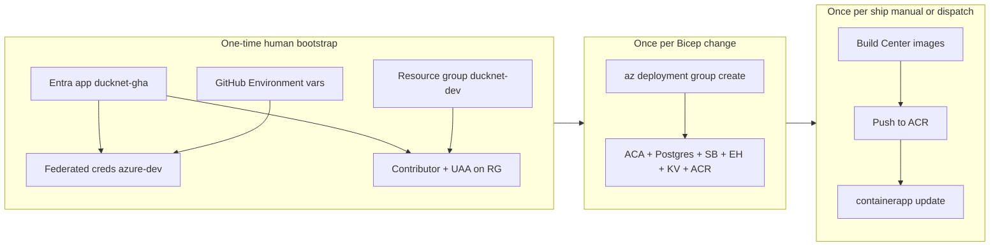

# Azure first deploy (one-time)

Operational runbook for standing up DuckNet **`dev`** in Azure once. Continuous deployment stays manual until you turn on the GitHub workflows described in [CD contract](./cd-contract.md) — path-filtered merges already push **GHCR** images automatically; they do **not** update Container Apps by default.

**Not this file:** industry context, options A/B/C, and lab pricing → [azure-deployment.md](./azure-deployment.md). OIDC identity planes and pipeline map → [cd-contract.md](./cd-contract.md). Why these Azure products → [design-rationale.md](./design-rationale.md).

**Current repo state (12b):** Bicep compiles; `ServiceBusEventBus`, `EventHubsLogWriter`, and `PostgresKernelDb` exist behind env flags. Centers still open **SQLite** via `KernelDb.Open` in composition roots — full squeak → alarm → dashboard → billing in Azure needs the remaining **12c app wiring** ([ImplementationPlan § 12c](../ImplementationPlan.md#step-12c--first-azure-environment-live-deploy)). This runbook still gets you: live infra, ACR images, Container App revisions, and `/health` on Azure FQDNs.

## What you deploy

One resource group (`ducknet-dev`), Sweden Central (fallback West Europe if a SKU is missing):

| Module | Resource |
|--------|----------|
| `monitoring` | Log Analytics + Application Insights |
| `acr` | Container Registry (Basic, no admin user) |
| `identities` | User-assigned managed identity per Center |
| `keyvault` | Key Vault (RBAC) |
| `postgres` | Flexible Server B1ms + databases `telemetry`, `alarm`, `dashboard`, `billing` |
| `eventhubs` | Namespace + hub `ducknet-events` (4 partitions) |
| `servicebus` | Namespace + topic `ducknet-events` + subscriptions per consumer group |
| `containerapps` | Container Apps Environment + `ducknet-telemetry`, `ducknet-alarm`, `ducknet-dashboard`, `ducknet-billing` |
| `roles` | Runtime MI data-plane RBAC; pipeline `AcrPush` + Key Vault Secrets Officer when `pipelinePrincipalId` is set |

Container Apps start with a **placeholder image** until you push Center images to ACR and update revisions.

## Prerequisites

1. Azure subscription — create resource groups and role assignments.
2. Entra rights — create an app registration and **federated credentials** (Application Developer, or higher in locked-down tenants).
3. Local tools — [Azure CLI](https://learn.microsoft.com/cli/azure/install-azure-cli) with `az bicep install`, [Docker](https://docs.docker.com/get-docker/), `dotnet` 10 SDK (for local image builds if not using Actions).
4. GitHub — admin on `muxare/DuckNet` to create Environments and set variables.
5. Budget — Option C left running is roughly **$65–120/month**; see [azure-deployment.md](./azure-deployment.md#option-c--production-shaped-locked-in-as-steps-12b12c). Stop apps and Postgres between demos.

## Overview



**Later (CD):** same `infra.yml` and `deploy-center.yml` jobs, triggered on `workflow_dispatch` (and optional `AZURE_AUTO_DEPLOY_DEV` — not default). See [When CD kicks in](#when-cd-kicks-in).

---

## Phase 0 — Bootstrap (human, once per environment)

Do this before any Bicep apply. No `AZURE_CLIENT_SECRET` — OIDC only ([cd-contract](./cd-contract.md#oidc-federation-github--entra--azure)).

### 0.1 Entra app registration

```bash
az login
az account set --subscription "<subscription-id>"

APP_NAME=ducknet-gha
APP_ID=$(az ad app create --display-name "$APP_NAME" --query appId -o tsv)
SP_OBJECT_ID=$(az ad sp create --id "$APP_ID" --query id -o tsv)
TENANT_ID=$(az account show --query tenantId -o tsv)
SUBSCRIPTION_ID=$(az account show --query id -o tsv)

echo "AZURE_CLIENT_ID=$APP_ID"
echo "AZURE_TENANT_ID=$TENANT_ID"
echo "AZURE_SUBSCRIPTION_ID=$SUBSCRIPTION_ID"
echo "PIPELINE_OBJECT_ID=$SP_OBJECT_ID   # for Bicep pipelinePrincipalId"
```

### 0.2 Federated credential (GitHub Environment `azure-dev`)

In Entra → App registrations → `ducknet-gha` → Certificates & secrets → Federated credentials:

| Field | Value |
|-------|--------|
| Issuer | `https://token.actions.githubusercontent.com` |
| Audience | `api://AzureADTokenExchange` |
| Subject | `repo:muxare/DuckNet:environment:azure-dev` |

Add a second credential with subject `repo:muxare/DuckNet:environment:azure-prod` when you stand up prod.

Or via CLI:

```bash
az ad app federated-credential create --id "$APP_ID" \
  --parameters '{
    "name": "github-azure-dev",
    "issuer": "https://token.actions.githubusercontent.com",
    "subject": "repo:muxare/DuckNet:environment:azure-dev",
    "audiences": ["api://AzureADTokenExchange"]
  }'
```

### 0.3 Resource group + pipeline RBAC

```bash
LOCATION=swedencentral
RG=ducknet-dev

az group create --name "$RG" --location "$LOCATION"

az role assignment create --assignee "$SP_OBJECT_ID" --role Contributor --scope "/subscriptions/$SUBSCRIPTION_ID/resourceGroups/$RG"
az role assignment create --assignee "$SP_OBJECT_ID" --role "User Access Administrator" --scope "/subscriptions/$SUBSCRIPTION_ID/resourceGroups/$RG"
```

`User Access Administrator` is required so Bicep can assign **runtime** managed identities their data-plane roles (`roles.bicep`).

### 0.4 GitHub Environment variables

Repo → Settings → Environments → create **`azure-dev`**. Add **variables** (not secrets):

| Variable | Example |
|----------|---------|
| `AZURE_CLIENT_ID` | Entra application (client) id |
| `AZURE_TENANT_ID` | Directory id |
| `AZURE_SUBSCRIPTION_ID` | Subscription id |
| `AZURE_RESOURCE_GROUP` | `ducknet-dev` |

Optional: create **`azure-prod`** with the same keys and a prod RG name; add a required reviewer on that Environment.

---

## Phase 1 — Apply infrastructure (one-time, or when Bicep changes)

### Option A — GitHub Actions (recommended if OIDC is configured)

1. Actions → **Infra** → Run workflow.
2. `environment`: **dev**
3. `action`: **what-if** first, then **apply**.

The workflow uses `environment: azure-dev`, mints an OIDC token, and runs:

```bash
az deployment group create \
  --resource-group "$AZURE_RESOURCE_GROUP" \
  --template-file infra/bicep/main.bicep \
  --parameters infra/bicep/parameters/dev.bicepparam
```

### Option B — Azure CLI from your laptop

You must be logged in as a user with Contributor + UAA on the RG (or subscription Owner). Supply a real Postgres password and the pipeline service principal **object id** from Phase 0.

```bash
az bicep install
az bicep build --file infra/bicep/main.bicep

RG=ducknet-dev
PIPELINE_OBJECT_ID="<SP_OBJECT_ID from Phase 0>"
PG_PASSWORD="$(openssl rand -base64 24)"

az deployment group create \
  --resource-group "$RG" \
  --template-file infra/bicep/main.bicep \
  --parameters infra/bicep/parameters/dev.bicepparam \
  --parameters pipelinePrincipalId="$PIPELINE_OBJECT_ID" \
               postgresAdminLoginPassword="$PG_PASSWORD"
```

Store `PG_PASSWORD` somewhere safe (password manager). Bicep does not write Postgres connection strings into Key Vault yet — you will need them for 12c app wiring.

### Verify infra

```bash
RG=ducknet-dev
az deployment group show --resource-group "$RG" --name main --query properties.provisioningState -o tsv
az containerapp list --resource-group "$RG" --query "[].{name:name, fqdn:properties.configuration.ingress.fqdn}" -o table
az acr list --resource-group "$RG" --query "[].name" -o tsv
```

Deployment outputs (FQDNs, ACR name, Postgres host) are in the deployment result:

```bash
az deployment group show --resource-group "$RG" --name main \
  --query properties.outputs -o json
```

If Sweden Central rejects a SKU, re-apply with `--parameters location=westeurope` (or edit `dev.bicepparam`).

---

## Phase 2 — Deploy Center images (one-time full stack)

Container Apps need DuckNet images in **ACR** (not GHCR). Two paths:

### Option A — GitHub Actions

1. Actions → **Deploy Center** → Run workflow.
2. `center`: **all**
3. `environment`: **dev**

This builds all four images, pushes to GHCR, then (Azure job) OIDC → pull from GHCR → push to ACR → `az containerapp update` → `curl https://<fqdn>/health`.

### Option B — Local Docker + Azure CLI

```bash
RG=ducknet-dev
ACR=$(az acr list --resource-group "$RG" --query "[0].name" -o tsv)
az acr login --name "$ACR"
TAG=$(git rev-parse --short HEAD)

for center in telemetry alarm dashboard billing; do
  case $center in
    telemetry) DF=infra/docker/DuckNet.TelemetryCenter/Dockerfile ;;
    alarm)     DF=infra/docker/DuckNet.AlarmCenter/Dockerfile ;;
    dashboard) DF=infra/docker/DuckNet.DashboardCenter/Dockerfile ;;
    billing)   DF=infra/docker/DuckNet.BillingCenter/Dockerfile ;;
  esac
  docker build -f "$DF" -t "${ACR}.azurecr.io/ducknet-${center}:${TAG}" .
  docker push "${ACR}.azurecr.io/ducknet-${center}:${TAG}"
  az containerapp update --name "ducknet-${center}" --resource-group "$RG" \
    --image "${ACR}.azurecr.io/ducknet-${center}:${TAG}"
done
```

### Smoke — health only (works after Phase 2)

```bash
RG=ducknet-dev
for app in ducknet-telemetry ducknet-alarm ducknet-dashboard ducknet-billing; do
  FQDN=$(az containerapp show --name "$app" --resource-group "$RG" \
    --query properties.configuration.ingress.fqdn -o tsv)
  curl -fsS "https://${FQDN}/health"
  echo " OK $app"
done
```

### Smoke — full demo (after 12c app wiring)

When Centers use Postgres + Service Bus + Event Hubs from Container App env (12c acceptance), repeat the Aspire demo against Azure FQDNs:

```bash
# Telemetry LoudDuck / squeak path — same routes as local
curl "https://<telemetry-fqdn>/stats"
curl "https://<dashboard-fqdn>/metrics"
curl "https://<billing-fqdn>/sagas"
```

Traces → Application Insights (connection string is already injected via Bicep). Independent deploy: update only `ducknet-alarm` and confirm other FQDNs unchanged.

---

## Phase 3 — Postgres secrets (before full 12c demo)

Bicep provisions Postgres and Key Vault but does **not** yet:

- Write per-Center connection strings into Key Vault
- Point Container Apps at Key Vault references for `DUCKNET_DB`

For the full Azure demo, 12c adds that wiring (or you do it manually once):

```bash
KV_NAME=$(az keyvault list --resource-group ducknet-dev --query "[0].name" -o tsv)
PG_HOST=$(az postgres flexible-server list --resource-group ducknet-dev --query "[0].fullyQualifiedDomainName" -o tsv)

# Example — repeat per database name matching the Center
az keyvault secret set --vault-name "$KV_NAME" --name "db-telemetry" \
  --value "Host=${PG_HOST};Database=telemetry;Username=ducknet;Password=${PG_PASSWORD};Ssl Mode=Require"
```

Until Center code reads Postgres connection strings (and Telemetry uses `EventHubsLogWriterFactory`), apps keep SQLite inside the container — fine for `/health`, not for durable cross-restart demos.

---

## Stop spend between demos

```bash
RG=ducknet-dev
for app in ducknet-telemetry ducknet-alarm ducknet-dashboard ducknet-billing; do
  az containerapp update --name "$app" --resource-group "$RG" --min-replicas 0 --max-replicas 1
done
PG=$(az postgres flexible-server list --resource-group "$RG" --query "[0].name" -o tsv)
az postgres flexible-server stop --resource-group "$RG" --name "$PG"
```

`min-replicas 0` lets each app scale to zero (no replica compute). The Container Apps Environment still bills; Postgres stop removes the largest idle cost.

To run again:

```bash
az postgres flexible-server start --resource-group "$RG" --name "$PG"
for app in ducknet-telemetry ducknet-alarm ducknet-dashboard ducknet-billing; do
  az containerapp update --name "$app" --resource-group "$RG" --min-replicas 1 --max-replicas 1
done
```

Bicep defaults `minReplicas: 1` because scale-to-zero drops the consumer poll/queue loop during live demos.

---

## When CD kicks in (not part of the one-time deploy)

| What | Today | After you enable CD habits |
|------|--------|------------------------------|
| Build + test | `ci.yml` on every PR/push | Same |
| Images to GHCR | `deploy-center.yml` on `main` path filters | Same — still automatic |
| Bicep apply | Manual: `infra.yml` **workflow_dispatch** apply | Same unless you add a scheduled or merge-triggered apply (not recommended for a lab) |
| ACR + Container App revision | Manual: `deploy-center.yml` **workflow_dispatch** | Same by default; optional repo var `AZURE_AUTO_DEPLOY_DEV=true` for auto-dev on `main` ([cd-contract](./cd-contract.md#pipeline-map)) |
| Prod | — | `azure-prod` Environment with required reviewer; always dispatch |

Pipeline identity (`ducknet-gha`) deploys; each Center’s **managed identity** is the data plane. Never put `AZURE_CLIENT_SECRET` or Center DB connection strings in GitHub.

---

## Troubleshooting

| Symptom | Likely cause |
|---------|----------------|
| `infra.yml` Azure job skipped | GitHub Environment variables missing on `azure-dev` |
| `AADSTS70021` / federated login failed | Wrong federated credential **subject** (must be `environment:azure-dev`, not only `refs/heads/main`) |
| Bicep role assignment failed | Pipeline SP missing **User Access Administrator** on the RG |
| `containerapp update` skipped in Actions | No ACR in RG (infra not applied) or OIDC vars missing |
| Health OK but no squeaks | 12c app wiring not done — still SQLite + no Service Bus consumer path in composition root |
| Postgres connection refused from app | Firewall rule `AllowAllAzureServices` is in Bicep; check server is **Running** |
| SKU unavailable in Sweden Central | Re-apply with `location=westeurope` |

---

## Related files

- Bicep: [`infra/bicep/`](../infra/bicep/) — module list in [`infra/bicep/README.md`](../infra/bicep/README.md)
- Workflows: [`infra.yml`](../.github/workflows/infra.yml), [`deploy-center.yml`](../.github/workflows/deploy-center.yml)
- Step acceptance: [ImplementationPlan § 12c](../ImplementationPlan.md#step-12c--first-azure-environment-live-deploy)
