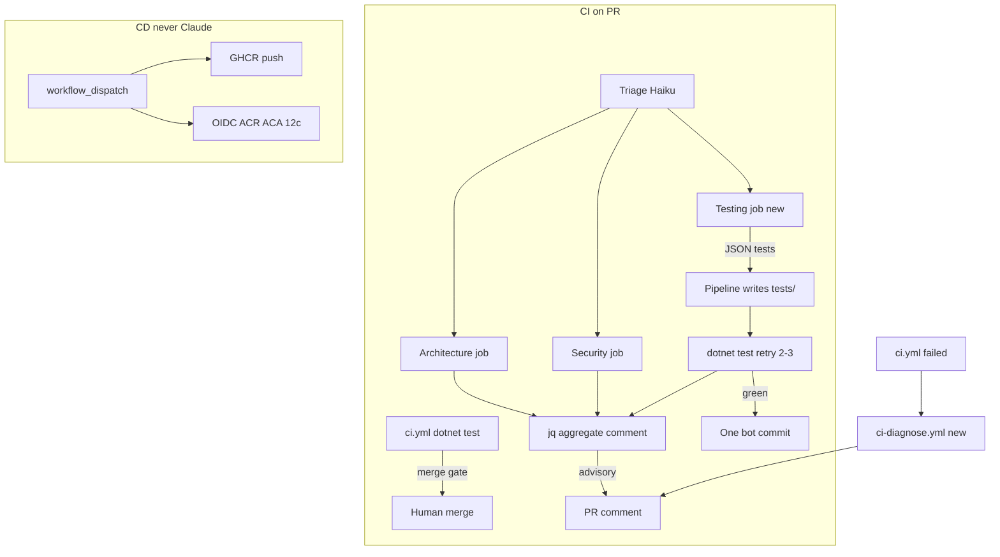

# CCA-F Scenario 5 — CI/CD expansion (planned)

**Status:** planned — not implemented. Implement in the three phases below; each phase is independently committable.

**Exam prompt this answers:** *You are integrating Claude Code into your CI/CD pipeline. The system runs automated code reviews, generates test cases, and provides feedback on pull requests. You need to design prompts that provide actionable feedback and minimize false positives.*

DuckNet already has the **review + PR feedback** half. This spec fills **test generation**, the **flag/prompt gaps** the exam scores, and a **CD-adjacent** failed-CI job. Claude stays advisory. Tests decide merge. Claude never deploys.

Companion: live policy in [`ci-policy.md`](./ci-policy.md). CD identity/jobs in [`cd-contract.md`](./cd-contract.md). Do not treat this file as Step 12c work.

## What already is the exam-correct answer

[`.github/workflows/claude-review.yml`](../.github/workflows/claude-review.yml) + [`.github/scripts/run-claude.sh`](../.github/scripts/run-claude.sh) already demonstrate most of D3/D4/D5:

| Exam demand | DuckNet today |
|---|---|
| `-p` (no hang) | `run-claude.sh` |
| `--output-format json` + `--json-schema` | same; parse `.structured_output`, never regex |
| Isolated specialists (no inherited context) | separate jobs; triage artifact only |
| Advisory PR feedback | sticky comment; **[`ci.yml`](../.github/workflows/ci.yml) decides merge** |
| Do not guess | prompts: empty/truncated → notes, not findings |
| Confidence not a merge signal | aggregator ignores `confidence` (exam trap: self-reported confidence is poorly calibrated) |
| Independent verify | [`refactor-scan.yml`](../.github/workflows/refactor-scan.yml) scan then separate confidence session |
| CD stays human | [`cd-contract.md`](./cd-contract.md): Azure is `workflow_dispatch`; Claude never applies Bicep or `containerapp update` |

Keep [`.github/prompts/code-review.md`](../.github/prompts/code-review.md) parked per [`ci-policy.md`](./ci-policy.md) §D. This spec adds a **testing** specialist, not the general code specialist.



## Non-goals (still true after this work)

- Claude as a required status check
- Claude pushing to `main` or auto-merging
- Claude running `az` or mutating Container Apps
- Pattern 3 *remediation of `src/`* in CI (fix production code to make generated tests pass)
- Message Batches API (document the mapping only — nightly `refactor-scan.yml` is the DuckNet stand-in)
- Wiring the parked `code-review.md` specialist

## Assumptions

1. Same-repo PRs only (forks already skipped).
2. Generated tests may be imperfect; the author can revert the bot commit.
3. Claude does not get `Write` / `Bash` / `git` in CI — the workflow writes and tests.
4. Phase A can ship alone; B and C are independently committable.

## Prompt design rules (every new or changed prompt)

Copy these into the prompt files; they are the Scenario 5 scoring rubric:

1. **Actionable finding:** file + what is wrong + why (one or two sentences). Suggested test: path + `[Fact]` name + the behavior asserted.
2. **Explicit allow/deny**, not vibes. Disable a noisy category instead of “be conservative.”
3. **Diff-only.** Pre-existing code is out of scope.
4. **Independent sessions** for generate vs review vs diagnose.
5. **Schema is the contract**; `jq` aggregates; never parse “LGTM.”
6. **Escalation:** cannot confirm → `notes`; cannot generate compiling tests after 3 tries → comment, no commit.

---

## Phase A — Flags and false-positive prompts (no new jobs)

Exam scoring details DuckNet is missing or incomplete. No new workflows.

### A1. `--bare` + schema retry

**File:** [`.github/scripts/run-claude.sh`](../.github/scripts/run-claude.sh)

- Add `--bare` next to existing `-p`, `--output-format json`, `--json-schema`, `--permission-mode dontAsk`. Exam answer for “CI vs laptop drift” is `--bare`, not more timeout.
- Keep `--tools ""` for triage / architecture / security (sandbox = `--tools`, not `--allowedTools`).
- **`--bare` skips auto-loaded `CLAUDE.md`.** That is intended. Standing rules stay *inlined in the prompt files* (already true for the five architecture rules). For Phase B, the workflow **cats a testing slice into the input** so you get reproducibility *and* project conventions.
- Validation-retry: if `.structured_output` is missing or fails a `jq` / schema check, re-invoke **2 more times** (cap 3) with the validation error as feedback.
- Still exit 0 on model failure (degraded artifact); exit 2 only on missing `CLAUDE_CODE_OAUTH_TOKEN`. Do not fail the workflow on a verdict.

**Done when:** `run-claude.sh` passes `--bare`; a missing `structured_output` triggers retries (fixture or dry-run comment is enough — no live Claude required in `ci.yml`).

### A2. Explicit criteria + few-shot (not “be conservative”)

Exam D4: vague “only report high-confidence findings” does **not** reduce false positives.

**Files:** [`.github/prompts/architecture-review.md`](../.github/prompts/architecture-review.md), [`.github/prompts/security-review.md`](../.github/prompts/security-review.md)

Add 2–4 few-shots that show:

- **Finding** — claimed behavior contradicts the *diff* (e.g. AlarmCenter `HttpClient` to TelemetryCenter).
- **Note, not finding** — suspicious but unconfirmed without surrounding code.
- **Not a finding** — acceptable pattern (in-memory bus in tests; `PayloadJson` parse behind existing envelope guards).

Keep the existing note-vs-finding failure modes. Add one line: style / format / nits are out of scope (`dotnet format` hook). If a category stays noisy after this, **disable that category** rather than asking the model to be cautious.

**Done when:** both specialist prompts include finding / note / not-a-finding examples grounded in DuckNet.

### A3. Testing conventions in `CLAUDE.md`

**File:** [`CLAUDE.md`](../CLAUDE.md) (mirror in [`AGENTS.md`](../AGENTS.md) if that file still duplicates the constitution)

Short “Tests” section (exam: document runner, fixtures, what counts as a valuable test):

- Runner: `dotnet test DuckNet.slnx`
- xUnit `[Fact]`, name the behavior (`Below_threshold_does_not_raise`)
- Prefer `KernelDb.OpenInMemory(CenterSchema.*)` and existing helpers; do not invent new HTTP hosts for store tests
- Valuable: new branch, error path, hostile-transport duplicate / out-of-order, contract upcast
- Low-value: re-testing the framework, tautological asserts, duplicating an existing `[Fact]`

**Done when:** `CLAUDE.md` has that section; Phase B can cat it into the `--bare` input.

---

## Phase B — Test specialist: generate → write → `dotnet test` → retry → one commit

Exam Pattern 2, adapted so **the pipeline is the writer and the test runner**. Claude never gets git credentials and never edits `src/`.

### B1. New specialist (isolated session)

New files:

- [`.github/prompts/test-generation.md`](../.github/prompts/test-generation.md) — independent job; does **not** see architecture/security findings (subagents do not inherit parent context). Tools: `Read,Grep,Glob` only.
- [`.github/schemas/test-generation.schema.json`](../.github/schemas/test-generation.schema.json) — shape:

```json
{
  "tests": [{ "path": "tests/…/*.cs", "reason": "…", "contents": "…" }],
  "skipped_reason": "",
  "notes": []
}
```

Caps: at most **2 files**, **5 tests**, paths must match `tests/**/*.cs`. Prefer **new files** under the matching `tests/DuckNet.*.Tests/` project so the writer stays dumb.

Triage routing — extend:

- [`.github/prompts/triage.md`](../.github/prompts/triage.md)
- [`.github/schemas/triage.schema.json`](../.github/schemas/triage.schema.json)
- [`.github/scripts/merge-triage-state.jq`](../.github/scripts/merge-triage-state.jq)
- [`.github/schemas/review-state.schema.json`](../.github/schemas/review-state.schema.json)

Add `testing` to `requestedReviewers` / file `areas`. Request it only when `src/**` adds behavior and `tests/**` does not already cover that path. Never for docs-only, test-only, or infra-only.

### B2. Write-and-verify loop (programmatic)

New job in [`claude-review.yml`](../.github/workflows/claude-review.yml) (`needs: triage`, `if: wants_testing`):

1. Run Claude with `--bare -p --json-schema` and the testing-conventions slice + diff of src-tagged files. Model: **Sonnet**, budget **`$0.40`**. Real-time API (developer waiting), not Batch.
2. Script writes only paths under `tests/` that pass a path allowlist. Reject anything else (programmatic sandbox).
3. `dotnet test` on the affected test project(s).
4. On failure: retry Claude **up to 2 more times** with compiler/test stderr. Instruct it to **fix the generated tests**, not production code.
5. After 3 failures: do **not** commit; put the last `contents` + error in the aggregate comment as a suggestion.
6. On green: **one** commit to the PR head branch (`contents: write` on this job only), message like `test(ci): generated cases [claude-tests]`, author `github-actions`. Never `main`. Same-repo PRs only (already gated).

**Loop guard:** skip the testing job if HEAD commit message contains `[claude-tests]`. Otherwise `synchronize` retriggers ReviewFlow forever.

**Aggregate:** extend [`.github/scripts/aggregate-review.sh`](../.github/scripts/aggregate-review.sh) with a “Generated tests” section (paths, pass/fail, `skipped_reason`). Verdict stays architecture/security findings only — green generated tests do not `approve` a PR; red generated tests do not `request_changes`.

### B3. Fixture tests

Extend [`.github/scripts/test-aggregate-review.sh`](../.github/scripts/test-aggregate-review.sh) and add a small write-path script so `ci.yml` covers:

- allowlist reject
- skip-on-`[claude-tests]` marker
- comment markdown for pass vs fail-after-retries

No live Claude in `ci.yml`.

**Done when:** a same-repo PR that adds `src/` behavior can get a `[claude-tests]` commit of compiling xUnit, or a comment with the failed suggestion; a second push of that commit does not generate again.

---

## Phase C — CD-adjacent, never CD

Claude does **not** join [`deploy-center.yml`](../.github/workflows/deploy-center.yml) or [`infra.yml`](../.github/workflows/infra.yml) apply. 12c stays OIDC + Environment approval.

### C1. Failed-CI diagnosis

New [`.github/workflows/ci-diagnose.yml`](../.github/workflows/ci-diagnose.yml):

- `on: workflow_run` of **failed** `ci.yml` on pull_request (not success, not `main` push).
- Independent session; `--bare -p --json-schema`; tools `Read` only; input = failed job logs (truncated) + PR diff summary.
- Sticky comment `<!-- ducknet-ci-diagnose -->`: likely cause + file, or “cannot tell from logs” as a note. Advisory. Real-time API (human waiting).
- Do not open Azure, do not retry deploy, do not edit files.

This implements [`ci-policy.md`](./ci-policy.md) §E (`workflow_run` on failed `ci.yml`) without expanding Claude into CD.

Optional later (not this spec): path-conditioned architecture already covers `infra/bicep/**` via triage fallback; a dedicated Bicep specialist stays parked.

**Done when:** a PR that fails `dotnet test` gets one diagnosis comment; a green `ci.yml` does not invoke Claude; dispatching `deploy-center.yml` never calls Claude.

### Exam cost-tier mapping (write into `ci-policy.md` when implementing, not a separate essay)

| Workload | Exam answer | DuckNet |
|---|---|---|
| PR review / test-gen / diagnose (human waiting) | Real-time API + prompt cache of static prompts | Claude Code CLI, real-time |
| Nightly tree scan (nobody waiting) | Message Batches API (50% off), **unless ZDR** | Scheduled `refactor-scan.yml` — Batch *shape*, not the Batches API (CLI is not Batch) |
| ZDR required | Real-time only; Batch is ineligible | N/A for this lab; know the trap |

---

## Docs to update when a phase ships

Do these as part of the implementing PR, not as a fourth phase:

- [`docs/ci-policy.md`](./ci-policy.md) — move shipped items from Later → Current; keep Claude advisory.
- [`ImplementationPlan.md`](../ImplementationPlan.md) D3 table — add test-generation + diagnose; keep “tests decide merge.”
- [`docs/development-diary.md`](./development-diary.md) — one dated entry with a small flowchart (generate → verify → commit-or-comment).
- Do **not** invent a `docs/architecture/step-N.md` — this is not a step.

## CCA-F machinery (propose, do not add until approved)

Project skill `ducknet-ci-test-gen`:

- `description`: generate xUnit cases for a DuckNet PR diff
- `allowed-tools`: Read, Grep, Glob
- `argument-hint`: PR number or diff path

So local `/generate-tests` matches CI. Workflow stays on prompt files until that skill exists.

---

## Implementation checklist

Phase A

- [ ] `--bare` + schema retries in `run-claude.sh`
- [ ] Few-shots in architecture + security prompts
- [ ] Tests section in `CLAUDE.md`

Phase B

- [ ] `test-generation.md` + schema
- [ ] Triage can request `testing`
- [ ] Isolated job, `tests/` allowlist writer
- [ ] `dotnet test` retry; one `[claude-tests]` commit on green; comment-only after 3 failures
- [ ] Loop guard + fixture tests

Phase C

- [ ] `ci-diagnose.yml` on failed `ci.yml` PRs; advisory sticky comment; no Azure, no file edits

After each phase

- [ ] `ci-policy.md` + ImplementationPlan D3 + development diary
