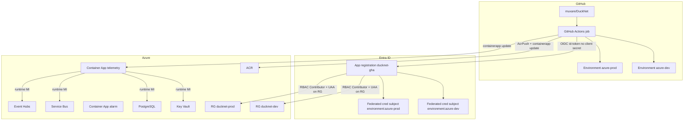

# CD contract — GitHub → Azure (Step 12a)

Spec for Steps 12b–12c. **12b as-built in workflows:** [`infra.yml`](../.github/workflows/infra.yml) compiles Bicep; [`deploy-center.yml`](../.github/workflows/deploy-center.yml) still pushes GHCR and **skips** the Azure job when OIDC vars are missing. Apply / `az containerapp update` wait for 12c bootstrap.

**Step-by-step one-time deploy:** [azure-first-deploy.md](./azure-first-deploy.md) (bootstrap → Bicep apply → images; CD habits documented separately).

Decisions this file assumes:

- CD home = GitHub Actions — [decision record](./decisions/cd-github-actions-vs-azure-devops.md)
- IaC = Bicep — [decision record](./decisions/iac-bicep-vs-pulumi.md)
- Azure target = Option C in [azure-deployment.md](./azure-deployment.md) (Container Apps + Postgres per Center + Event Hubs + Service Bus). Why those products: [design-rationale.md](./design-rationale.md)

## Two identity planes (do not conflate)



| Plane | Who | Authenticates as | Allowed to | Never |
|-------|-----|------------------|------------|--------|
| **Pipeline** (deploy-time) | GitHub Actions job with `environment: azure-dev` or `azure-prod` | Entra app `ducknet-gha` via **OIDC federated credential** | Push images to ACR; `az deployment group` (12c infra); `az containerapp update`; read deploy outputs | Hold connection strings long-term; call Service Bus / Event Hubs / Postgres as a data-plane client; use a GitHub `AZURE_CLIENT_SECRET` |
| **Runtime** (run-time) | Each Container App | **Managed identity** (user-assigned, one per Center, or one per environment if 12c starts smaller) | Get Key Vault secrets; send/receive Service Bus; send/receive Event Hubs; connect to *its* Postgres database | See GitHub tokens; use the pipeline Entra app; read another Center’s database |

Pipeline identity and runtime identity are different principals. A leaked GitHub log must not be a data-plane credential. A compromised Center must not be able to redeploy its siblings.

## OIDC federation (GitHub → Entra → Azure)

No long-lived Azure password in GitHub. The job requests an OIDC `id-token`; Entra exchanges it for an access token because a federated credential matches the token’s subject.

**Workflow permissions** (required on the Azure job):

```yaml
permissions:
  contents: read
  id-token: write   # OIDC
  packages: write   # GHCR (existing)
```

**GitHub configuration variables** (not secrets — they are identifiers):

| Name | Where | Example |
|------|--------|---------|
| `AZURE_CLIENT_ID` | GitHub Environment `azure-dev` / `azure-prod` | Entra app (client) id |
| `AZURE_TENANT_ID` | same | Directory id |
| `AZURE_SUBSCRIPTION_ID` | same | Subscription id |
| `AZURE_RESOURCE_GROUP` | same | `ducknet-dev` / `ducknet-prod` |

Do **not** create `AZURE_CLIENT_SECRET`. If a walkthrough suggests it, stop — that is the 2019 pattern this contract replaces.

**Federated credential** on the Entra app (one per GitHub Environment):

| Field | Value |
|-------|--------|
| Issuer | `https://token.actions.githubusercontent.com` |
| Audience | `api://AzureADTokenExchange` |
| Subject (`sub`) | `repo:muxare/DuckNet:environment:azure-dev` (and a second cred for `azure-prod`) |

Subject is bound to the **environment**, not merely `ref:refs/heads/main`. A job that omits `environment: azure-dev` cannot mint a token Entra will accept for that cred. Replace `muxare/DuckNet` if the GitHub remote owner/name differs.

**Login action** (12c):

```yaml
- uses: azure/login@v2
  with:
    client-id: ${{ vars.AZURE_CLIENT_ID }}
    tenant-id: ${{ vars.AZURE_TENANT_ID }}
    subscription-id: ${{ vars.AZURE_SUBSCRIPTION_ID }}
```

## GitHub Environments

| Environment | Used by | Protection | Auto Azure mutate? |
|-------------|---------|------------|--------------------|
| `azure-dev` | 12c infra apply + Center revision updates | None required (solo lab). Optional wait timer. | **No** — `workflow_dispatch` only (see below) |
| `azure-prod` | 12c Center revision updates (and infra if prod is ever stood up) | **Required reviewer** even if the reviewer is the same human — teaches the gate | **No** — `workflow_dispatch` only |

Create the Environments in the GitHub repo **during 12c** (or earlier if you want the names reserved). 12a does not require them to exist; it only names them.

Existing `workflow_dispatch` input `environment: dev \| prod` maps to GitHub Environment `azure-dev` / `azure-prod`. Do not invent a third name.

## Pipeline map

| Workflow | Trigger | Azure? | Job |
|----------|---------|--------|-----|
| `ci.yml` | PR + push | Never | Build, test, kernel smoke, Docker build (no push required) |
| `claude-review.yml` | PR | Never | Advisory ReviewFlow |
| `deploy-center.yml` (today, through 12b) | `workflow_dispatch` + path-filtered push to `main` | No | Pick Center(s) → build → push **GHCR** → local `/health` smoke |
| `deploy-center.yml` (from 12c) | same, plus an **Azure job** that only runs on `workflow_dispatch` | Yes, when inputs say so | OIDC → push **ACR** → `az containerapp update` → HTTP `/health` on the Azure FQDN |
| `infra.yml` (new in 12b, apply in 12c) | PR: `bicep build` (+ `what-if` if OIDC vars exist). `workflow_dispatch`: deploy a parameter file to one RG | PR = compile only; dispatch = Azure | Never path-auto-apply Bicep to a live RG |

**Lab lock — images auto, Azure does not.** Path-filtered merges to `main` keep publishing GHCR tags (already live). They must **not** by default update Container Apps or run `az deployment group create`. Option C left running is ~$65–120/month; auto-deploy on every docs-adjacent Center tweak would start and mutate a billed environment.

Enterprise-shaped later switch (not 12c): repository variable `AZURE_AUTO_DEPLOY_DEV=true` makes the Azure job run on `main` path filters targeting `azure-dev` only. Prod stays manual forever in this repo.

**Contract / bus change → all Centers** (already in `deploy-center.yml`): `src/DuckNet.Contracts/**`, `src/DuckNet.EventBus/**`, `src/DuckNet.ServiceDefaults/**` fan out to telemetry + alarm + dashboard + billing. From 12c that fan-out still only **pushes GHCR** automatically; Azure revisions stay dispatch (`center=all`).

## Registries

| Registry | When | Auth |
|----------|------|------|
| **GHCR** `ghcr.io/<owner>/ducknet-{center}:{sha}` | Every successful deploy-center run (today + forever) | `GITHUB_TOKEN` / `packages: write` |
| **ACR** `<acr>.azurecr.io/ducknet-{center}:{sha}` | 12c Azure job only | Pipeline OIDC → `AcrPush`; Container Apps pull via the **ACA environment** managed identity (no pull PAT) |

Do not put a GitHub PAT on the Container App to pull GHCR. ACR + MI is the Azure-native pull path. GHCR remains the artifact you can inspect with zero Azure.

## Bootstrap vs app CD

Chicken-and-egg: the pipeline identity needs RBAC to create resources and to assign the Container App managed identities their data-plane roles (`Microsoft.Authorization/roleAssignments/write`).

| Phase | Who | Once? | What |
|-------|-----|-------|------|
| **0 — Human bootstrap** | Subscription Owner (or User Access Administrator + Contributor) | Once per environment | Create Entra app `ducknet-gha`; add two federated credentials; create resource groups; grant the app **Contributor** and **User Access Administrator** on each RG; set GitHub Environment variables |
| **1 — Infra CD** | `infra.yml` `workflow_dispatch` | When Bicep changes | `az deployment group create` of `infra/bicep`. Creates Container Apps, Postgres, namespaces, Key Vault, role assignments to runtime MIs |
| **2 — App CD** | `deploy-center.yml` Azure job | Each Center ship | ACR push + `az containerapp update --image`. Must not recreate Postgres or wipe databases |

12b writes the Bicep and the workflow YAML such that missing OIDC vars **skip** Azure steps (fail closed, not crash CI). 12c is the first time phase 0 + 1 + 2 actually run.

Lab-sized privilege: one Entra app, Contributor + UAA scoped to the env RGs — **not** subscription Owner. An enterprise would split an infra-pipeline identity from an app-pipeline identity; DuckNet does not need that split at four apps.

## Runtime secrets & data plane

| Resource | How the Center authenticates (12c target) |
|----------|---------------------------------------------|
| PostgreSQL | Connection string **in Key Vault**; Center MI has `Key Vault Secrets User`. AAD/MI login to Postgres is a follow-up, not a 12c gate |
| Service Bus | **Managed Identity** (`Azure.Identity` / `DefaultAzureCredential`); Azure RBAC data roles on the topic/subscriptions |
| Event Hubs | Same: MI data roles, not a SAS in GitHub |
| App Insights | Connection string or MI; OTel exporter endpoint from Container App settings |
| Other Center DBs | Never |

GitHub must not grow a `TELEMETRY_DB_CONNECTION_STRING` secret. If a value is needed at deploy time, Bicep writes it to Key Vault and the Container App uses a Key Vault reference.

## Human prerequisites (block 12c, not 12a/12b)

12a/12b must stay runnable with **no Azure account**. 12c needs:

1. An Azure subscription where you can create RGs and role assignments.
2. Permission to create an Entra app registration and federated credentials (Application Developer / Privileged Role Administrator in stricter tenants — confirm before 12c).
3. A region parameter; default **Sweden Central**, fallback **West Europe** if a SKU is missing.
4. Willingness to pay Option C while the env is up, or a habit of stopping Container Apps + PostgreSQL between demos ([price ballpark](./azure-deployment.md)).
5. GitHub repo rights to create Environments and set Environment variables.

## What 12b vs 12c implement from this file

| Item | 12b (Azure-ready, $0) | 12c (first environment) |
|------|------------------------|-------------------------|
| `infra/bicep/` modules + parameters | Write + `az bicep build` on PRs | First `az deployment group create` to `ducknet-dev` |
| `ServiceBusEventBus` / Event Hubs writer | Code + tests (Testcontainers / emulator or skip-if-no-cred) | Wired in the deployed apps |
| Postgres provider | Code + Testcontainers; local Aspire stays SQLite | Flexible Server databases |
| `infra.yml` | `bicep build`; `what-if` only if OIDC vars exist | Dispatch apply |
| `deploy-center.yml` Azure job | YAML present; skipped without OIDC | OIDC login, ACR, `containerapp update` |
| Entra app + GitHub Environments | Documented only | Created |
| Live squeak → alarm → dashboard → billing in Azure | No | Yes — Step 12c acceptance |

## Non-goals (still true in 12c)

- Azure DevOps pipelines, service connections, or boards.
- AKS.
- Splitting a Center into App Service + Functions.
- Auto-deploy to Azure on every `main` push.
- Storing Azure passwords in GitHub secrets.
- Pipeline identity used as a data-plane client.
