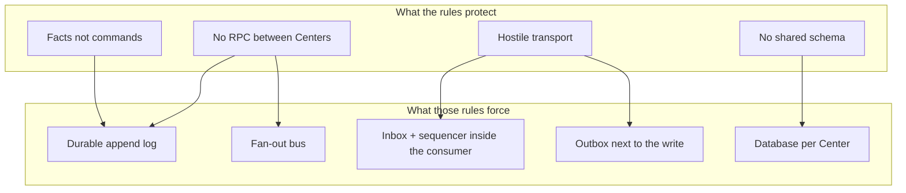
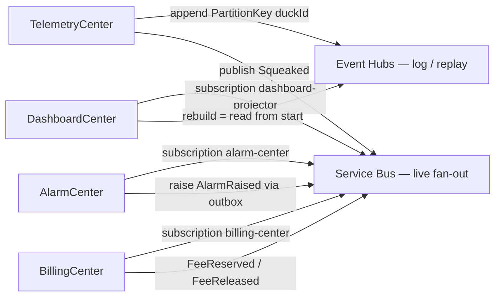

# Why DuckNet is shaped this way

This is the *why* document. Architecture rules, planned Azure resources, and the alternatives that were rejected. It is not a step spec and not a pricing sheet.

- **As-built runtime** (Aspire + SQLite + HTTP log + RabbitMQ): [architecture/](./architecture/)
- **Azure mapping, 2018–2026 path, lab cost:** [azure-deployment.md](./azure-deployment.md)
- **CD / identity contract:** [cd-contract.md](./cd-contract.md)
- **IaC and CD home decisions:** [Bicep vs Pulumi](./decisions/iac-bicep-vs-pulumi.md), [GitHub Actions vs Azure DevOps](./decisions/cd-github-actions-vs-azure-devops.md)

Status: locked for Steps 0–12b and the 12c landing. 12c has not been applied; no Azure subscription is required to read this.

---

## The problem this architecture is answering

DuckNet exists to rebuild the *seams* of a Telia-style platform — several autonomous “Centers,” event-driven, eventually consistent — in a codebase small enough to run on a laptop. Rubber ducks are the payload so attention stays on those seams.

The failure mode it is designed *against* is the distributed monolith: four services that still call each other over HTTP, still share one database, and still hope the network delivers each message exactly once and in order. That shape looks like microservices in a slide deck and behaves like one process with extra latency. When one Center is down, the callers pile up. When the shared schema changes, every team ships together. When a duplicate arrives, counts drift and nobody can say whether the bug is the bus or the handler.

The five rules are the constraints that make the Telia complexity show up on purpose:

| Rule | What it forces you to design | What it prevents |
|------|------------------------------|------------------|
| **No Center-to-Center calls** | Integration is published facts. Alarm does not `GET` Telemetry. Billing does not `POST` Alarm. | Sync chains, cascading timeouts, “the dashboard is down so billing cannot reserve a fee” |
| **No shared database** | Each Center owns schema and writes. One PostgreSQL *server* with four *databases* is allowed; one schema is not | Cross-service joins as an integration strategy; lock-step migrations; one restore wiping four products |
| **Events are past facts** | `Squeaked`, `AlarmRaised`, `FeeReserved` — never `SqueakTheDuck` | Command-as-integration (the publisher starts owning the subscriber’s job) |
| **Transport is hostile** | At-least-once, unordered across keys — even in memory, even on Azure | Designing as if the broker were a local method call |
| **Every step stays runnable** | A concept that cannot be demoed is not done | Architecture that only exists in a diagram |

Everything else — inbox, outbox, sequencer, shards, sagas, `IEventBus` — is machinery those rules require. Azure is a *swap of stand-ins* behind the same seams, not a redesign.

---

## Why Centers, not a modular monolith

A single process with four modules and one SQLite file would teach domain events and miss the actual pain: independent deploy, independent failure, catch-up after downtime, and “I can delete the dashboard database and rebuild it from the log.”

Four ASP.NET apps is the smallest topology that makes those properties *visible*. Telemetry owns the write path and the log. Alarm is stateful detection. Dashboard is a disposable read model. Billing is a long-running saga. They share `Contracts`, `Kernel`, and `EventBus` as *libraries compiled into each image* — not as a shared runtime and not as a shared database.

**Alternative — modular monolith, extract later.** Correct for many products. Rejected here because the teaching target *is* the extraction: own DB, own deploy, own DLQ, own shard pool. A monolith hides the seams the lab is for.

**Alternative — many more services** (ingest API, queue worker, projection job, saga worker as separate apps). That is an ops split you might do after a Center is large. Starting there confuses “service boundary” with “process boundary.” DuckNet’s lock is **1 Center = 1 deployable** that happens to expose HTTP *and* run a consumer loop.

---

## Two pipes, not one: log versus bus

This is the design choice that most people flatten, and it is why Azure uses **both** Event Hubs and Service Bus.

| | **Append log** (system of record) | **Fan-out bus** (live delivery) |
|--|----------------------------------|----------------------------------|
| **Job** | Durable history. Replay. Catch-up after a Center was down. Rebuild a read model | Deliver *new* facts to independent consumer groups now |
| **Local stand-in** | Telemetry-owned `event_log` via `GET/POST /bus/events` | RabbitMQ topic exchanges behind `IEventBus` |
| **Azure stand-in** | Event Hubs, partition key = `duckId` | Service Bus topic `ducknet-events` + one subscription per consumer group |
| **Who writes** | Telemetry (single log writer) | Any Center that publishes a fact (Telemetry, Alarm, Billing) |
| **Who decides order** | Offset / partition | Not the bus — `PerKeySequencer` inside the consumer |
| **Dedupe** | Not the log’s job | Not the bus’s job — **inbox** on `EventId` |

A log without a bus means every consumer polls Telemetry over HTTP. That works on a laptop (and is what Steps 4–10 did). In Azure it couples every Center’s availability to Telemetry’s HTTP and does not prove a managed broker.

A bus without a log means you can fan out live messages and you **cannot** rebuild Dashboard from scratch, cannot catch up Alarm after an hour of downtime from a retained history, and cannot teach “the log is the pet, projections are cattle.” Brokers are not archives. Service Bus Standard retention is days, not “replay from offset 0 of the universe.”

Using **one** product for both (Event Hubs consumer groups, or Kafka) is a valid simpler Azure variant. DuckNet keeps both because they are different jobs, and because that split is the Telia-shaped story: high-throughput partitioned log *and* a .NET business-event bus. It is heavier than the median four-service shop, which would often run **Service Bus only** and accept that replay is “re-publish” or “query another system.” The dual product is a teaching cost, not a claim that every startup needs both.

What does **not** sit in either pipe: inbox, sequencer, outbox, saga state, per-Center DLQ table, checkpoints. Those are consumer (or producer) concerns. Putting them “in the bus” would make every Center’s correctness depend on broker features you cannot run on the laptop, and would break the Step 11 punchline: swap RabbitMQ for Service Bus with an empty handler diff.

---

## Why the consumer looks paranoid

Hostile transport is a **premise**, not a bug. Azure Service Bus and RabbitMQ are at-least-once. Event Hubs is at-least-once. Duplicates and cross-key reordering will happen. DuckNet makes that happen on purpose from Step 1 so the defenses are real.

| Defense | Lives in | Why not in the broker |
|---------|----------|------------------------|
| **Inbox** (skip duplicate `EventId`) | Each Center’s database | Broker duplicate detection is a time window, not an eternal set. The Bicep topic sets `requiresDuplicateDetection: false` on purpose — inbox is the source of truth |
| **Per-key sequencer** | Each Center | Brokers order *within* a partition/session if you opt in; they do not repair a shuffle across keys. Partition key choice (`duckId`) is an architecture decision, not a SKU checkbox |
| **Outbox** | Same transaction as the state write | There is no distributed transaction spanning Postgres and Service Bus. Write-then-publish is how you double-emit or lose the message on a crash |
| **Retry → DLQ, keep consuming** | Center table locally; Service Bus sub-queue in Azure | One poison message must not stall a shard. Platform DLQ is extra, not a replacement for “advance the offset and continue” |
| **Shards** | `ShardWorkerPool` inside the Center | A hot `duckId` is a *key* problem. More replicas of the whole app do not isolate a hot partition; hashing keys onto workers does (the Event Hubs / Cosmos lesson, on a laptop in Step 8) |

**Alternative — “the bus will give us exactly-once.”** It will not. Azure’s “exactly-once” stories are either transactional send *within* a namespace, or session locks. They do not replace an inbox for handler side effects.

**Alternative — HTTP between Centers plus retries.** Easy to demo, becomes a distributed monolith under load. Rule 1 exists because the industry learned this the hard way around 2018–2020.

---

## Why Azure at all (and why not yet)

Local Aspire is the inner loop forever: zero cloud bill, RabbitMQ container, SQLite files, traces on the Aspire dashboard. Phase D exists to prove the *same binaries* can run where an estate actually runs — independent Container App revisions, managed identities, a real partitioned log, a real topic/subscription bus — without rewriting handlers.

12a locked identity/CD before any billed resource. 12b wrote Bicep and adapters that **skip** when OIDC vars are missing. 12c is the first apply. That split is itself a design choice: do not learn Entra federation on the same evening you debug a Flexible Server firewall.

The mapping is stand-in replacement, not a rewrite:

| Local | Azure (12c) | Why this pair |
|-------|-------------|---------------|
| Aspire AppHost | Container Apps Environment + one app per Center | Same process topology; AppHost stays on the laptop |
| SQLite per Center | PostgreSQL Flexible Server, **database** per Center | Concurrent writers + managed backup; Rule 2 preserved |
| HTTP `event_log` | Event Hubs | Partitioned append log; replay from the beginning |
| RabbitMQ | Service Bus topics + subscriptions | Consumer groups with competing consumers and a DLQ |
| Aspire OTel dashboard | Application Insights | Same SDK, different exporter |
| Env vars in AppHost | Key Vault + per-Center managed identity | No connection strings in GitHub |
| GHCR images | ACR pull by the app | Managed identity pull; no GHCR PAT on the Container App |

---

## Planned Azure resources: chosen versus alternatives

These are the modules in [`infra/bicep/`](../infra/bicep/). Compile in 12b; apply in 12c.

### Compute — Azure Container Apps (one app per Center)

**Chosen.** Dedicated Container Apps Environment, `minReplicas: 1`, KEDA scale on Service Bus depth for the three consumers. Always-on loops (inbox, outbox dispatcher, sequencer, saga timeout) cannot scale to zero without missing work unless a real queue scaler is in front — and even then DuckNet keeps a floor of one replica so catch-up does not wait on a cold start.

| Alternative | Why not (here) |
|-------------|----------------|
| **App Service** (one plan, four Web Apps) | Still the most common *existing* Azure host for .NET. One plan couples scale; WebJobs for consumers is 2015-era. Independent deploy is clumsier. Fine for a lift-and-shift website, weak for “1 Center = 1 scale unit” |
| **Azure Functions** | Standard for *one message → one execution*. Fights this codebase: always-on feeder, outbox dispatcher, per-key buffer, shard workers. Using Functions would rewrite Centers, not host them |
| **AKS** | Standard when a platform team already runs Kubernetes for many services. Four Centers do not justify cluster upgrades, node pools, and ingress. Same Center code would run there; the tax teaches cluster ops, not Center isolation |
| **One VM / ACI** (Option A in [azure-deployment.md](./azure-deployment.md)) | Cheapest “it runs in Azure.” Proves nothing about independent deploy or managed messaging |
| **Keep Aspire in the cloud** | Aspire is the laptop orchestrator. Running AppHost as the production supervisor would hide the deploy model the lab is meant to show |

Aspire was built to publish to Container Apps. Local `AddProject("alarm")` becoming revision `ducknet-alarm` is the 2024–2026 greenfield path.

### Log — Azure Event Hubs (`ducknet-events`, 4 partitions)

**Chosen** as the system of record for replay. Partition key = `EventEnvelope.PartitionKey` (`duckId`). Telemetry is the sender; Centers that rebuild (Dashboard) read from the beginning. Partition count is the hot-key lesson from Step 8 made concrete: one hot duck hashes to one partition; extra throughput units do not save you if the key is wrong.

| Alternative | Why not (here) |
|-------------|----------------|
| **Keep the HTTP `event_log`** | Lift-and-shift. Couples replay to Telemetry HTTP. Does not teach partition keys or independent retention |
| **Service Bus as the log** | Topics are not an append-only archive you replay from offset 0 for months. Duplicate detection windows and TTL are the wrong primitive for “the log is the pet” |
| **Kafka / Confluent / Event Hubs Kafka protocol** | The same *shape* as Event Hubs. Extra product and ops for a lab that already has an Event Hubs adapter. Right answer in a Telia-like estate that already runs Kafka |
| **Storage / blob log** | Cheap archive, no partition semantics, no consumer groups, you would build a feeder anyway |
| **Event Hubs only (no Service Bus)** | Honest simpler lab: consumer groups = DuckNet groups. Loses Service Bus DLQ/subscription niceties. Documented as a variant; rejected as the *locked* path because the dual-pipe lesson is the point of Phase D |

### Fan-out — Azure Service Bus Standard (topic + subscriptions)

**Chosen** as the live `IEventBus`. One topic, subscriptions `alarm-center`, `dashboard-projector`, `billing-center`. That is what NServiceBus/MassTransit default to on Azure. `maxDeliveryCount: 10` then the platform dead-letter sub-queue. Completing a message is *delivery* ack, not “handler committed” — inbox still decides the side effect. Step 11 already proved the port with RabbitMQ; 12b’s `ServiceBusEventBus` is the same contract.

| Alternative | Why not (here) |
|-------------|----------------|
| **RabbitMQ in Azure** (Container App or VM) | Works, and matches local. Then you operate a broker: disk, clustering, upgrades. The point of 12c is a *managed* bus, not to re-home Rabbit |
| **Event Grid** | Push notifications and webhooks. Weak competing-consumer / subscription isolation / DLQ story for this consumer loop. Wrong product for “three Centers independently consume the same facts” |
| **Storage Queues** | Cheap and simple. No topics: fan-out means N copies or a dispatcher you write. No subscriptions-as-consumer-groups |
| **Event Hubs consumer groups as the only bus** | See log section. Good if you collapse the two pipes |
| **Service Bus Premium / sessions** | Sessions can give per-key order *in the broker*. DuckNet already repairs order in `PerKeySequencer` so the laptop and Azure stay honest. Premium is a cost jump the lab does not need |

Bicep turns **off** topic duplicate detection. Turning it on would hide bugs that the inbox is supposed to survive, and would still not be eternal `EventId` identity.

### Data — Azure Database for PostgreSQL Flexible Server (four databases)

**Chosen:** one server, databases `telemetry`, `alarm`, `dashboard`, `billing`. Rule 2 is *schema ownership*, not “one VM per database.” Shared *server*, separate *databases*, is normal and cheap. The 12b `PostgresKernelDb` path is already written; SQLite stays the local demo.

| Alternative | Why not (here) |
|-------------|----------------|
| **SQLite on Azure Files** | Option B. Fine for a toy; fights concurrent writers and multiple replicas |
| **Azure SQL** | Perfectly valid for .NET estates. Would be a second provider next to the Npgsql work already done. Postgres is the greenfield default and keeps “not everything is Microsoft SQL” visible |
| **Cosmos DB** | Standard when global distribution, RU, and partition keys *in the data store* are the product. DuckNet’s stores are relational (inbox, outbox, saga rows, hour buckets). Cosmos would rewrite persistence to teach a lesson Step 8 already teaches at the *log* layer |
| **One database, four schemas** | Easier backups, easier leaks. A `JOIN` across Centers becomes tempting. Rejected as a Rule 2 violation in spirit even if the server is shared |
| **SQL per Center on four servers** | Isolation theater. Cost and ops with no extra teaching |

Burstable `B1ms`, no HA, 7-day backup: lab SKU. Prod-shaped HA is a later money decision, not an architecture one.

### Identity — user-assigned managed identity per Center + Key Vault (RBAC)

**Chosen.** Pipeline identity (`ducknet-gha` via GitHub OIDC) deploys. Runtime identities pull secrets and talk to data-plane resources. Those are **different principals** so a leaked Actions log is not a Service Bus sender, and a compromised Billing app cannot `containerapp update` Alarm.

Each Center has its own UAMI so RBAC can be tightened later (today Bicep is still fairly open on the bus — all Centers can send/receive — because Alarm and Billing *publish* as well as consume). Key Vault uses Azure RBAC, not access policies.

| Alternative | Why not (here) |
|-------------|----------------|
| **Connection strings in GitHub Secrets** | Works until a log, a fork, or a `echo` leaks them. 12a forbids `AZURE_CLIENT_SECRET` for the same reason |
| **One identity for all four apps** | Simpler Bicep. One compromise is all four databases and both buses |
| **System-assigned identity only** | Tied to the Container App resource lifecycle; fine at small scale. User-assigned is easier to grant before the app exists and to share across a swap |
| **Put secrets in Container App settings as plaintext** | Convenient, visible in portal/ARM, harder to rotate. Key Vault references + MI is the 2026 default |

### Registry — Azure Container Registry Basic (no admin user)

**Chosen** as what Container Apps pull, via `AcrPull` on each Center’s MI. **GHCR** stays the no-Azure artifact: every PR can push images without a subscription. The pipeline (when 12c OIDC exists) pushes to ACR; the app never holds a GHCR PAT.

| Alternative | Why not (here) |
|-------------|----------------|
| **Pull GHCR from Container Apps** | Needs a PAT or federated pull. Extra secret on the runtime plane. ACR + MI is the Azure-native pull |
| **Docker Hub** | Rate limits, no MI, not where this CD already publishes |
| **ACR admin user** | Username/password. Bicep sets `adminUserEnabled: false` |

### Observability — Log Analytics + Application Insights

**Chosen.** OpenTelemetry is already in `ServiceDefaults`. Azure changes the exporter endpoint, not the `DuckNet.*` ActivitySources or `TraceId` / `CausationId` on the envelope. Container Apps logs go to the same workspace.

| Alternative | Why not (here) |
|-------------|----------------|
| **Aspire dashboard in Azure** | Laptop tool. Not a production store |
| **Grafana / Prometheus / Tempo self-hosted** | Standard on AKS. Another cluster’s worth of ops for four apps |
| **Vendor APM only (no OTel)** | Locks traces to one product. DuckNet already paid the OTel cost locally |

### IaC — Bicep (compile now, apply in 12c)

**Chosen** because Aspire/`azd` emit Bicep, Azure is the state store (no Pulumi/Terraform backend), and CI is `az bicep build` / `what-if`. Full argument: [iac-bicep-vs-pulumi.md](./decisions/iac-bicep-vs-pulumi.md).

**Terraform** is a third language plus provider lag, with the same state-backend cost as Pulumi and none of the C# upside. **Hand-click the portal** would not be reviewable and would drift from `infra.yml`.

### CD — GitHub Actions + OIDC, mutate Azure only on `workflow_dispatch`

**Chosen** because the code, PRs, `ci.yml`, and `deploy-center.yml` already live on GitHub. Azure DevOps would split CI from CD for a repo ADO does not host. Full argument: [cd-github-actions-vs-azure-devops.md](./decisions/cd-github-actions-vs-azure-devops.md). Dispatch-only apply is a **lab cost** control, not an enterprise CD ideal. Prod still wants a required Environment reviewer; auto-deploy-on-merge is an optional later flag.

### Region — Sweden Central, fallback West Europe

Default in `main.bicep`. Data-residency-shaped default for a Nordic lab; SKU gaps are a 12c operational fallback, not an architecture change.

---

## What this landing is *not*

- **Not** “break Alarm into an API App Service + a Functions queue worker + a SQL box.” Queues and databases are attachments. The Center stays one deployable.
- **Not** the median startup’s cheapest correct Azure (that is Container Apps + **Service Bus only** + one Postgres + App Insights). Dual Event Hubs + Service Bus is the Telia teaching layer on that host.
- **Not** a Telia *estate* clone (AKS, Kafka, Azure DevOps, Cosmos). Same Center rules, heavier platform. DuckNet teaches the rules without renting the estate.
- **Not** live until 12c. Reading this document does not require a subscription.

---

## How to read this against the rest of the repo

| Question | Document |
|----------|----------|
| What did step *N* actually build? | [docs/architecture/step-N.md](./architecture/) |
| What would Option A/B cost this weekend? | [azure-deployment.md](./azure-deployment.md) |
| Who is allowed to deploy, and with which identity? | [cd-contract.md](./cd-contract.md) |
| Which production systems this maps to, and where it falls short | [industry-mappings.md](./industry-mappings.md) |
| Locked 12a–12c acceptance criteria | [ImplementationPlan.md](../ImplementationPlan.md) Phase D |
