# Development diary

After each implementation: what changed, architecture (mermaid), how to test, and **follow-ups** (concerns, refactors, CCA-F proposals). Follow-ups wait for approval — do not implement them in the same pass.

## 2026-08-31 — Step 12b: Azure-ready IaC + adapters (no live deploy)

### What changed
Bicep under `infra/bicep/` (Container Apps, Event Hubs, Service Bus, Postgres per Center, Key Vault, UAMI, ACR, App Insights). `ServiceBusEventBus` + `EventHubsLogWriter` behind env; `EventBusFactory` still picks RabbitMQ locally. Postgres provider in Kernel with Testcontainers. `infra.yml` compiles Bicep; Azure jobs skip when OIDC vars are missing. Center handlers unchanged. Local demo still Step 11.

### Architecture impact
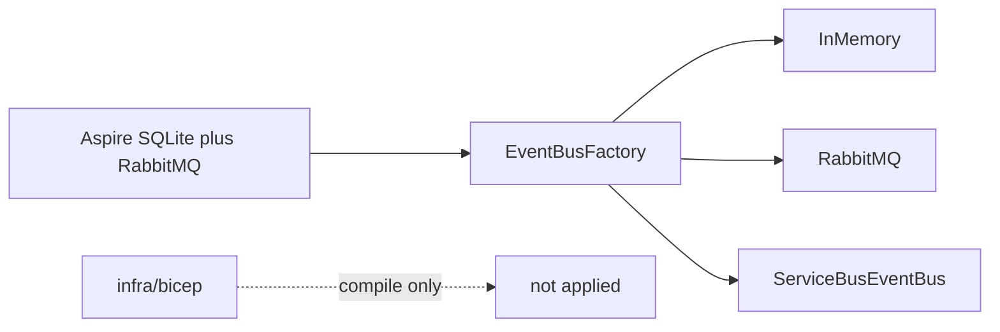

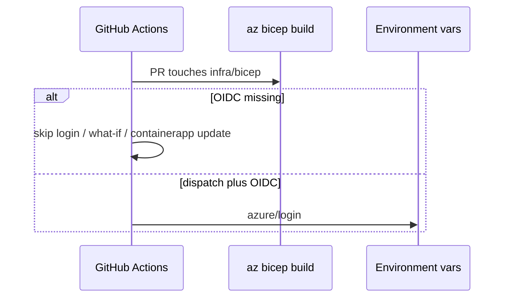

### How to test
- `az bicep build --file infra/bicep/main.bicep`
- `dotnet test` (no Azure creds; Service Bus / Event Hubs tests skip; Postgres Testcontainers run)
- `dotnet run --project src/DuckNet.AppHost` — same Step 11 demo

### Follow-ups
**12c next:** human bootstrap (Entra app, federated creds, RG RBAC, GitHub Environments), first `dev` apply, wire Container App env to Service Bus + Event Hubs + Postgres.
**Not this pass:** live Azure, `azd` profile, migrating Center stores off `SqliteConnection`.

**CCA-F:** none new. A `ducknet-azure-oidc` skill still waits for 12c bootstrap to be repetitive enough to script.

## 2026-08-31 — Step 12a: split Phase D + CD contract


### What changed
Step 12 was one “host on Azure” blob. Split into **12a** (this step: CD/identity contract, $0), **12b** (Bicep + EventBus/Postgres adapters, still $0), **12c** (first live `dev`, needs a subscription).

Locked: CD stays in **GitHub Actions** (not Azure DevOps). Two identity planes (pipeline Entra app + OIDC vs Container App MI). No `AZURE_CLIENT_SECRET`. Path-filtered `main` keeps publishing GHCR; Azure mutate is `workflow_dispatch` only.

### Architecture impact
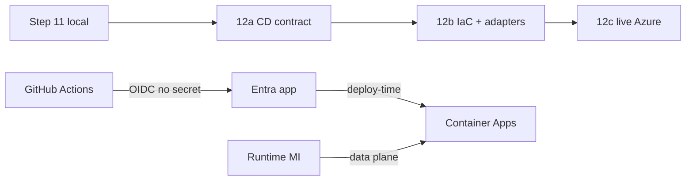

```mermaid
sequenceDiagram
  participant GHA as GitHub Actions
  participant Entra as Entra OIDC
  participant ACR as ACR
  participant ACA as Container App
  Note over GHA: 12a specifies; 12c runs
  GHA->>Entra: id-token environment:azure-dev
  Entra-->>GHA: access token
  GHA->>ACR: push image
  GHA->>ACA: az containerapp update
```

### How to test
- Docs-only / **untested** (no `.cs` change). Skim [ImplementationPlan.md](../ImplementationPlan.md) Phase D, [docs/cd-contract.md](./cd-contract.md), [docs/architecture/step-12a.md](./architecture/step-12a.md).
- `dotnet test` still the merge gate for any later code; this step does not claim “no behavior change” as a test result.

### Follow-ups
**12b next** (needs OK to start): `infra/bicep/` + `ServiceBusEventBus` + skip-safe `infra.yml` / Azure job.
**Not this pass:** Entra app, GitHub Environments, live RG.

**CCA-F:** none new — D3 story is now explicit (OIDC + Environments). Propose a `ducknet-azure-oidc` skill when 12c bootstrap is repetitive enough to script.

## 2026-08-31 — Docs aligned to Step 11 as-built

### What changed
User-facing and agent docs were still describing Step 5 / Step 10. Steps 0–11 are on `main`. Updated README status, inspect keys (Enter not T), azure-deployment “today”, CLAUDE/AGENTS step table, AGENTS ReviewFlow (was Codex-review.yml), ImplementationPlan current banner + SQLite-through-11 deviation + honest DoD, CentersBuildPlan .NET 10.

### Architecture impact
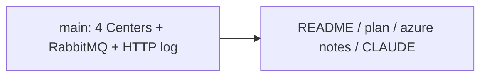

### How to test
- Skim README roadmap: 11 complete, 12 planned.
- Skim [docs/azure-deployment.md](./azure-deployment.md) “What you have today (Step 11)”.

### Follow-ups
**Process (not this pass):** create missing `git tag step-2` … `step-11`. MCP ops and `infra/bicep/` remain Step 12 / CCA-F D2.

## 2026-08-31 — Inspect pin: Enter + chip, drop T

### What changed
Bare **T** collided with Chrome’s new-tab chord (`⌘T` / `Ctrl+T` still report `key: "t"`) and with letter-key extensions. Pin is now unmodified **Enter**, plus a **Pin** chip on the preview (top-left, `pointer-events: auto`). Leave waits 350ms so the chip is reachable; hovering the chip holds the card. Modified Enter is ignored.

### Architecture impact
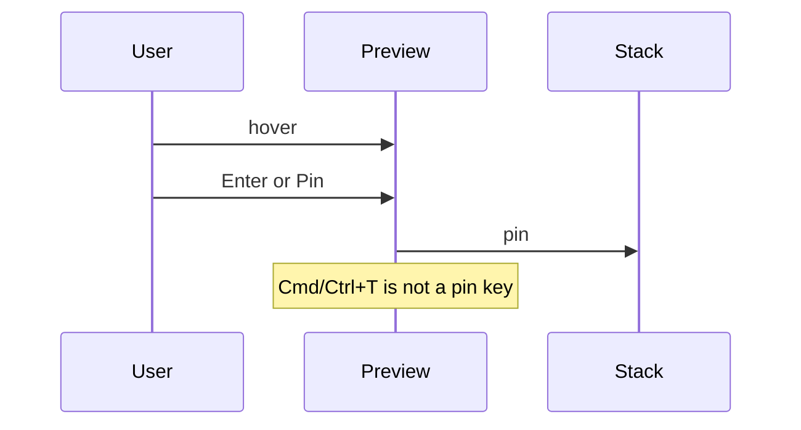

### How to test
- `cd src/DuckNet.DashboardCenter/ui && npm test && npm run build`
- Hover a Center → **Enter** pins, no new tab. **Pin** chip also pins. **T** does nothing. **Esc** still pops.

## 2026-08-31 — Inspect pin + process-graph overlap

### What changed
**T** no longer drops the card: pinned inspect lived in `.dn-inspect-pin { position: relative }`, which overrode `position: fixed` and sent the card into document flow (looked like a z-index miss). Cards now sit in a `pointer-events: none` overlay layer; pins re-enable pointer events. Decision diamonds were laid out as 72px tall while the rotated square is ~148px, so they ate neighboring nodes; Dagre size and rank/node gaps match the visual.

### How to test
- `cd src/DuckNet.DashboardCenter/ui && npm test && npm run build`
- Hover a process node, **T** — card stays, **X** / **Esc** close. All detail: diamond no longer overlaps inbox / Drop.

## 2026-08-31 — BG3-style inspect docs on the Developer map

### What changed
Developer maps grow a hover inspect overlay. Hover a Center, process node, labeled edge, or live metric; **T** pins the card; wiki `[[terms]]` inside a pin are hoverable and **T** stacks another card. **Esc** pops. Live numbers from `/stats` splice into the card when the hover had a Center scope. Glossary is a typed corpus in the Vue bundle — not fetched architecture markdown. Click still drills into a Center.

### Architecture impact
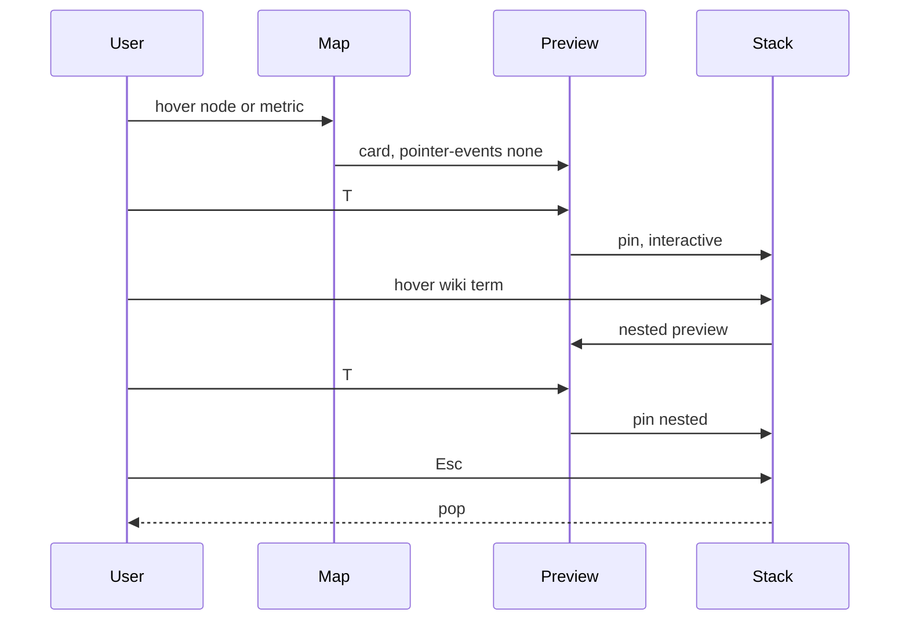

### How to test
- `cd src/DuckNet.DashboardCenter/ui && npm test && npm run build`
- Aspire dashboard URL: hover Alarm → live offset in the card; **T**; hover **Inbox**; **T**; **Esc**. Click still opens the Center. Type in ingest without pinning. Read model unchanged.

### Follow-ups
**Parked:** Read-model cell inspect, hash `#inspect=`, glossary search, scraping `docs/architecture/*.md`.

## 2026-08-31 — Developer maps as Vue Flow graphs

### What changed
The Developer SPA now uses Vue Flow instead of cards and a vertical list. **Overview** (`#developer`) is circular Center nodes plus labeled communication edges. Click a Center for its **process** flowchart; **Objects** is a type-level collaboration graph on the same page. **All detail** (`#developer/all`) is one grouped canvas of every pipeline. Topology stays as-built: events only, `IEventBus` is a port, no Center-to-Center arrows.

### Architecture impact
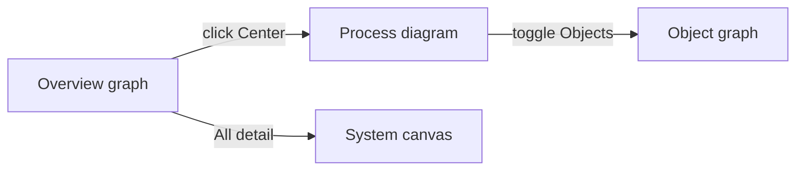

### How to test
- `cd src/DuckNet.DashboardCenter/ui && npm run build`
- `dotnet test tests/DuckNet.DashboardCenter.Tests`
- Aspire dashboard URL: overview circles + live offsets; click Alarm for process + live resolve; toggle Objects; `#developer/all`; Read model still rebuilds.

### Follow-ups
**Parked:** follow-one-event / TraceId strip, SSE, RabbitMQ management iframe (unchanged).

## 2026-08-30 — Developer maps on the Dashboard Vue app

### What changed
The Dashboard SPA now has two jobs. **Developer** (default, `#developer`) is a living system map: overview of Centers + event arrows, drill-in to one Center's pipeline, and an all-detail canvas. Live numbers come from each Center's existing `/stats` (browser CORS). DashboardCenter only publishes `GET /ui/catalog` (Aspire `UI_*_URL`). **Read model** (`#read-model`) is the previous hour-bucket table.

### Architecture impact
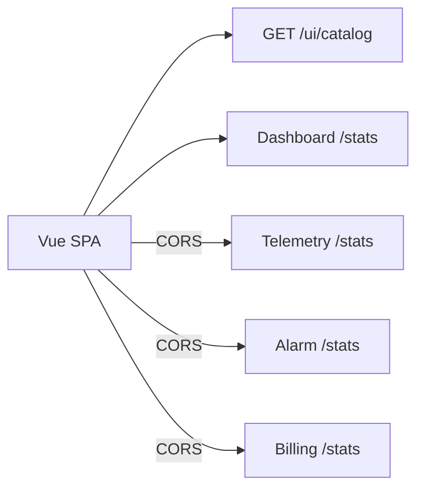

### How to test
- `dotnet test tests/DuckNet.DashboardCenter.Tests`
- Aspire: `dotnet run --project src/DuckNet.AppHost` — open the dashboard URL. Overview shows live offsets; click Alarm for internals + alarms; All detail scrolls; Read model still rebuilds.

### Follow-ups
**Parked:** follow-one-event / TraceId strip, SSE, RabbitMQ management iframe, pan/zoom library.

## 2026-08-30 — ReviewFlow job summaries and structured objects

### What changed
Each Claude PR Review job writes `$GITHUB_STEP_SUMMARY` (role, model/budget, schema object — not the raw envelope). The sticky comment now has a pipeline table, labeled risk reasons, files, notes grouped by reviewer, and collapsed JSON. Triage `risk.reasons` is constrained to why the level, not a changelog.

### Architecture impact
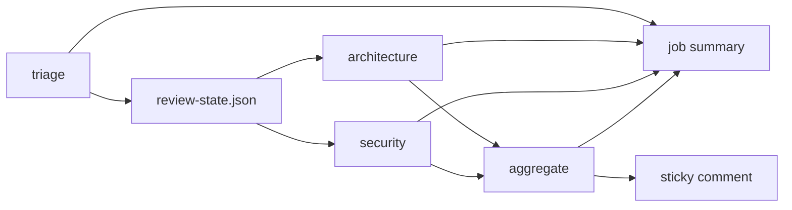

### How to test
- `bash .github/scripts/test-aggregate-review.sh`
- Next PR: open a ReviewFlow check for the job summary; the sticky comment should include **What ran** and a **Structured objects** details block.

### Follow-ups
**Later:** inline Check annotations on the Files tab are still parked (`docs/ci-policy.md` out of scope for this pass). Job summaries + the collapsed JSON block are the surfaces.

## 2026-08-30 — Step 11: IEventBus port to RabbitMQ

### What changed
`InMemoryEventBus` fans out per `consumerGroup`. Same conformance suite runs on `RabbitMqEventBus` (Testcontainers), including broker restart. Aspire adds a RabbitMQ container; Centers call `EventBusFactory.Create()`. Handlers and Center `.csproj` files do not reference RabbitMQ. HTTP log remains the system of record; each Center gets its own topic exchange so feeders do not triple-publish.

### Architecture impact
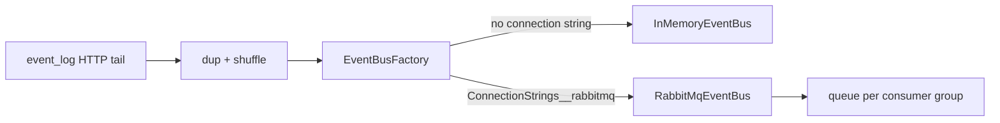

### How to test
- `dotnet test --filter FullyQualifiedName~EventBus`
- `dotnet test`
- Aspire: `dotnet run --project src/DuckNet.AppHost` — `rabbitmq` healthy, then the Step 10 saga demo. Kill the broker in Aspire to watch reconnect.

### Follow-ups
**CCA-F:** skill `ducknet-event-bus` — `.agents/skills/ducknet-event-bus/SKILL.md` with `description` covering new `IEventBus` adapters (Service Bus in Step 12), `argument-hint: "[adapter-name]"`, `allowed-tools: Read, Edit, Write, Grep, Glob, Bash(dotnet *)`. Auto-invoke when adding `*EventBus.cs` or changing `EventBusFactory`. Not built this pass.

**Refactor:** `EventBusFactory.Create()` is a one-line composition change in three Center App files. Step 12 (`ServiceBusEventBus`) should be empty handler diff if the factory grows a third branch from env.

## 2026-08-30 — Step 10: Billing saga without a distributed transaction

### What changed
BillingCenter owns `billing_sagas`. `AlarmRaised` inserts `Reserved` and publishes `FeeReserved`. `AlarmResolved` before expiry → `Released` + `FeeReleased` (`AlarmResolved`). Timeout worker: still `Reserved` after `SAGA_TIMEOUT_SECONDS` → `Expired` + `FeeReleased` (`Timeout`). Duplicate `AlarmRaised` cannot double-charge (inbox `EventId` + saga PK). AlarmCenter now emits `AlarmResolved` when the event-time window drops, and `POST /alarms/{duckId}/resolve` for the fast demo. No Center-to-Center calls.

### Architecture impact
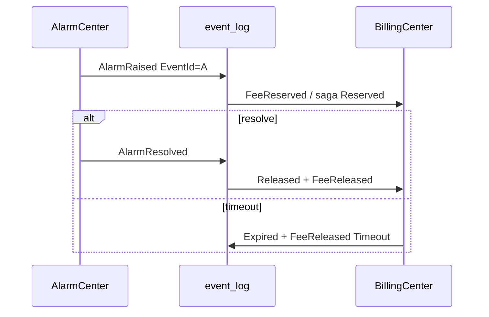

### How to test
- `dotnet test --filter FullyQualifiedName~Billing`
- `dotnet test`
- Aspire: `GET /sagas` on billing; fast `POST /alarms/duck-1/resolve`; slow wait 15s (`SAGA_TIMEOUT_SECONDS`)

### Follow-ups
**CCA-F:** `/saga-demo` command — curl the two paths and print `/sagas` JSON. Not built this pass; `/run-aspire` already covers the smoke steps.

**Refactor:** `RemoteOutboxDispatcher` is copied in Alarm and Billing. Extract to Kernel/EventBus if a third producer Center appears.

## 2026-08-30 — Step 9: distributed tracing

### What changed
Envelope `TraceId` is now a W3C traceparent stamped by the simulator / ingest. `event_log` stores `trace_id` and `causation_id` so the HTTP tail returns them. Each Center starts an `Activity` from that id (`DuckNet.Telemetry` / `DuckNet.Alarm` / `DuckNet.Dashboard`). `AlarmRaised` copies `TraceId` and sets `CausationId` to the parent `EventId`. Duplicates keep `TraceId`; inbox skip tags `ducknet.duplicate`. `DuckNet.ServiceDefaults` is OTel only (AlwaysOn sampler, OTLP when Aspire sets the endpoint).

### Architecture impact
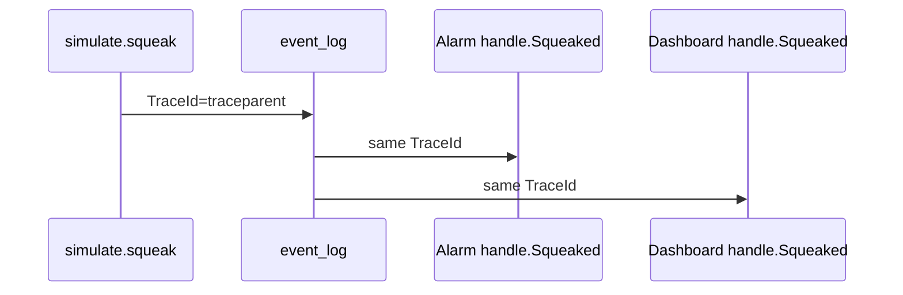

### How to test
- `dotnet test --filter Tracing`
- `dotnet test`
- Aspire: `dotnet run --project src/DuckNet.AppHost` → **Traces**, filter `handle.Squeaked` (not `DuckNet.*`)

### Follow-ups
**CCA-F:** `ducknet-mcp-ops` — `.claude/skills/ducknet-mcp-ops/SKILL.md` plus a small `DuckNet.Mcp` project (`get_consumer_lag`, `list_dlq`, `replay_event`, `rebuild_dashboard`). Plan lists it as Step 9+ optional. Not built this pass.

**Deferred:** HTTP resilience / `MapDefaultEndpoints` in ServiceDefaults (would collide with existing `/health` and double-retry `HttpLogClient`). Azure Monitor exporter is Step 12.

## 2026-08-29 — Refactor scan opens per-task GitHub issues

### What changed
The weekly scan no longer maintains one sticky "Refactor scan" rollup. Held patch findings and plan-tier `proposed_issues` each become (or update) a GitHub issue. Matching: scan marker in the body, then case-insensitive title among open issues. Closed `refactor-scan` issues are skipped. Human text outside the generated markers is kept. The old rollup is closed on the next CI run. Local `/refactor-scan` still does not open issues.

### Architecture impact
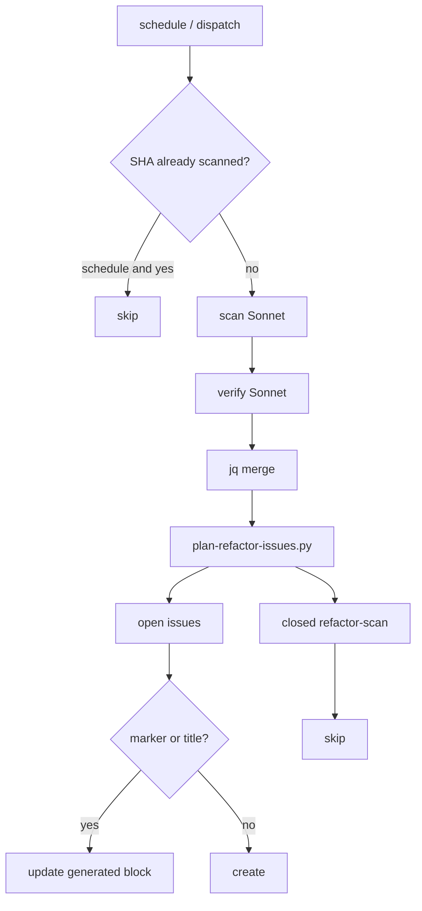

### How to test
- `bash .github/scripts/test-refactor-scan.sh` — merge, format, plan create/update/skip
- Actions → Claude refactor scan → Run workflow
- Expect one issue per task, labels `refactoring` + `refactor-scan`; re-run updates the same issues

## 2026-08-29 — Hot-partition lag test no longer folds in publish time

### What changed
`RunBurstAsync` now enqueues the hot burst on `InMemoryEventBus` *before* `SqueakCounter.RunAsync`. Lag is `UtcNow - OccurredAt` at handle time; publishing while workers (and other test assemblies) run made the quiet key look slow even on its own shard. CI failed `sharded quiet 176ms vs starved 257ms` against `starved / 2`.

### Architecture impact
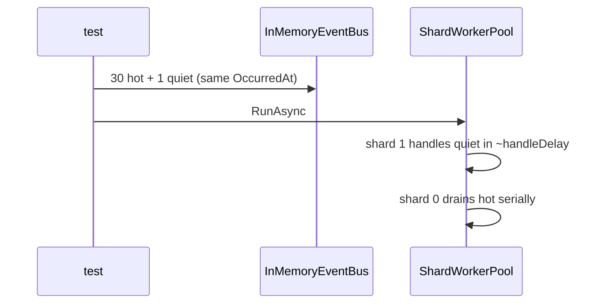

### How to test
- `dotnet test tests/DuckNet.Kernel.Tests --filter HotPartition`
- `dotnet test DuckNet.slnx -c Release` (three assemblies in parallel, as CI)

## 2026-08-29 — Refactor scan as a GitHub workflow

### What changed
Whole-tree refactor scan is now `refactor-scan.yml`: weekly Monday + `workflow_dispatch`. Not on PRs. Two isolated Sonnet sessions (scan, then independent confidence) merged by `jq`; one sticky GitHub issue. `ci.yml` still gates merge. Fixture tests cover merge + issue markdown without Claude.

### Architecture impact
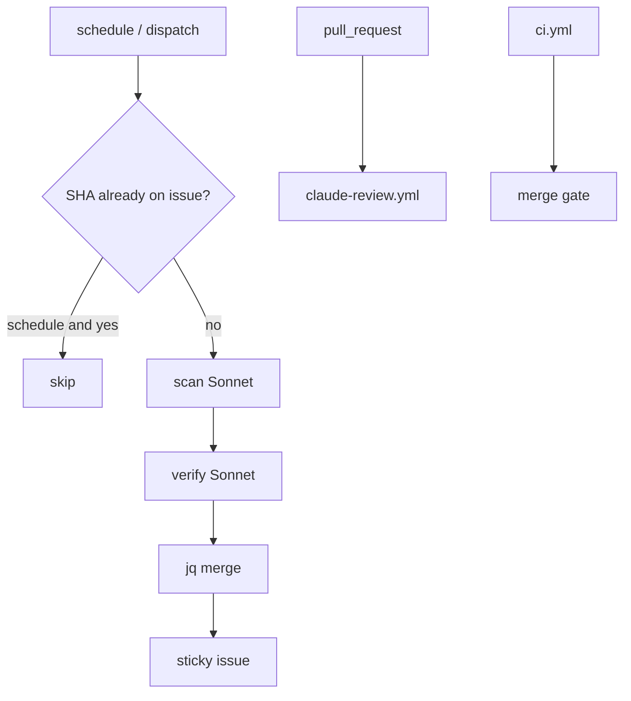

### How to test
- `bash .github/scripts/test-refactor-scan.sh` — merge, missing assessment, format, low confidence, empty (no Claude)
- Actions → Claude refactor scan → Run workflow (needs `CLAUDE_CODE_OAUTH_TOKEN`)
- Expect one issue titled "Refactor scan" with marker `ducknet-refactor-scan`; later runs update it
- Missing token: job fails (infra); findings never fail the workflow

### Follow-ups
**CCA-F:** `/refactor-scan` — `.claude/commands/refactor-scan.md` (`disable-model-invocation: true`). Local wrap of `run-refactor-scan.sh`; weekly CI stays `refactor-scan.yml`.

**Deferred:** nightly architecture/docs audit (ci-policy C) is a different whole-tree pass — not this scan.

## 2026-08-28 — Step 8: backpressure + hot partitions

### What changed
`LoudDuck` (weight 100) floods one `PartitionKey`. Consumers hash the key to `ShardCount` workers (default 3). Capacity is a backpressure **signal** — the dispatcher does not block on a hot shard, or quiet keys HOL-block on the subscribe loop. Per-shard and per-key lag on `GET /metrics` and the Dashboard cards. `--hot-demo --shard-count 1` vs `3` is the before/after.

SQLite stays. Postgres-from-Step-8 was a locked swap for concurrent writers; the starvation demo is at the worker layer.

### Architecture impact
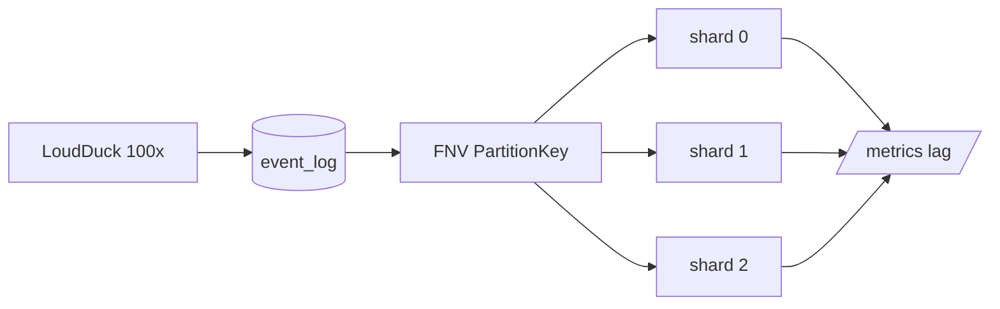

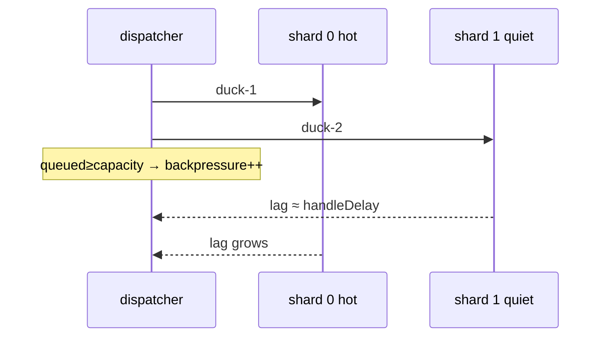

### How to test
- `dotnet test --filter HotPartition` — starve vs sharded quiet lag; LoudDuck ~100×; backpressure
- `dotnet run --project src/DuckNet.Kernel -- --reset-db --seconds 1 --hot-demo --shard-count 1 --no-shuffle --duplicate-rate 0`
- same with `--shard-count 3` — compare `maxLagMs`
- Aspire: Dashboard shard cards; `GET /metrics`

### Follow-ups
**CCA-F (needs OK):** project command `.claude/commands/hot-demo.md` (`/hot-demo`) — run shard-count 1 then 3 and print the lag table. Human-triggered; skill auto-invoke is the wrong primitive.

**Deferred:** Postgres per Center (locked architecture decision). Needed when shard workers must truly write concurrently; not required for this AC.

## 2026-08-28 — Step 7: poison messages + DLQ

### What changed
Each consumer wraps the handler in `RetryPipeline` (5 attempts, exponential backoff). Exhausted retries write that Center's `dead_letter_queue` and still advance contiguous `last_offset`. Inbox is not marked, so replay can apply. Poison is a well-formed envelope with `{not-json` payload — `POST /bus/poison`, `INJECT_POISON_EVENT`, or kernel `--inject-poison`. Inspect `GET /dlq`; replay `?fix=true` or skip.

### Architecture impact
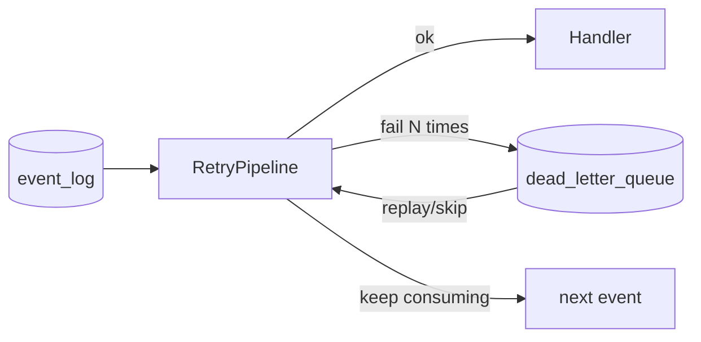

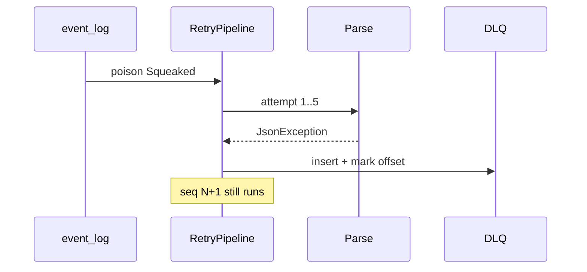

### How to test
- `dotnet test` — same-key seq 1/poison/3 still counts 2; replay `--fix` counts 3; Alarm and Dashboard HTTP DLQ
- `dotnet run --project src/DuckNet.Kernel -- --reset-db --seconds 5 --inject-poison` then `--list-dlq` / `--replay-dlq 1 --fix`
- Aspire: `POST /bus/poison` then `GET /dlq` on alarm or dashboard

### Follow-ups
**CCA-F (needs OK):** project command `.claude/commands/dlq.md` (`/dlq`) — list / replay / skip against a running Center. Skill auto-invoke is the wrong primitive (this is a human-triggered ops workflow). Planned MCP `ducknet-mcp-ops` already names DLQ inspect for Step 9+.

**Refactor:** `TryReplay` / `TrySkip` / `DeadLetter` are copy-pasted on three consumers. Extract only if a fourth Center needs it.

## 2026-08-28 — ReviewFlow MVP (PR review)


### What changed
`claude-review.yml` is a staged loop: Haiku triage writes `review-state.json` (artifact) → architecture and security run only if requested, each on a file-subset diff → `jq` aggregates one sticky PR comment. Specialists are stateless; they do not talk to each other. `code-review.md` stays on disk but is not invoked. Orchestrator scripts are fixture-tested in `ci.yml` without Claude.

### Architecture impact
```mermaid
flowchart TD
  PR[pull_request] --> T[triage Haiku]
  T --> S[review-state.json]
  S -->|architecture| A[architecture Haiku]
  S -->|security| Sec[security Haiku]
  S -->|low risk| Skip[skip specialists]
  A --> Agg[aggregate-review.sh]
  Sec --> Agg
  Skip --> Agg
  Agg --> C[one sticky comment]
  CI[ci.yml] --> Merge[merge gate]
```

### How to test
- `bash .github/scripts/test-aggregate-review.sh` — merge, skip, both specialists, degraded (no Claude)
- Open a non-draft code PR from this repo: expect jobs `triage` → optional `architecture`/`security` → `aggregate`, one comment with marker `ducknet-reviewflow`
- Low-risk / docs-only: specialists skipped or workflow not started
- Missing `CLAUDE_CODE_OAUTH_TOKEN`: triage fails (infra); verdict never fails the workflow

### Follow-ups
**CCA-F:** coordinator + isolated specialists + structured state (D1/D4). Later/parked list: [docs/ci-policy.md](./ci-policy.md).

## 2026-08-28 — DashboardCenter Vue UI


### What changed
DashboardCenter `/` is a Vue 3 + Bootstrap 5 SPA. TanStack Query polls `/dashboard/summary` and `/stats`; TanStack Table sorts/filters hour buckets. Rebuild is a modal → `POST /dashboard/rebuild`. JSON APIs unchanged. UI lives in the same Center (no extra process, no Center-to-Center calls). `dotnet build` runs `npm ci && npm run build` into `wwwroot`.

### Architecture impact
```mermaid
flowchart LR
  Browser[Vue SPA] -->|same origin| API["/dashboard/summary /stats /rebuild"]
  API --> RM[("squeaks_by_duck_hour")]
  Log[("event_log")] -->|IEventBus| Proj[DashboardConsumer]
  Proj --> RM
```

### How to test
- `dotnet test` — JSON `/dashboard/summary` still 200
- `dotnet run --project src/DuckNet.AppHost` — click dashboard URL; table fills; Rebuild replays
- UI only: `cd src/DuckNet.DashboardCenter/ui && npm run dev` (proxies to `:5152`)

## 2026-08-28 — Step 6: schema evolution across a boundary

### What changed
Telemetry emits `Squeaked` v2 (`volumeDb`). `SqueakedV1` stays as the frozen wire shape. Each consumer runs `EventUpcasterPipeline` before parse; handlers never see v1. v1→v2 default is `VolumeDb = 0` (unknown). Dashboard `volume_db` is the hour sum; Step 5 SQLite files get a nullable column via `EnsureVolumeColumn`. Mixed v1/v2 logs are a test fixture, not a live flag.

### Architecture impact
```mermaid
flowchart LR
  Tel[TelemetryCenter] -->|v2 + volumeDb| Log[("event_log mixed v1+v2")]
  Log --> U1[Upcaster]
  Log --> U2[Upcaster]
  U1 --> Alm[Alarm handler v2 only]
  U2 --> Dash[Dashboard projector]
  Dash --> RM[("squeaks_by_duck_hour + volume_db")]
```

```mermaid
sequenceDiagram
  participant Log as event_log
  participant Up as SqueakedV1ToV2Upcaster
  participant H as Handler
  Log->>Up: Squeaked v1
  Up->>Up: VolumeDb=0, Version=2
  Note over Up: EventId unchanged
  Up->>H: Parse v2
```

### How to test
- `dotnet test` — upcaster defaults; Parse rejects v1; mixed log replay in Alarm + Dashboard; dashboard rebuild keeps volume sum
- `dotnet run --project src/DuckNet.AppHost` — live traffic is v2; `/dashboard/summary` has `totalVolumeDb`
- Filter: `dotnet test --filter "FullyQualifiedName~Upcaster|FullyQualifiedName~MixedVersion"`

### Follow-ups
**Vs the plan:** upcasters live in `DuckNet.EventBus`, not Contracts (immutable shapes only). Kernel `SqueakCounter` also upcasts so the Step 3 console can replay mixed logs. `volume_db` is a **sum**, not an average.

**CCA-F:** skill `ducknet-event-contract` is live (version + upcaster checklist). `deploy-center.yml` already fans out on Contracts/EventBus — that is the Step 6 contract-change deploy-all path.

## 2026-08-28 — Azure deployment learning notes

### What changed
Added [docs/azure-deployment.md](./azure-deployment.md): how the current Aspire multi-Center shape maps to Azure without splitting Centers, 2018–2026 industry path (App Service/Fabric → AKS → Container Apps → Aspire), Options A/B/C, and lab price ranges. Linked from README, architecture index, and ImplementationPlan Step 12. No Azure resources or Bicep — learning only.

### How to test
Open `docs/azure-deployment.md` and confirm the four Mermaid diagrams render. Follow the README Docs link.

## 2026-08-27 — Cheaper Claude PR reviews

### What changed
`claude-review.yml` skips drafts and docs-only diffs. Architecture is Haiku with `--tools ""` (diff only). Code stays Sonnet, `--max-turns 4`, `$0.15` cap. Both jobs cap at `$0.15`.

### How to test
- Draft PR: checks skipped until **Ready for review**.
- Docs-only PR (`docs/**`, `*.md`, `*.html`): workflow does not run.
- Code PR: two checks still post; architecture should be a cheap Haiku one-shot.

## 2026-08-27 — Headless PR code review (`claude -p`)

### What changed
`claude-review.yml` now runs two isolated `claude -p --json-schema` jobs on every PR: architecture (the five CLAUDE.md rules) and code (bugs, tests, security, reliability, contract breaks). Each posts its own sticky comment. Still advisory — `ci.yml` gates merge. Does **not** run on push (no PR to comment on).

### Architecture impact
```mermaid
flowchart LR
  PR[pull_request] --> W[claude-review.yml]
  W --> A["claude -p architecture"]
  W --> C["claude -p code"]
  A --> Ac["sticky comment: architecture"]
  C --> Cc["sticky comment: code"]
  CI[ci.yml] --> Merge[merge gate]
```

### How to test
- Open or push to a PR from this repo (not a fork).
- Expect two checks: `Claude PR Review / architecture` and `Claude PR Review / code`.
- Expect two sticky comments; later pushes update them in place.
- Fork PRs skip both jobs (no `CLAUDE_CODE_OAUTH_TOKEN`).


## 2026-08-27 — Step 1: at-least-once + inbox

### What changed
Hostile transport now redelivers a fraction of events with the **same** `EventId`. The consumer owns an in-memory inbox and counts each id once. `--mis-demo` / `INBOX_ENABLED=false` turns the inbox off so totals drift on purpose.

### Architecture impact
```mermaid
flowchart LR
  Sim[DuckSimulator] --> Dup[DuplicatorMiddleware]
  Dup --> Bus[InMemoryEventBus]
  Bus --> Inbox[Inbox]
  Inbox -->|new EventId| Counter[SqueakCounter]
  Inbox -->|duplicate EventId| Skip[Skipping duplicate]
```

```mermaid
sequenceDiagram
  participant Sim as DuckSimulator
  participant Dup as Duplicator
  participant Inbox as Inbox
  participant C as SqueakCounter
  Sim->>Dup: Publish Squeaked (EventId=X)
  Dup->>Inbox: envelope X
  Dup-->>Inbox: clone X (~P)
  Inbox->>C: handle once
  Inbox-->>Inbox: skip second X
```

### How to test
- `dotnet test` — same id twice → one handle; 10k events at 20% dup → exact unique count; inbox off → 2x at rate 1.0
- `dotnet run --project src/DuckNet.Kernel -- --seconds 5` — Published == Counted, Skipped == Duplicates
- `dotnet run --project src/DuckNet.Kernel -- --mis-demo --seconds 5` — Counted > Published
- Agent: `/run-demo`, `/mis-demo`

## 2026-08-27 — Step 1 follow-up: helper, /mis-demo, README

### What changed
Shared `ConsumerWait` in kernel tests. Added `/mis-demo` command. Root `README.md` is the human entry point (build, demos, roadmap).

### How to test
- `dotnet test`
- `/mis-demo` 5 — Counted exceeds Published

## 2026-08-27 — As-built architecture diagrams

### What changed
`CLAUDE.md` now requires architecture + execution Mermaid after every step. Added `docs/architecture/step-0.md` and `step-1.md` (as-built). Target HTML links to those files; Step 1 HTML graph matches the duplicator-as-wrapper.

### How to test
Open `docs/architecture/step-1.md` (GitHub Mermaid) or `DuckNetArchitectureSteps.html` in a browser.

## 2026-08-27 — Step 2: shuffle + per-key sequencer

### What changed
Transport shuffles windows of envelopes. Consumer-owned `PerKeySequencer` restores order per duck. `--mis-demo` now disables inbox **and** sequencer.

### Architecture impact
```mermaid
flowchart LR
  Sim[DuckSimulator] --> Dup[DuplicatorMiddleware]
  Dup --> Shf[ShufflerMiddleware]
  Shf --> Seq[PerKeySequencer]
  Seq -->|seq == nextExpected| Inbox[Inbox]
  Seq -->|seq greater| Buf[per-key buffer]
  Seq -->|seq less| Late[late drop]
  Inbox --> C[SqueakCounter]
```

```mermaid
sequenceDiagram
  participant Shf as Shuffler
  participant Seq as PerKeySequencer
  participant C as SqueakCounter
  Shf->>Seq: B1, A2, A1
  Seq-->>C: B1
  Seq-->>Seq: buffer A2
  Seq-->>C: A1 then A2
  Note over C: OutOfOrderCount = 0
```

Ordering is per `PartitionKey`, never global. Gap timeout logs only.

### How to test
- `dotnet test` — `(B1, A2, A1)` reorders per key; shuffle+dup demo → exact totals, zero out-of-order
- `dotnet run --project src/DuckNet.Kernel -- --seconds 5` — Published == Counted, Out of order == 0
- `dotnet run --project src/DuckNet.Kernel -- --mis-demo --seconds 5` — Counted > Published, Out of order > 0
- Agent: `/run-demo`, `/mis-demo`

## 2026-08-27 — Step 3: durable log + outbox

### What changed
Producer writes duck seq and outbox in one SQLite transaction. Dispatcher appends `event_log`. Tail feeder publishes through hostile bus (dup + shuffle **after** the log). Consumer checkpoints inbox + counts + contiguous offset together. Kill/restart continues counts; `--reset-db` starts clean.

### Architecture impact
```mermaid
flowchart LR
  Sim[DuckSimulator] --> Tx[Tx: state + outbox]
  Tx --> Dsp[OutboxDispatcher]
  Dsp --> Log[(event_log)]
  Log --> Feed[LogTailFeeder]
  Feed --> Dup[Duplicator]
  Dup --> Shf[Shuffler]
  Shf --> Seq[PerKeySequencer]
  Seq --> Ck[ConsumerCheckpoint]
  Ck --> C[SqueakCounter]
```

```mermaid
sequenceDiagram
  participant Sim as DuckSimulator
  participant Tx as TransactionalPublisher
  participant Dsp as Dispatcher
  participant Feed as LogTailFeeder
  participant Ck as Checkpoint
  Sim->>Tx: state + outbox (one COMMIT)
  Tx-->>Dsp: unpublished row
  Dsp->>Dsp: append log + mark published
  Feed->>Ck: envelope with LogOffset
  Ck->>Ck: inbox + counts + last_offset (one COMMIT)
```

### How to test
- `dotnet test` — crash before commit writes neither side; restart from offset does not double-count; replay from 0 reproduces counts
- `dotnet run --project src/DuckNet.Kernel -- --reset-db --seconds 5` — session Published == lifetime Counted == Log rows, Out of order == 0
- Run again without `--reset-db` — lifetime Counted continues; equals Log rows
- `dotnet run --project src/DuckNet.Kernel -- --mis-demo --reset-db --seconds 5` — Counted > Log rows, Out of order > 0
- Agent: `/run-demo`, `/mis-demo`

## 2026-08-27 — Step 4: second Center, own database (Aspire)

### What changed
Split into TelemetryCenter + AlarmCenter under Aspire. Telemetry owns `event_log`. AlarmCenter tails/appends via `GET/POST /bus/events` (`HttpLogClient`) and never opens Telemetry SQLite. Rate window is event-time; crossing `ALARM_RATE_THRESHOLD` publishes `AlarmRaised` through Alarm's local outbox.

### Architecture impact
```mermaid
flowchart LR
  Sim[DuckSimulator] --> Tdb[(telemetry.db)]
  Tdb --> Bus["/bus/events"]
  Bus --> Alm[AlarmConsumer]
  Alm --> Adb[(alarm.db)]
  Adb -->|AlarmRaised outbox| Bus
```

```mermaid
sequenceDiagram
  participant Tel as Telemetry
  participant Log as event_log
  participant Alm as AlarmCenter
  Tel->>Log: Squeaked
  Note over Alm: optional downtime
  Alm->>Log: GET after last_offset
  Alm->>Alm: window > threshold
  Alm->>Log: POST AlarmRaised
```

### How to test
- `dotnet test` — isolation (no Center csproj refs; Alarm schema has no `event_log`); threshold crossing; catch-up from HTTP log
- `dotnet run --project src/DuckNet.AppHost` — both services healthy; stop alarm, restart, `/alarms` catches up
- Agent: `/run-aspire`

## 2026-08-27 — Step 5: CQRS disposable read model

### What changed
DashboardCenter projects `squeaks_by_duck_hour` from `Squeaked` via `IEventBus` (HTTP log tail). It never writes the log. `POST /dashboard/rebuild` truncates the read model + inbox, resets offset to 0, and replays. Same rows come back.

### Architecture impact
```mermaid
flowchart LR
  Tel[TelemetryCenter] --> Log[("event_log")]
  Log -->|GET /bus/events| Dash[DashboardConsumer]
  Dash --> RM[("squeaks_by_duck_hour")]
  RB[POST /dashboard/rebuild] -->|truncate + offset 0| RM
```

```mermaid
sequenceDiagram
  participant Tel as Telemetry
  participant Log as event_log
  participant Dash as DashboardCenter
  Tel->>Log: Squeaked
  Dash->>Log: GET after last_offset
  Dash->>Dash: inbox + upsert hour count
  Note over Dash: POST /dashboard/rebuild
  Dash->>Dash: truncate, replay from 0
```

### How to test
- `dotnet test` — isolation; duplicate EventId counts once; 1000 events → rebuild → deep-equal summary
- `dotnet run --project src/DuckNet.AppHost` — `GET /dashboard/summary`; `POST /dashboard/rebuild`; rows refill
- Agent: `/run-aspire`

### Follow-ups
**Vs the plan:** no Dashboard outbox (projector does not publish). No `PerKeySequencer` — hour counts are commutative; inbox + contiguous offset still survive dup/shuffle.

**Concerns:** rebuild holds the consumer lock, then `HttpLogTailFeeder.ResetTo(0)`. Leftover in-memory envelopes are counted once via inbox. Worth a glance in a live Aspire session (tests cover equality, not the host).

**Refactors (not done):** Alarm vs Dashboard App composition (hostile pipeline + HTTP feeder) is copy-paste-shaped. Extract if a fourth Center copies it again.

**CCA-F (needs OK):**
- Command `.claude/commands/rebuild-dashboard.md` — curl `POST /dashboard/rebuild` against running Aspire
- Skill `ducknet-center`: projector-only Centers omit outbox

