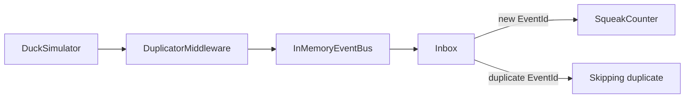
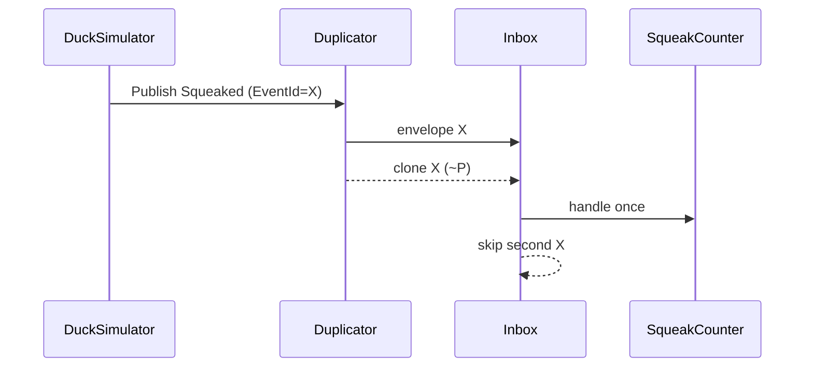
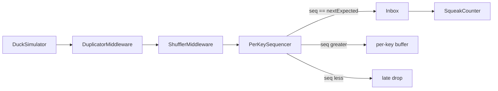
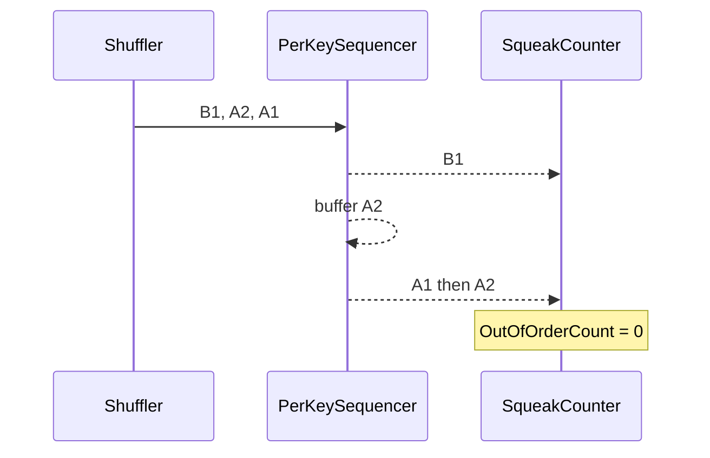
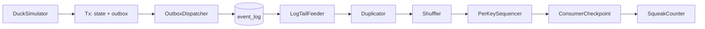
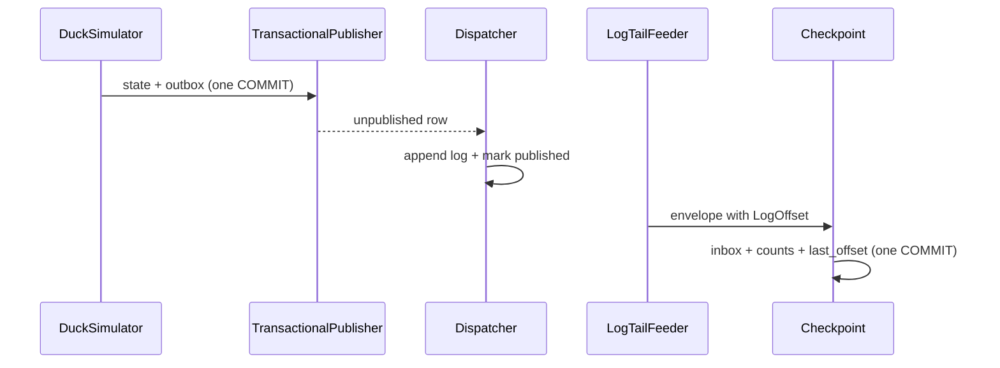

# Development diary

## 2026-08-27 — Step 1: at-least-once + inbox

### What changed
Hostile transport now redelivers a fraction of events with the **same** `EventId`. The consumer owns an in-memory inbox and counts each id once. `--mis-demo` / `INBOX_ENABLED=false` turns the inbox off so totals drift on purpose.

### Architecture impact

### How to test
- `dotnet test` — same id twice → one handle; 10k events at 20% dup → exact unique count; inbox off → 2x at rate 1.0
- `dotnet run --project src/DuckNet.Kernel -- --seconds 5` — Published == Counted, Skipped == Duplicates
- `dotnet run --project src/DuckNet.Kernel -- --mis-demo --seconds 5` — Counted > Published
- Agent: `/run-demo`, `/mis-demo`

## 2026-08-27 — Step 1 follow-up: helper, /mis-demo, README

### What changed
Shared `ConsumerWait` in kernel tests. Added `/mis-demo` command. Root `README.md` is the human entry point (build, demos, roadmap).

### How to test
- `dotnet test`
- `/mis-demo` 5 — Counted exceeds Published

## 2026-08-27 — As-built architecture diagrams

### What changed
`CLAUDE.md` now requires architecture + execution Mermaid after every step. Added `docs/architecture/step-0.md` and `step-1.md` (as-built). Target HTML links to those files; Step 1 HTML graph matches the duplicator-as-wrapper.

### How to test
Open `docs/architecture/step-1.md` (GitHub Mermaid) or `DuckNetArchitectureSteps.html` in a browser.

## 2026-08-27 — Step 2: shuffle + per-key sequencer

### What changed
Transport shuffles windows of envelopes. Consumer-owned `PerKeySequencer` restores order per duck. `--mis-demo` now disables inbox **and** sequencer.

### Architecture impact

Ordering is per `PartitionKey`, never global. Gap timeout logs only.

### How to test
- `dotnet test` — `(B1, A2, A1)` reorders per key; shuffle+dup demo → exact totals, zero out-of-order
- `dotnet run --project src/DuckNet.Kernel -- --seconds 5` — Published == Counted, Out of order == 0
- `dotnet run --project src/DuckNet.Kernel -- --mis-demo --seconds 5` — Counted > Published, Out of order > 0
- Agent: `/run-demo`, `/mis-demo`

## 2026-08-27 — Step 3: durable log + outbox

### What changed
Producer writes duck seq and outbox in one SQLite transaction. Dispatcher appends `event_log`. Tail feeder publishes through hostile bus (dup + shuffle **after** the log). Consumer checkpoints inbox + counts + contiguous offset together. Kill/restart continues counts; `--reset-db` starts clean.

### Architecture impact

### How to test
- `dotnet test` — crash before commit writes neither side; restart from offset does not double-count; replay from 0 reproduces counts
- `dotnet run --project src/DuckNet.Kernel -- --reset-db --seconds 5` — session Published == lifetime Counted == Log rows, Out of order == 0
- Run again without `--reset-db` — lifetime Counted continues; equals Log rows
- `dotnet run --project src/DuckNet.Kernel -- --mis-demo --reset-db --seconds 5` — Counted > Log rows, Out of order > 0
- Agent: `/run-demo`, `/mis-demo`

