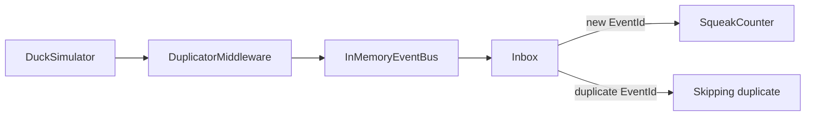
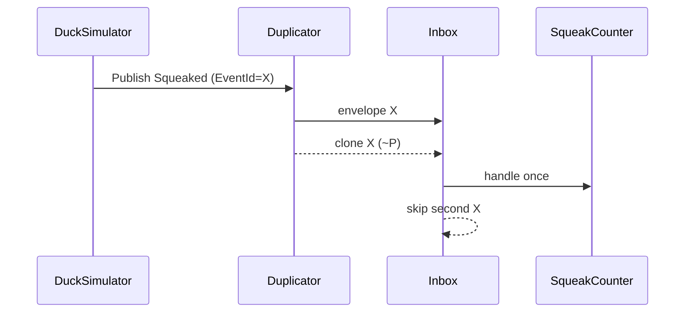

# Development diary

## 2026-08-27 — Step 1: at-least-once + inbox

### What changed
Hostile transport now redelivers a fraction of events with the **same** `EventId`. The consumer owns an in-memory inbox and counts each id once. `--mis-demo` / `INBOX_ENABLED=false` turns the inbox off so totals drift on purpose.

### Architecture impact

### How to test
- `dotnet test` — same id twice → one handle; 10k events at 20% dup → exact unique count; inbox off → 2x at rate 1.0
- `dotnet run --project src/DuckNet.Kernel -- --seconds 5` — Published == Counted, Skipped == Duplicates
- `dotnet run --project src/DuckNet.Kernel -- --mis-demo --seconds 5` — Counted > Published
- Agent: `/run-demo`, `/mis-demo`

## 2026-08-27 — Step 1 follow-up: helper, /mis-demo, README

### What changed
Shared `ConsumerWait` in kernel tests. Added `/mis-demo` command. Root `README.md` is the human entry point (build, demos, roadmap).

### How to test
- `dotnet test`
- `/mis-demo` 5 — Counted exceeds Published

## 2026-08-27 — As-built architecture diagrams

### What changed
`CLAUDE.md` now requires architecture + execution Mermaid after every step. Added `docs/architecture/step-0.md` and `step-1.md` (as-built). Target HTML links to those files; Step 1 HTML graph matches the duplicator-as-wrapper.

### How to test
Open `docs/architecture/step-1.md` (GitHub Mermaid) or `DuckNetArchitectureSteps.html` in a browser.
