# Development diary

After each implementation: what changed, architecture (mermaid), how to test, and **follow-ups** (concerns, refactors, CCA-F proposals). Follow-ups wait for approval — do not implement them in the same pass.

## 2026-08-28 — Azure deployment learning notes

### What changed
Added [docs/azure-deployment.md](./azure-deployment.md): how the current Aspire multi-Center shape maps to Azure without splitting Centers, 2018–2026 industry path (App Service/Fabric → AKS → Container Apps → Aspire), Options A/B/C, and lab price ranges. Linked from README, architecture index, and ImplementationPlan Step 12. No Azure resources or Bicep — learning only.

### How to test
Open `docs/azure-deployment.md` and confirm the four Mermaid diagrams render. Follow the README Docs link.

## 2026-08-27 — Cheaper Claude PR reviews

### What changed
`claude-review.yml` skips drafts and docs-only diffs. Architecture is Haiku with `--tools ""` (diff only). Code stays Sonnet, `--max-turns 4`, `$0.15` cap. Both jobs cap at `$0.15`.

### How to test
- Draft PR: checks skipped until **Ready for review**.
- Docs-only PR (`docs/**`, `*.md`, `*.html`): workflow does not run.
- Code PR: two checks still post; architecture should be a cheap Haiku one-shot.

## 2026-08-27 — Headless PR code review (`claude -p`)

### What changed
`claude-review.yml` now runs two isolated `claude -p --json-schema` jobs on every PR: architecture (the five CLAUDE.md rules) and code (bugs, tests, security, reliability, contract breaks). Each posts its own sticky comment. Still advisory — `ci.yml` gates merge. Does **not** run on push (no PR to comment on).

### Architecture impact
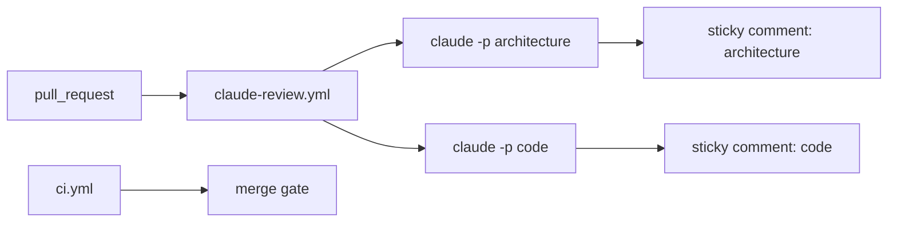

### How to test
- Open or push to a PR from this repo (not a fork).
- Expect two checks: `Claude PR Review / architecture` and `Claude PR Review / code`.
- Expect two sticky comments; later pushes update them in place.
- Fork PRs skip both jobs (no `CLAUDE_CODE_OAUTH_TOKEN`).

## 2026-08-27 — Step 1: at-least-once + inbox

### What changed
Hostile transport now redelivers a fraction of events with the **same** `EventId`. The consumer owns an in-memory inbox and counts each id once. `--mis-demo` / `INBOX_ENABLED=false` turns the inbox off so totals drift on purpose.

### Architecture impact
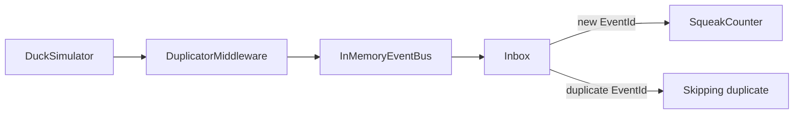

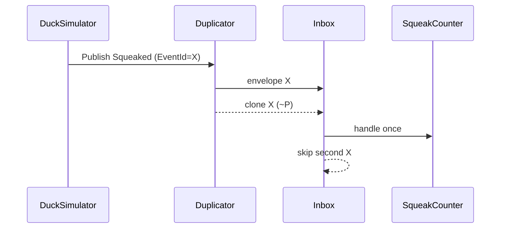

### How to test
- `dotnet test` — same id twice → one handle; 10k events at 20% dup → exact unique count; inbox off → 2x at rate 1.0
- `dotnet run --project src/DuckNet.Kernel -- --seconds 5` — Published == Counted, Skipped == Duplicates
- `dotnet run --project src/DuckNet.Kernel -- --mis-demo --seconds 5` — Counted > Published
- Agent: `/run-demo`, `/mis-demo`

## 2026-08-27 — Step 1 follow-up: helper, /mis-demo, README

### What changed
Shared `ConsumerWait` in kernel tests. Added `/mis-demo` command. Root `README.md` is the human entry point (build, demos, roadmap).

### How to test
- `dotnet test`
- `/mis-demo` 5 — Counted exceeds Published

## 2026-08-27 — As-built architecture diagrams

### What changed
`CLAUDE.md` now requires architecture + execution Mermaid after every step. Added `docs/architecture/step-0.md` and `step-1.md` (as-built). Target HTML links to those files; Step 1 HTML graph matches the duplicator-as-wrapper.

### How to test
Open `docs/architecture/step-1.md` (GitHub Mermaid) or `DuckNetArchitectureSteps.html` in a browser.

## 2026-08-27 — Step 2: shuffle + per-key sequencer

### What changed
Transport shuffles windows of envelopes. Consumer-owned `PerKeySequencer` restores order per duck. `--mis-demo` now disables inbox **and** sequencer.

### Architecture impact
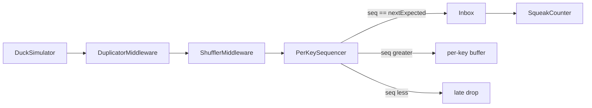

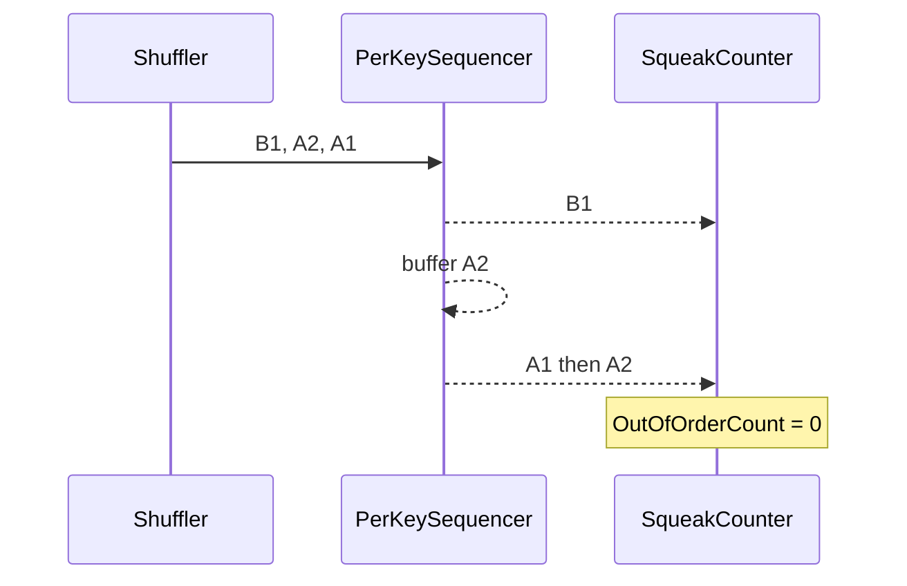

Ordering is per `PartitionKey`, never global. Gap timeout logs only.

### How to test
- `dotnet test` — `(B1, A2, A1)` reorders per key; shuffle+dup demo → exact totals, zero out-of-order
- `dotnet run --project src/DuckNet.Kernel -- --seconds 5` — Published == Counted, Out of order == 0
- `dotnet run --project src/DuckNet.Kernel -- --mis-demo --seconds 5` — Counted > Published, Out of order > 0
- Agent: `/run-demo`, `/mis-demo`

## 2026-08-27 — Step 3: durable log + outbox

### What changed
Producer writes duck seq and outbox in one SQLite transaction. Dispatcher appends `event_log`. Tail feeder publishes through hostile bus (dup + shuffle **after** the log). Consumer checkpoints inbox + counts + contiguous offset together. Kill/restart continues counts; `--reset-db` starts clean.

### Architecture impact
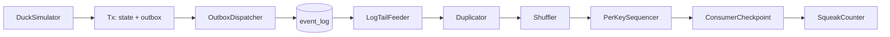

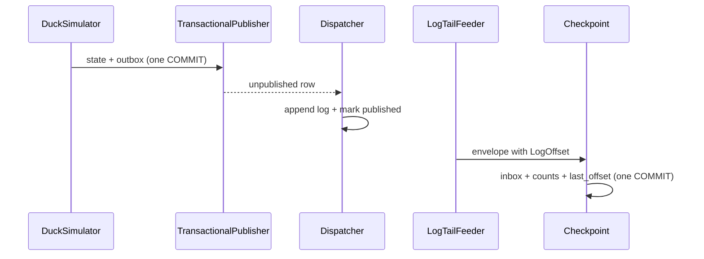

### How to test
- `dotnet test` — crash before commit writes neither side; restart from offset does not double-count; replay from 0 reproduces counts
- `dotnet run --project src/DuckNet.Kernel -- --reset-db --seconds 5` — session Published == lifetime Counted == Log rows, Out of order == 0
- Run again without `--reset-db` — lifetime Counted continues; equals Log rows
- `dotnet run --project src/DuckNet.Kernel -- --mis-demo --reset-db --seconds 5` — Counted > Log rows, Out of order > 0
- Agent: `/run-demo`, `/mis-demo`

## 2026-08-27 — Step 4: second Center, own database (Aspire)

### What changed
Split into TelemetryCenter + AlarmCenter under Aspire. Telemetry owns `event_log`. AlarmCenter tails/appends via `GET/POST /bus/events` (`HttpLogClient`) and never opens Telemetry SQLite. Rate window is event-time; crossing `ALARM_RATE_THRESHOLD` publishes `AlarmRaised` through Alarm's local outbox.

### Architecture impact
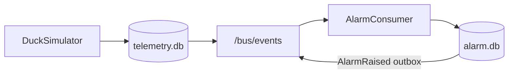

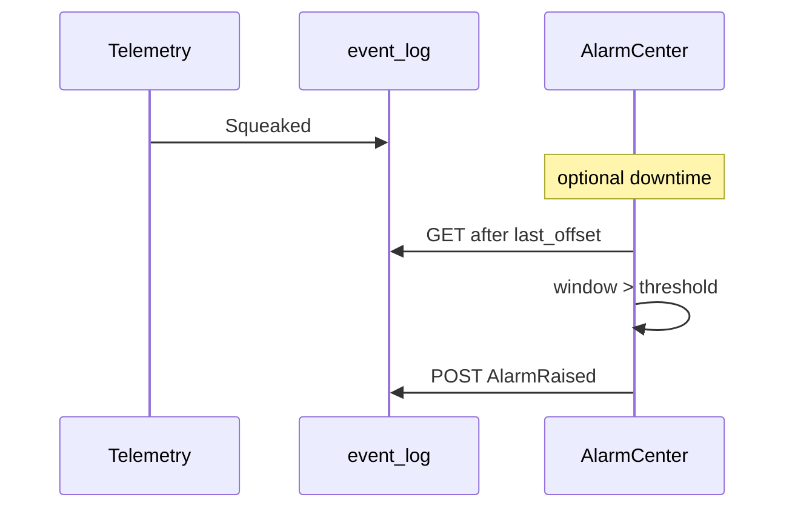

### How to test
- `dotnet test` — isolation (no Center csproj refs; Alarm schema has no `event_log`); threshold crossing; catch-up from HTTP log
- `dotnet run --project src/DuckNet.AppHost` — both services healthy; stop alarm, restart, `/alarms` catches up
- Agent: `/run-aspire`

## 2026-08-27 — Step 5: CQRS disposable read model

### What changed
DashboardCenter projects `squeaks_by_duck_hour` from `Squeaked` via `IEventBus` (HTTP log tail). It never writes the log. `POST /dashboard/rebuild` truncates the read model + inbox, resets offset to 0, and replays. Same rows come back.

### Architecture impact
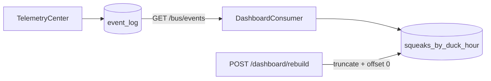

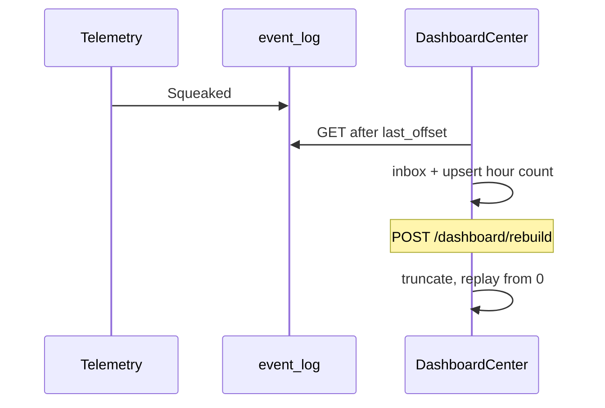

### How to test
- `dotnet test` — isolation; duplicate EventId counts once; 1000 events → rebuild → deep-equal summary
- `dotnet run --project src/DuckNet.AppHost` — `GET /dashboard/summary`; `POST /dashboard/rebuild`; rows refill
- Agent: `/run-aspire`

### Follow-ups
**Vs the plan:** no Dashboard outbox (projector does not publish). No `PerKeySequencer` — hour counts are commutative; inbox + contiguous offset still survive dup/shuffle.

**Concerns:** rebuild holds the consumer lock, then `HttpLogTailFeeder.ResetTo(0)`. Leftover in-memory envelopes are counted once via inbox. Worth a glance in a live Aspire session (tests cover equality, not the host).

**Refactors (not done):** Alarm vs Dashboard App composition (hostile pipeline + HTTP feeder) is copy-paste-shaped. Extract if a fourth Center copies it again.

**CCA-F (needs OK):**
- Command `.claude/commands/rebuild-dashboard.md` — curl `POST /dashboard/rebuild` against running Aspire
- Skill `ducknet-center`: projector-only Centers omit outbox

