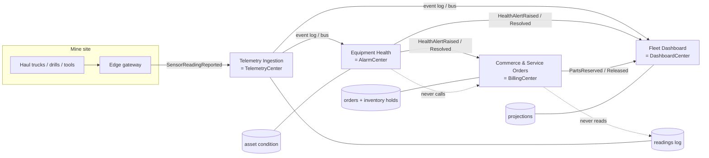

# DuckNet as a blueprint: industry mappings and gap analysis

DuckNet is a toy domain wired with real distributed-systems machinery. This document asks the
question the toy exists to answer: **which load-bearing production systems does this architecture
actually map to, and where does DuckNet fall short of them?**

Four systems are analyzed, in four different industries and markets:

| # | System | Industry | Market | Depth |
|---|--------|----------|--------|-------|
| 1 | [OrePart Connect](#1-orepart-connect--mining-parts-e-commerce--fleet-health) | Mining / heavy industry | B2B e-commerce + industrial IoT | Anchor case (deepest) |
| 2 | [GridPulse](#2-gridpulse--smart-meter-ingestion--utility-billing) | Energy utilities | Regulated consumer/commercial metering | Full |
| 3 | [WardWatch](#3-wardwatch--hospital-patient-telemetry--clinical-alerting) | Healthcare | Institutional (hospitals) | Full |
| 4 | [SettleRight](#4-settleright--card-payment-authorization--fraud-detection) | Fintech | Consumer payments | Full |

Each section gives a project description, a system description, a functional mapping onto DuckNet's
actual components, and a gap analysis. A [cross-cutting gap analysis](#cross-cutting-gap-analysis)
at the end collects the gaps that recur regardless of domain.

Everything mapped here refers to code that exists on `main` as of Step 12b — not the roadmap HTML.

---

## DuckNet capability inventory (what is actually being mapped)

The reusable machinery, by component:

| Capability | Where it lives in DuckNet |
|------------|---------------------------|
| Versioned event contract with identity, partition key, per-key sequence, trace + causation | `EventEnvelope` (`EventId`, `Type`, `Version`, `PartitionKey`, `SequenceNumber`, `OccurredAt`, `PayloadJson`, `TraceId`, `CausationId`, `LogOffset`) |
| Durable append-only event log with a single writer | `event_log` owned by TelemetryCenter; `GET/POST /bus/events` |
| Hostile transport survived by design | at-least-once, unordered-across-keys transport (Step 1 onward); RabbitMQ / Service Bus / Event Hubs adapters behind `IEventBus` via `EventBusFactory` |
| Exactly-once *processing* effect | Inbox dedupe on `EventId` per consumer |
| Per-key ordering repair | `PerKeySequencer` + consumer checkpoints |
| Atomic state-change + publish | `TransactionalPublisher` + `OutboxDispatcher` (`RemoteOutboxDispatcher` in Alarm and Billing) |
| Failure isolation | `RetryPipeline` → DLQ; `POST /bus/poison`; poison messages don't stall a shard |
| Horizontal scale within a consumer | `ShardWorkerPool` (partition-hash shards) |
| Contract evolution on a mixed log | `SqueakedV1` → `Squeaked` v2 via `EventUpcasterPipeline`, frozen v1 wire shape |
| Stateful detection over a stream | AlarmCenter rate window → `AlarmRaised` / `AlarmResolved` |
| Long-running process with compensation | BillingCenter saga on `AlarmRaised`/`AlarmResolved` → `FeeReserved` / `FeeReleased`, `SagaTimeoutWorker` timeout compensation |
| Independent read models | DashboardCenter `squeaks_by_duck_hour` + `volume_db` projections, Vue UI, `GET /metrics` |
| Schema-per-service persistence | Per-Center SQLite / `PostgresKernelDb` (one server, four databases) |
| Distributed tracing across async hops | OTel via ServiceDefaults, `DuckNet.*` ActivitySources, `TraceId`/`CausationId` on the wire |
| Local orchestration + deployability | Aspire AppHost; Dockerfiles per Center; Bicep for Container Apps / Service Bus / Event Hubs / Postgres (compile-only until 12c) |

And the two structural rules that carry more weight than any component: **no Center-to-Center
calls** and **no shared database**.

---

## 1. OrePart Connect — mining parts e-commerce + fleet health

### Project description

OrePart Connect is a B2B platform operated by a mining-equipment parts distributor. Its customers
are mining operators running fleets of haul trucks, drill rigs, loaders, crushers, and hand tools.
The platform does two connected things:

1. **Commerce** — customers browse a parts catalog (filters, wear plates, hydraulic hoses, drill
   bits, ground-engaging tools), place orders, track deliveries, and get invoiced on account terms.
2. **Fleet health** — vehicles and tools stream telemetry (engine hours, vibration, oil pressure,
   hydraulic temperature, impact counts on tools) to the platform. The platform monitors equipment
   condition, predicts wear, and turns predictions into **service recommendations with a
   pre-filled parts basket** — closing the loop between "your crusher's bearing vibration is
   trending up" and "here is the bearing kit, in stock, deliverable to your site before the
   predicted failure window."

The business case is the loop: telemetry drives parts demand prediction, which drives both the
customer's uptime and the distributor's inventory planning.

### System description

The platform decomposes into services that line up one-to-one with DuckNet Centers:

- **Telemetry Ingestion Service** — receives device readings from edge gateways at mine sites,
  validates and appends them to a durable event log. Owns the log; nothing else writes it.
- **Equipment Health Service** — consumes readings per asset, maintains condition state (rolling
  windows over vibration/temperature/hours), raises `HealthAlertRaised` when a threshold or trend
  fires, `HealthAlertResolved` when the signal recovers or a service event is recorded.
- **Fleet Dashboard Service** — projections per customer: asset health boards, usage-by-asset-hour,
  alert history. The screen a maintenance planner has open all day.
- **Commerce & Service-Order Service** — reacts to health alerts by opening a *service case*:
  reserves the recommended parts against inventory, holds pricing, and either converts to a
  confirmed order (customer accepts / auto-approval policy) or releases the reservation on
  resolution or timeout.

### Functional mapping

| OrePart Connect function | DuckNet mechanism it maps to |
|--------------------------|------------------------------|
| Asset identity (truck, drill, tool serial) | `DuckId` / `PartitionKey` — per-asset ordering is exactly per-duck ordering |
| Sensor reading (`SensorReadingReported`: asset, hours, vibration mm/s, temp) | `Squeaked` v2 (`DuckId`, `SequenceNumber`, `OccurredAt`, `VolumeDb`) — `VolumeDb` is literally a sensor magnitude |
| Device fleet with firmware generations sending old payload shapes | `SqueakedV1` → v2 upcasting; frozen v1 wire shape is the "old firmware still in the field" problem |
| Flaky satellite/LTE uplinks from remote sites: duplicates, reordering, bursts after reconnect | Hostile transport + inbox dedupe + `PerKeySequencer` + checkpoints — this is DuckNet's core competency |
| Condition monitoring (vibration rate over a window) | AlarmCenter rate window → `AlarmRaised` when a duck squeaks too fast |
| Alert lifecycle (raise, auto-resolve on recovery) | `AlarmRaised` / `AlarmResolved` via outbox |
| Service case: reserve parts + pricing on an alert, release on resolution, expire unanswered cases | BillingCenter saga: `FeeReserved` on `AlarmRaised`, `FeeReleased` on `AlarmResolved`, `SagaTimeoutWorker` compensation — a near-perfect structural match for an inventory/quote hold |
| Corrupt or malformed device payloads (bit-flipped uplink frames) | `RetryPipeline` → DLQ; `POST /bus/poison`; a bad frame doesn't stall the asset's shard |
| Fleet dashboard: usage per asset per hour, health boards | `squeaks_by_duck_hour` + `volume_db` projections + Vue UI + `GET /metrics` |
| Scaling ingestion per mine/fleet | `ShardWorkerPool` sharded on `PartitionKey`; Event Hubs partitions keyed by asset id |
| "Why did this order get created?" audit from order back to sensor reading | `TraceId` + `CausationId` chain across TelemetryCenter → AlarmCenter → BillingCenter, visible in OTel |
| Each service deployable and owned independently | Per-Center DBs, Dockerfiles, Bicep Container Apps, no shared schema |

The structural rules carry over verbatim: the Commerce service must never query the telemetry DB
to decide anything (it reacts to `HealthAlertRaised`), and Equipment Health must never call
Commerce to "create an order" (events are past facts, not commands).

### Gap analysis

| # | Gap | DuckNet today | What OrePart Connect needs | Severity |
|---|-----|---------------|----------------------------|----------|
| G1 | **Ingestion scale and protocol edge** | One `DuckSimulator` posting HTTP to a single SQLite-backed log endpoint | Tens of thousands of assets × multi-Hz sensors: MQTT/OPC-UA edge gateways, store-and-forward buffering during uplink outages, batched compressed uploads, a partitioned log (Event Hubs/Kafka) as the *primary* ingest path, not an adapter behind a single HTTP writer. TelemetryCenter as sole log writer is a structural single point of failure at this volume | High |
| G2 | **Time-series storage and downsampling** | Raw events in `event_log`; Dashboard keeps hourly counts | Retention tiers (raw → 1-min → 1-hour rollups), a real TSDB or columnar store for years of vibration history, event-time (device clock) vs ingest-time handling for readings buffered offline for days. DuckNet's sequencer repairs order but has no concept of *late* data re-opening a closed window | High |
| G3 | **Prediction is absent** | AlarmCenter is a fixed-threshold rate window | The product promise is *predictive*: feature pipelines over telemetry history, trained wear models per equipment class, remaining-useful-life estimates, model versioning/rollout, and a feedback loop from actual service outcomes. Nothing in DuckNet trains, scores, or versions a model. The event backbone is the right substrate (score events, prediction events) but the entire ML plane is a gap | High |
| G4 | **The commerce half is missing** | BillingCenter reserves/releases an abstract fee | Catalog + search, inventory across warehouses, equipment-to-part compatibility data (which bearing kit fits which crusher model/year), pricing per contract, cart/checkout, ERP + logistics integration, invoicing on account terms. This is a full command-side domain — DuckNet has essentially no command API at all (its only inputs are simulator squeaks and `/bus/poison`) | High |
| G5 | **Multi-tenancy and authorization** | No auth anywhere; every duck is visible to every consumer | Customer A must never see customer B's fleet, telemetry, prices, or orders. Tenant scoping in every projection and API, device identity/attestation for gateways (a spoofed asset id must not poison another tenant's data), role-based access (planner vs purchaser vs distributor admin) | High |
| G6 | **Human workflow on alerts** | `AlarmRaised` flows straight to an automated saga | A service recommendation is a *proposal*: accept / modify basket / decline / snooze, technician notes, integration with the customer's CMMS. Requires a task/workflow model and user-facing commands feeding back into the saga — DuckNet's saga only ever hears `AlarmResolved` or its own timeout | Medium |
| G7 | **Saga breadth** | One saga, two outcomes, one timeout | Order fulfilment spans reservation → confirmation → picking → shipping → delivery → invoice, with partial shipments and returns; weeks-long, multi-step, human-interruptible. The reserve/release/timeout pattern is the right seed but needs a general saga/process-manager framework (state machine persistence exists; step orchestration and versioning of in-flight sagas don't) | Medium |
| G8 | **Reference/master data distribution** | Contracts are events only | Part catalog and compatibility data change slowly and are needed by several services. Event-carried state transfer or a published snapshot feed is needed; DuckNet has no pattern for "big slow-changing reference data" (and copying it into every Center by hand violates nobody's rules but scales badly) | Medium |
| G9 | **Analytics offramp** | Projections are per-Center SQLite tables | Demand forecasting and inventory planning need the event stream landed in a warehouse/lake. `EventHubsLogWriter` is a stub of this idea; there is no capture-to-storage, no schema-on-read story | Medium |

**Verdict**: the event backbone, per-asset ordering, dedupe, DLQ, upcasting (firmware drift!), and
the alert→reserve→release/timeout saga transfer almost unchanged — DuckNet is a credible skeleton
for the *telemetry-to-service-case* spine. The gaps are the entire commerce command side, the ML
plane, tenancy/security, and industrial-scale ingestion.

---

## 2. GridPulse — smart-meter ingestion & utility billing

### Project description

GridPulse is the metering backbone of a mid-size electricity utility: 2 million smart meters
reporting interval consumption every 15 minutes, plus exception events (outage, tamper, reverse
flow from solar). It computes billable consumption, detects anomalies, feeds a customer-facing
usage portal, and produces billing determinants for a regulated tariff engine. It operates in a
regulated market: auditability, data retention mandates, and correction/estimation rules are law,
not preference.

### System description

- **Meter Data Collection** — head-end systems push interval reads; the service validates and
  appends to the meter-read log (single writer, per-meter ordering).
- **VEE / Anomaly Service** (Validation, Estimation, Editing) — per-meter stream analysis: gap
  detection, tamper patterns, consumption spikes; raises `MeterAnomalyRaised` / `Resolved`.
- **Usage Portal Service** — per-customer consumption projections, daily/hourly rollups.
- **Billing Determinants Service** — aggregates validated reads into billing periods; on anomaly,
  *holds* the affected billing period (no invoice issued), releases the hold when the anomaly
  resolves or an estimation rule kicks in after a deadline.

### Functional mapping

| GridPulse function | DuckNet mechanism |
|--------------------|-------------------|
| Meter id | `PartitionKey` — per-meter ordering, cross-meter order irrelevant |
| Interval read (`IntervalReadRecorded`: meter, seq, timestamp, kWh) | `Squeaked` v2, with `VolumeDb` as the kWh magnitude |
| Meter fleet spanning hardware generations (different read payloads) | `SqueakedV1`→v2 upcasting — utilities run 15-year-old meters next to new ones; frozen wire shapes are exactly right |
| Mesh-network transport: duplicate and reordered reads, bulk backfill after outages | At-least-once + inbox dedupe + `PerKeySequencer` + checkpoint |
| Tamper/anomaly detection over a window | AlarmCenter rate window → `AlarmRaised`/`AlarmResolved` |
| Billing hold on anomaly, release on resolution, estimation fallback on deadline | BillingCenter saga + `SagaTimeoutWorker` — "estimate after N days if unresolved" is precisely timeout compensation |
| Unparseable head-end frames | Retry → DLQ, poison endpoint |
| Usage portal rollups | `squeaks_by_duck_hour`-style projections + `/metrics` |
| Regulator asks "show the path from this read to this invoice line" | `TraceId`/`CausationId` chain + append-only log |
| 2M meters / partition scale | `ShardWorkerPool`, Event Hubs partitioning by meter id |

### Gap analysis

| # | Gap | DuckNet today | What GridPulse needs | Severity |
|---|-----|---------------|----------------------|----------|
| G1 | **Corrections as first-class events** | Events are appended and never revised; the only compensation is the saga's release | Regulated metering requires *replacement* reads (estimated → actual), retroactive edits, and re-derivation of already-published rollups and bills. Needs correction/retraction event patterns and projections that can reprocess a corrected key window. DuckNet's projections are additive-only | High |
| G2 | **Event-time windowing and late data** | Rate window is over arrival; sequencer buffers per-key gaps but has no watermark concept | A meter offline for 3 days backfills 288 reads; billing windows must close on *event time* with explicit lateness policy (estimate, then true-up). No watermarks, no window re-opening, no estimation rules | High |
| G3 | **Scale of the log writer** | Single-writer HTTP log over SQLite/Postgres | 2M meters × 96 reads/day ≈ 200M events/day; the single-writer TelemetryCenter pattern must become a partitioned commit log as the source of truth, with the "owned log" rule preserved per partition | High |
| G4 | **Retention, archival, and audit mandates** | Log grows; no retention/archival tooling | 7–10 year retention by law, immutable archive, legally defensible audit extracts, plus deletion of customer-identifying data on contract end while retaining metering data. No retention, compaction, or selective-erasure machinery exists | High |
| G5 | **Tariff/billing computation** | Fee is a fixed abstract reserve | Time-of-use tariffs, demand charges, regulated price changes with effective dates, bill rendering and delivery. Whole domain absent (expected — but note the saga is the *hold* mechanism, not the calculator) | Medium |
| G6 | **External market integration** | No egress except events on its own bus | Utilities exchange meter data with market operators and other suppliers via mandated formats/protocols (EDI-style). Needs an anti-corruption/egress layer with delivery guarantees to third parties | Medium |
| G7 | **Replay/rebuild at scale** | Projections could be rebuilt by re-reading the log, but there is no tooling, versioning, or dual-run cutover | Rebuilding a 200M-events/day projection needs orchestrated replay: parallel backfill, projection versioning, cutover. DuckNet proves the *possibility* (append-only log + checkpoints), not the operation | Medium |

**Verdict**: transport hostility, upcasting across meter generations, and hold/release/timeout
billing map beautifully. The killer gaps are corrections/late data (regulated metering is *built*
on revisions, DuckNet's world is append-and-never-look-back) and log scale.

---

## 3. WardWatch — hospital patient telemetry & clinical alerting

### Project description

WardWatch is a patient-monitoring platform for hospital wards: bedside monitors and wearables
stream vitals (heart rate, SpO₂, respiration); the system detects deterioration patterns, raises
clinical alerts to nurse stations and on-call phones, and maintains ward dashboards. It is a
safety-relevant system in a regulated industry (medical-device software, PHI protection), sold to
hospitals — an institutional market where certification and integration determine purchasability.

### System description

- **Vitals Ingestion Service** — device gateways per ward push observations; validated, appended
  to the observation log; per-patient ordering.
- **Deterioration Detection Service** — per-patient sliding windows and early-warning scores;
  raises `ClinicalAlertRaised` (with severity), `ClinicalAlertResolved` on recovery.
- **Ward Dashboard Service** — per-ward projections: live tiles, trends, alert history.
- **Care Escalation Service** — on alert: notifies assigned nurse, *escalates* to charge nurse
  then rapid-response team when unacknowledged within the deadline (timeout-driven escalation),
  stands down on resolution.

### Functional mapping

| WardWatch function | DuckNet mechanism |
|--------------------|-------------------|
| Patient/bed identity | `PartitionKey` — per-patient ordering is the clinically meaningful order |
| Vital-sign observation | `Squeaked` v2; `VolumeDb` as the measured value |
| Ward Wi-Fi and gateway hiccups: duplicates, reordering, reconnect bursts | Hostile transport + inbox + sequencer — the exact failure mode of bedside networking |
| Deterioration detection over a window | AlarmCenter rate window (a rising-rate-of-events detector is a crude early-warning score) |
| Alert lifecycle | `AlarmRaised`/`AlarmResolved` via outbox (alerts must not be lost between DB commit and publish — outbox is clinically necessary, not a nicety) |
| Escalate when unacknowledged within deadline | BillingCenter's `SagaTimeoutWorker` pattern: reserve = "alert pending ack", timeout = escalate, release = stand down |
| Malformed device frames | Retry → DLQ without stalling the patient's stream |
| Nurse-station dashboard | DashboardCenter projections + Vue UI |
| Clinical audit ("which reading triggered this page?") | `TraceId`/`CausationId` + append-only log |
| Monitor firmware generations | Upcasting pipeline |

### Gap analysis

| # | Gap | DuckNet today | What WardWatch needs | Severity |
|---|-----|---------------|----------------------|----------|
| G1 | **Bounded latency and delivery assurance for alarms** | At-least-once with no latency budget; retries and DLQ trade latency for robustness; a poison alert could land in the DLQ | A deterioration alert has a seconds-level end-to-end budget and must *never* silently park in a DLQ — it needs guaranteed-escalation fallback (if the pipeline can't process it, ring the loudest bell). DuckNet has no latency SLOs, no priority lanes, no "fail toward alarm" degraded mode | Critical |
| G2 | **Availability and failover** | Single instance of each Center; Aspire restarts locally | Redundant ingestion paths, active–active consumers, and a defined behavior when the platform itself is down (bedside monitors keep alarming locally). No HA story, no health-driven failover, no chaos validation | Critical |
| G3 | **Clinical alarm semantics** | Binary raise/resolve, one threshold | Severity tiers, alarm fatigue suppression, ack/snooze/reassign by humans, escalation chains, per-patient thresholds set by clinicians, full auditable alarm-state machine (regulatory expectation). DuckNet's alarm has no human in the loop at all | High |
| G4 | **PHI protection and access control** | No auth, no encryption in transit or at rest, ids in plaintext | Patient data demands encryption, role-based and *relationship-based* access (this nurse, this ward, this shift), audit of every read, pseudonymization in lower environments, retention/erasure rules. Entirely absent | High |
| G5 | **Regulated interoperability** | Custom JSON contracts | Hospitals buy HL7/FHIR compatibility: observations in/out as FHIR resources, ADT feeds for patient/bed assignment (who is in which bed drives every projection). Needs an integration boundary; also patient identity is *reassigned* (bed ↔ patient mapping changes), which breaks the static `PartitionKey ≡ subject` assumption | High |
| G6 | **Safety certification and verification** | Unit/integration tests | Medical-device software classification: hazard analysis, requirements traceability, verification evidence, controlled release process. Process gap more than code gap, but it constrains architecture (e.g., provable alarm delivery) | High |
| G7 | **Real signal processing** | Count-rate window | Waveform-capable ingestion (high-frequency ECG), artifact rejection, validated clinical scores (NEWS2 etc.). The detection Center's *shape* (own DB, consumes stream, emits alerts via outbox) is right; its analytics are toy | Medium |

**Verdict**: the *shapes* map remarkably well — outbox for alerts, timeout-saga for escalation,
per-patient ordering, DLQ isolation. But WardWatch inverts DuckNet's core trade: DuckNet buys
robustness with unbounded latency; a clinical alarm system must bound latency and fail *loud*.
This is the mapping where missing HA and the "DLQ = silent parking lot" pattern become disqualifying
rather than inconvenient.

---

## 4. SettleRight — card payment authorization & fraud detection

### Project description

SettleRight is the processing core of a mid-size card issuer: it authorizes card transactions in
real time, detects fraud, places and releases authorization holds on customer accounts, and feeds
settlement/clearing. Consumer market, extreme volume, money-moving, PCI-DSS regulated.

### System description

- **Transaction Ingestion Service** — network messages (auth requests/advices) recorded as
  `TransactionAuthorized` / `TransactionDeclined` events; per-card ordering.
- **Fraud Detection Service** — per-card velocity windows and pattern rules; raises
  `FraudSuspicionRaised` / `FraudSuspicionResolved`.
- **Account Hold Service** — on suspicion, reserves/blocks card spending capacity
  (`HoldPlaced`), releases on resolution (`HoldReleased`), auto-releases after regulatory timeout.
- **Ops Dashboard Service** — fraud-queue projections, per-card activity views.

### Functional mapping

| SettleRight function | DuckNet mechanism |
|----------------------|-------------------|
| Card/account id | `PartitionKey` — per-card ordering, exactly the fraud-relevant order |
| Transaction event | `Squeaked` v2 (`VolumeDb` as amount) |
| Velocity fraud rule ("too many transactions in the window") | AlarmCenter rate window — DuckNet's alarm **is** a velocity check |
| Hold placed on suspicion, released on resolution, expiring holds | `FeeReserved` / `FeeReleased` + `SagaTimeoutWorker` — DuckNet's saga is literally an authorization-hold lifecycle |
| Idempotency under network retries (same auth delivered twice) | Inbox dedupe on `EventId` — the payments idempotency-key pattern |
| State change + event atomically (hold row + `HoldPlaced` must not diverge) | `TransactionalPublisher` + outbox |
| Message-format evolution (network mandates field changes on fixed dates) | Versioned contracts + upcasting |
| Malformed network messages | Retry → DLQ |
| Scale-out per card range | `ShardWorkerPool` / partitioned bus |
| Dispute/audit trail | Append-only log + `TraceId`/`CausationId` |

### Gap analysis

| # | Gap | DuckNet today | What SettleRight needs | Severity |
|---|-----|---------------|------------------------|----------|
| G1 | **Synchronous decisioning** | Events only; no request/reply anywhere; integration rule forbids service-to-service calls | An authorization must be *answered* in <100 ms while the terminal waits. Pure choreography can't answer a synchronous question; the auth path needs an in-line decision service with the event log as its journal, i.e., a deliberate, bounded exception to "events only." DuckNet has no pattern for a low-latency command/query path coexisting with the event backbone | Critical |
| G2 | **Money-grade consistency and a ledger** | Inbox gives effectively-once *processing*; balances are toy fees | Double-entry ledger, balance invariants under concurrency, cutoff-time settlement, cent-exact reconciliation against network clearing files, and provable no-loss/no-duplication of money. At-least-once + dedupe is necessary but nowhere near sufficient; there is no ledger domain at all | Critical |
| G3 | **Throughput and latency at issuer scale** | Thousands of events/sec locally, latency unmeasured | Thousands of TPS sustained with p99 latency SLOs, hot-partition handling (one card under attack), backpressure. No load testing, no latency instrumentation targets, no backpressure design | High |
| G4 | **Fraud ML** | Static rate threshold | Real-time feature store (per-card aggregates), model scoring in the auth path, champion/challenger rollout, analyst feedback loop, rules + model hybrid. Same ML-plane gap as OrePart, but here it sits on the critical latency path | High |
| G5 | **PCI-DSS and key management** | PANs would be plaintext in `PayloadJson`; no encryption, no tokenization | Tokenization of card data, HSM-backed crypto, field-level encryption, scoped audit. The append-only log makes this *harder*: you cannot delete a PAN you logged, so tokenization must happen before the log — an ingestion-boundary concern DuckNet doesn't have | High |
| G6 | **Long-running, many-step sagas** | Two-event saga + one timeout | Disputes/chargebacks run for months across networks, with representment steps, evidence deadlines, and partial outcomes; settlement is a daily multi-party batch process. Needs durable process managers with versioned definitions (in-flight sagas surviving deploys of new saga logic) | Medium |
| G7 | **Multi-region / DR** | One host, one region (12c targets a single Azure region) | Active–active across regions with partition-tolerant hold semantics, RPO≈0 for the ledger. Nothing exists | High |

**Verdict**: the saga is a startlingly literal match (reserve/release/timeout *is* an auth hold),
and inbox-dedupe-as-idempotency is the payments pattern verbatim. The disqualifying gap is
architectural: DuckNet's "events only, no sync calls" absolutism cannot answer a terminal waiting
for an answer — real payment systems are a hybrid of an in-line decision path and an event
backbone, and DuckNet only has the backbone.

---

## Cross-cutting gap analysis

Recurring across all four mappings, ordered roughly by how often they were disqualifying:

| Theme | The gap in one sentence | Seen in |
|-------|-------------------------|---------|
| **No command side** | DuckNet consumes a simulator and emits events; real systems are driven by users and external parties issuing commands (orders, acks, auth requests) that need validation, authz, and sometimes synchronous answers — an entire API/command plane is missing | All four (fatal in SettleRight) |
| **Security is absent** | No authn, authz, tenancy, encryption, device identity, or secret hygiene beyond Key Vault Bicep; every real mapping needs it before first customer | All four |
| **Single-writer log doesn't scale** | TelemetryCenter's owned HTTP log is the right *ownership* story and the wrong *throughput* story; the pattern must become "owned partitioned log" (the Event Hubs adapter gestures at this) | OrePart, GridPulse, SettleRight |
| **Latency is unmanaged** | At-least-once + retry + DLQ optimizes for robustness with unbounded latency; alarms (WardWatch) and decisions (SettleRight) need budgets, priority lanes, and fail-loud degraded modes | WardWatch, SettleRight |
| **Time is naive** | Arrival-time rate windows, no watermarks, no late-data policy, no correction/retraction events, additive-only projections | GridPulse (fatal), OrePart, WardWatch |
| **Analytics/ML plane missing** | Detection is a fixed threshold; every mapped system's differentiator is a learned model with a feature pipeline and versioned rollout | OrePart, WardWatch, SettleRight |
| **Saga machinery is embryonic** | One two-step saga with one timeout; real processes are long-lived, many-step, human-interruptible, and their definitions must be versionable while instances are in flight | All four |
| **Operations tooling** | No replay/rebuild orchestration, no retention/archival/erasure, no DLQ triage workflow beyond a POST, no HA/DR, no load/chaos evidence | All four |
| **Ecosystem boundaries** | No pattern for mandated external formats (FHIR, market EDI, card networks) — an anti-corruption/egress layer at the edge of the event world | GridPulse, WardWatch, SettleRight |

### What transfers unchanged

Worth stating, because it is the point of the lab — these DuckNet patterns mapped onto every
system with essentially no translation:

1. **Envelope discipline** — id, type, version, partition key, per-key sequence, event time,
   trace, causation. Every mapped wire format wanted exactly these fields.
2. **Inbox dedupe + per-key sequencing over hostile transport** — mining uplinks, meter mesh
   networks, hospital Wi-Fi, and payment networks are all DuckNet's Step-1 transport.
3. **Outbox / transactional publish** — everywhere a state change and an announcement must not
   diverge (alerts, holds, orders).
4. **Upcasting with frozen wire shapes** — device firmware, meter generations, monitor fleets,
   network mandates: every industry has old producers that never upgrade.
5. **Reserve / release / timeout-compensate** — parts holds, billing holds, escalation deadlines,
   auth holds. One toy saga, four industries.
6. **Per-service schema ownership + events-only integration** — the two non-negotiable rules are
   the two properties every mapped system depends on for independent deployability; the only
   principled exception found was the synchronous decision path in payments.

### Reading the gaps as a roadmap

If DuckNet wanted to close the highest-leverage gaps *as a lab* (not as any one product), the
recurring themes suggest, in order: (1) a command-side Center with authn/tenancy (turns the lab
into a request→command→event→reaction loop), (2) event-time windows with late-data and correction
events (unlocks the regulated-industry mappings), (3) replay/rebuild tooling over the existing
checkpointed projections, and (4) a partitioned primary log. Each is an extension of machinery
that already exists rather than a new subsystem.
